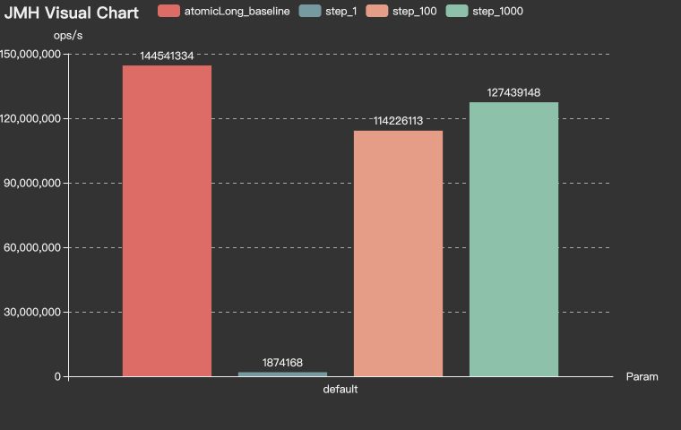
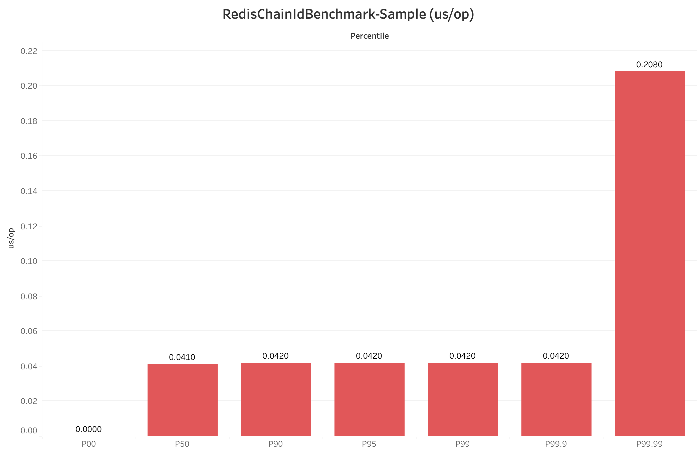
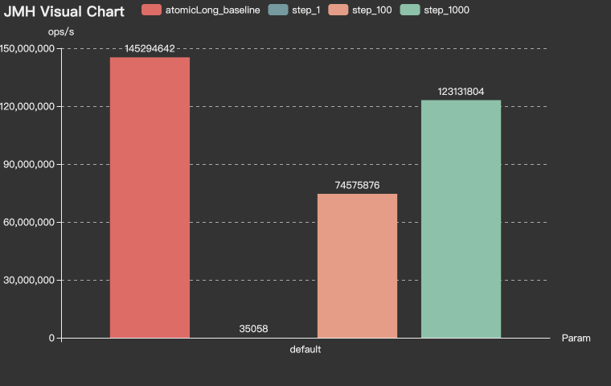
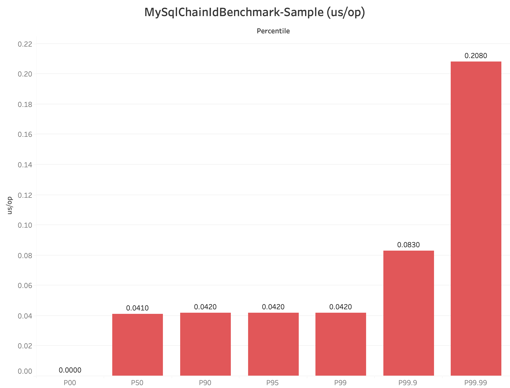

# [CosId](https://github.com/Ahoo-Wang/CosId) Universal, flexible, high-performance distributed ID generator

> [中文文档](https://github.com/Ahoo-Wang/CosId/blob/main/README.zh-CN.md)

## Introduction

*[CosId](https://github.com/Ahoo-Wang/CosId)* aims to provide a universal, flexible and high-performance distributed ID generator. Two types of ID generators are currently provided:

- `SnowflakeId` : Stand-alone *TPS performance：4,096,000* [JMH Benchmark](#jmh-benchmark) , It mainly solves two major problems of `SnowflakeId`: machine number allocation problem and clock backwards problem and provide a more friendly and flexible experience.
- `SegmentId`: Get a segment (`Step`) ID every time to reduce the network IO request frequency of the `IdSegment` distributor and improve performance.
    - `IdSegmentDistributor`: 
        - `RedisIdSegmentDistributor`: `IdSegment` distributor based on *Redis*.
        - `JdbcIdSegmentDistributor`: The *Jdbc-based* `IdSegment` distributor supports various relational databases.
    - `SegmentChainId`(**recommend**):`SegmentChainId` (*lock-free*) is an enhancement of `SegmentId`, the design diagram is as follows. `PrefetchWorker` maintains a `safe distance`, so that `SegmentChainId` achieves approximately `AtomicLong` *TPS performance (Step 1000): 127,439,148+/s* [JMH Benchmark](#jmh-benchmark) .
        - `PrefetchWorker` maintains a safe distance (`safeDistance`), and supports dynamic `safeDistance` expansion and contraction based on hunger status.

## SnowflakeId


> *SnowflakeId* is a distributed ID algorithm that uses `Long` (64-bit) bit partition to generate ID.
> The general bit allocation scheme is : `timestamp` (41-bit) + `machineId` (10-bit) + `sequence` (12-bit) = 63-bit。

- 41-bit `timestamp` = (1L<<41)/(1000/3600/365) approximately 69 years of timestamp can be stored, that is, the usable absolute time is `EPOCH` + 69 years. Generally, we need to customize `EPOCH` as the product development time. In addition, we can increase the number of allocated bits by compressing other areas， The number of timestamp bits to extend the available time.
- 10-bit `machineId` = (1L<<10) = 1024 That is, 1024 copies of the same business can be deployed (there is no master-slave copy in the Kubernetes concept, and the definition of Kubernetes is directly used here) instances. Generally, there is no need to use so many, so it will be redefined according to the scale of deployment.
- 12-bit `sequence` = (1L<<12) * 1000 = 4096000 That is, a single machine can generate about 409W ID per second, and a global same-service cluster can generate `4096000*1024=4194304000=4.19 billion (TPS)`.

It can be seen from the design of SnowflakeId:

- :thumbsup: The first 41-bit are a `timestamp`,So *SnowflakeId* is local monotonically increasing, and affected by global clock synchronization *SnowflakeId* is global trend increasing.
- :thumbsup: `SnowflakeId` does not have a strong dependency on any third-party middleware, and its performance is also very high.
- :thumbsup: The bit allocation scheme can be flexibly configured according to the needs of the business system to achieve the optimal use effect.
- :thumbsdown: Strong reliance on the local clock, potential clock moved backwards problems will cause ID duplication.
- :thumbsdown: The `machineId` needs to be set manually. If the `machineId` is manually assigned during actual deployment, it will be very inefficient.

---

*[CosId-SnowflakeId](https://github.com/Ahoo-Wang/CosId/tree/main/cosid-core/src/main/java/me/ahoo/cosid/snowflake)*

It mainly solves two major problems of `SnowflakeId`: machine number allocation problem and clock backwards problem and provide a more friendly and flexible experience.

### MachineIdDistributor

> Currently [CosId](https://github.com/Ahoo-Wang/CosId) provides the following three `MachineId` distributors.

#### ManualMachineIdDistributor

```yaml
cosid:
  snowflake:
    machine:
      distributor:
        type: manual
        manual:
          machine-id: 0
```

> Manually distribute `MachineId`

#### StatefulSetMachineIdDistributor

```yaml
cosid:
  snowflake:
    machine:
      distributor:
        type: stateful_set
```

> Use the stable identification ID provided by the `StatefulSet` of `Kubernetes` as the machine number.

#### RedisMachineIdDistributor


```yaml
cosid:
  snowflake:
    machine:
      distributor:
        type: redis
```

> Use *Redis* as the distribution store for the machine number.

### ClockBackwardsSynchronizer

```yaml
cosid:
  snowflake:
    clock-backwards:
      spin-threshold: 10
      broken-threshold: 2000
```

The default `DefaultClockBackwardsSynchronizer` clock moved backwards synchronizer uses active wait synchronization strategy, `spinThreshold` (default value 10 milliseconds) is used to set the spin wait threshold, when it is greater than `spinThreshold`, use thread sleep to wait for clock synchronization, if it exceeds` BrokenThreshold` (default value 2 seconds) will directly throw a `ClockTooManyBackwardsException` exception.

### MachineStateStorage

```java
public class MachineState {
  public static final MachineState NOT_FOUND = of(-1, -1);
  private final int machineId;
  private final long lastTimeStamp;

  public MachineState(int machineId, long lastTimeStamp) {
    this.machineId = machineId;
    this.lastTimeStamp = lastTimeStamp;
  }

  public int getMachineId() {
    return machineId;
  }

  public long getLastTimeStamp() {
    return lastTimeStamp;
  }

  public static MachineState of(int machineId, long lastStamp) {
    return new MachineState(machineId, lastStamp);
  }
}
```

```yaml
cosid:
  snowflake:
    machine:
      state-storage:
        local:
          state-location: ./cosid-machine-state/
```

The default `LocalMachineStateStorage` local machine state storage uses a local file to store the machine number and the most recent timestamp, which is used as a `MachineState` cache.

### ClockSyncSnowflakeId

```yaml
cosid:
  snowflake:
    share:
      clock-sync: true
```

The default `SnowflakeId` will directly throw a `ClockBackwardsException` when a clock moved backwards occurs, while using the `ClockSyncSnowflakeId` will use the `ClockBackwardsSynchronizer` to actively wait for clock synchronization to regenerate the ID, providing a more user-friendly experience.

### SafeJavaScriptSnowflakeId

```java
SnowflakeId snowflakeId = SafeJavaScriptSnowflakeId.ofMillisecond(1);
```

The `Number.MAX_SAFE_INTEGER` of `JavaScript` has only 53-bit. If the 63-bit `SnowflakeId` is directly returned to the front end, the value will overflow. Usually we can convert `SnowflakeId` to String type or customize `SnowflakeId` Bit allocation is used to shorten the number of bits of `SnowflakeId` so that `ID` does not overflow when it is provided to the front end.

### SnowflakeFriendlyId (Can parse `SnowflakeId` into a more readable `SnowflakeIdState`)

```yaml
cosid:
  snowflake:
    share:
      friendly: true
```

```java
public class SnowflakeIdState {

    private final long id;

    private final int machineId;

    private final long sequence;

    private final LocalDateTime timestamp;
    /**
     * {@link #timestamp}-{@link #machineId}-{@link #sequence}
     */
    private final String friendlyId;
}
```

```java
public interface SnowflakeFriendlyId extends SnowflakeId {

    SnowflakeIdState friendlyId(long id);

    SnowflakeIdState ofFriendlyId(String friendlyId);

    default SnowflakeIdState friendlyId() {
        long id = generate();
        return friendlyId(id);
    }
}
```

```java
        SnowflakeFriendlyId snowflakeFriendlyId=new DefaultSnowflakeFriendlyId(snowflakeId);
        SnowflakeIdState idState = snowflakeFriendlyId.friendlyId();
        idState.getFriendlyId(); //20210623131730192-1-0
```
## SegmentId


### RedisIdSegmentDistributor

```yaml
cosid:
  segment:
    enabled: true
    distributor:
      type: redis
```

### JdbcIdSegmentDistributor

> Initialize the `cosid` table

```mysql
create table if not exists cosid
(
    name            varchar(100) not null comment '{namespace}.{name}',
    last_max_id     bigint       not null default 0,
    last_fetch_time bigint       not null,
    constraint cosid_pk
        primary key (name)
) engine = InnoDB;
```

```yaml
spring:
  datasource:
    url: jdbc:mysql://localhost:3306/test_db
    username: root
    password: root
cosid:
  segment:
    enabled: true
    distributor:
      type: jdbc
      jdbc:
        enable-auto-init-cosid-table: false
        enable-auto-init-id-segment: true
```

After enabling `enable-auto-init-id-segment:true`, the application will try to create the `idSegment` record when it starts to avoid manual creation. Similar to the execution of the following initialization sql script, there is no need to worry about misoperation, because `name` is the primary key.

```mysql
insert into cosid
    (name, last_max_id, last_fetch_time)
    value
    ('namespace.name', 0, unix_timestamp());
```

### SegmentChainId


```yaml
cosid:
  segment:
    enabled: true
    mode: chain
    chain:
      safe-distance: 5
      prefetch-worker:
        core-pool-size: 2
        prefetch-period: 1s
    distributor:
      type: redis
    share:
      offset: 0
      step: 100
    provider:
      bizC:
        offset: 10000
        step: 100
      bizD:
        offset: 10000
        step: 100
```

## IdGeneratorProvider

```yaml
cosid:
  snowflake:
    provider:
      bizA:
        #      timestamp-bit:
        sequence-bit: 12
      bizB:
        #      timestamp-bit:
        sequence-bit: 12
```

```java
IdGenerator idGenerator = idGeneratorProvider.get("bizA");
```

In actual use, we generally do not use the same `IdGenerator` for all business services, but different businesses use different `IdGenerator`, then `IdGeneratorProvider` exists to solve this problem, and it is the container of `IdGenerator` , You can get the corresponding `IdGenerator` by the business name.

### CosIdPlugin (MyBatis Plugin)

```java

@Target({ElementType.FIELD})
@Documented
@Retention(RetentionPolicy.RUNTIME)
public @interface CosId {
    String value() default IdGeneratorProvider.SHARE;
    
    boolean friendlyId() default false;
}
```

```java
public class Order {

    @CosId
    private long id;

    @CosId
    private String stringId;

    @CosId(friendlyId = true)
    private String friendlyId;

    @CosId(value = "bizC")
    private long bizId;

    /**
     * ...
     * getter or setter
     */
}
```

```java
@Mapper
public interface OrderRepository {
    @Insert("insert into t_order (id,string_id,friendly_id,biz_id) value (#{id},#{stringId},#{friendlyId},#{bizId});")
    void insert(Order order);

    @Insert({
            "<script>",
            "insert into t_order (id,string_id,friendly_id,biz_id)",
            "VALUES" +
                    "<foreach item='item' collection='list' open='' separator=',' close=''>" +
                    "(#{item.id},#{item.stringId},#{item.friendlyId},#{item.bizId})" +
                    "</foreach>",
            "</script>"})
    void insertList(List<Order> orderList);
}
```

```java
        Order order = new Order();
        orderRepository.insert(order);
        /**
         * {
         *   "id": 213044050087903230,
         *   "stringId": "213044050087903233",
         *   "friendlyId": "20210803212059708-0-2",
         *   "bizId": 28801
         * }
         */
        return order;
```

## Examples

[CosId-Examples](https://github.com/Ahoo-Wang/CosId/tree/main/cosid-rest-api)

> http://localhost:8080/swagger-ui/index.html#/

## Installation

### Gradle

> Kotlin DSL

``` kotlin
    val cosidVersion = "1.3.9";
    implementation("me.ahoo.cosid:cosid-spring-boot-starter:${cosidVersion}")
```

### Maven

```xml
<?xml version="1.0" encoding="UTF-8"?>

<project xmlns="http://maven.apache.org/POM/4.0.0"
         xmlns:xsi="http://www.w3.org/2001/XMLSchema-instance"
         xsi:schemaLocation="http://maven.apache.org/POM/4.0.0 http://maven.apache.org/xsd/maven-4.0.0.xsd">

    <modelVersion>4.0.0</modelVersion>
    <artifactId>demo</artifactId>
    <properties>
        <cosid.version>1.3.12</cosid.version>
    </properties>

    <dependencies>
        <dependency>
            <groupId>me.ahoo.cosid</groupId>
            <artifactId>cosid-spring-boot-starter</artifactId>
            <version>${cosid.version}</version>
        </dependency>
    </dependencies>

</project>
```

### application.yaml

```yaml
spring:
  application:
    name: ${service.name:cosid-example}
  datasource:
    url: jdbc:mysql://localhost:3306/test_db
    username: root
    password: root
  redis:
    url: redis://localhost:6379
cosid:
  namespace: ${spring.application.name}
  snowflake:
    enabled: true
    #    epoch: 1577203200000
    clock-backwards:
      spin-threshold: 10
      broken-threshold: 2000
    machine:
      #      stable: true
      #      machine-bit: 10
      #      instance-id: ${HOSTNAME}
      distributor:
        type: redis
      #        manual:
      #          machine-id: 0
      state-storage:
        local:
          state-location: ./cosid-machine-state/
    share:
      clock-sync: true
      friendly: true
    provider:
      bizA:
        #        timestamp-bit:
        sequence-bit: 12
      bizB:
        #        timestamp-bit:
        sequence-bit: 12
  segment:
    enabled: true
    mode: chain
    chain:
      safe-distance: 5
      prefetch-worker:
        core-pool-size: 2
        prefetch-period: 1s
    distributor:
      type: redis
    share:
      offset: 0
      step: 100
    provider:
      bizC:
        offset: 10000
        step: 100
      bizD:
        offset: 10000
        step: 100


```

## JMH-Benchmark

- The development notebook : MacBook Pro (M1)
- All benchmark tests are carried out on the development notebook.
- Deploying Redis on the development notebook.

### SnowflakeId

``` shell
gradle cosid-core:jmh
# or
java -jar cosid-core/build/libs/cosid-core-1.3.12-jmh.jar -bm thrpt -wi 1 -rf json -f 1
```

```
Benchmark                                                    Mode  Cnt        Score   Error  Units
SnowflakeIdBenchmark.millisecondSnowflakeId_friendlyId      thrpt       4020311.665          ops/s
SnowflakeIdBenchmark.millisecondSnowflakeId_generate        thrpt       4095403.859          ops/s
SnowflakeIdBenchmark.safeJsMillisecondSnowflakeId_generate  thrpt        511654.048          ops/s
SnowflakeIdBenchmark.safeJsSecondSnowflakeId_generate       thrpt        539818.563          ops/s
SnowflakeIdBenchmark.secondSnowflakeId_generate             thrpt       4206843.941          ops/s
```

### RedisChainIdBenchmark

#### Throughput (ops/s)



``` shell
gradle cosid-redis:jmh
# or
java -jar cosid-redis/build/libs/cosid-redis-1.3.12-jmh.jar -bm thrpt -wi 1 -rf json -f 1 RedisChainIdBenchmark
```

```
Benchmark                                   Mode  Cnt          Score          Error  Units
RedisChainIdBenchmark.atomicLong_baseline  thrpt    5  144541334.198 ±  5578137.471  ops/s
RedisChainIdBenchmark.step_1               thrpt    5    1874168.687 ±   310274.706  ops/s
RedisChainIdBenchmark.step_100             thrpt    5  114226113.524 ± 15789563.078  ops/s
RedisChainIdBenchmark.step_1000            thrpt    5  127439148.104 ±  1833743.699  ops/s
```

#### Percentile-Sample (*P9999=0.208 us/op*)

> In statistics, a [percentile](https://en.wikipedia.org/wiki/Percentile) (or a centile) is a score below which a given percentage of scores in its frequency distribution falls (exclusive definition) or a score at or below which a given percentage falls (inclusive definition). For example, the 50th percentile (the median) is the score below which (exclusive) or at or below which (inclusive) 50% of the scores in the distribution may be found.



```shell
java -jar cosid-redis/build/libs/cosid-redis-1.3.12-jmh.jar -bm sample -wi 1 -rf json -f 1 -tu us step_1000
```

```
Benchmark                                            Mode      Cnt   Score    Error  Units
RedisChainIdBenchmark.step_1000                    sample  1336271   0.024 ±  0.001  us/op
RedisChainIdBenchmark.step_1000:step_1000·p0.00    sample              ≈ 0           us/op
RedisChainIdBenchmark.step_1000:step_1000·p0.50    sample            0.041           us/op
RedisChainIdBenchmark.step_1000:step_1000·p0.90    sample            0.042           us/op
RedisChainIdBenchmark.step_1000:step_1000·p0.95    sample            0.042           us/op
RedisChainIdBenchmark.step_1000:step_1000·p0.99    sample            0.042           us/op
RedisChainIdBenchmark.step_1000:step_1000·p0.999   sample            0.042           us/op
RedisChainIdBenchmark.step_1000:step_1000·p0.9999  sample            0.208           us/op
RedisChainIdBenchmark.step_1000:step_1000·p1.00    sample           37.440           us/op
```

### MySqlChainIdBenchmark

#### Throughput (ops/s)



``` shell
gradle cosid-jdbc:jmh
# or
java -jar cosid-jdbc/build/libs/cosid-jdbc-1.3.12-jmh.jar -bm thrpt -wi 1 -rf json -f 1 MySqlChainIdBenchmark
```

```
Benchmark                                   Mode  Cnt          Score         Error  Units
MySqlChainIdBenchmark.atomicLong_baseline  thrpt    5  145294642.937 ±  224876.284  ops/s
MySqlChainIdBenchmark.step_1               thrpt    5      35058.790 ±   36226.041  ops/s
MySqlChainIdBenchmark.step_100             thrpt    5   74575876.804 ± 5590390.811  ops/s
MySqlChainIdBenchmark.step_1000            thrpt    5  123131804.260 ± 1488004.409  ops/s
```

#### Percentile-Sample (*P9999=0.208 us/op*)



```shell
java -jar cosid-jdbc/build/libs/cosid-jdbc-1.3.12-jmh.jar -bm sample -wi 1 -rf json -f 1 -tu us step_1000
```
```
Benchmark                                            Mode      Cnt    Score   Error  Units
MySqlChainIdBenchmark.step_1000                    sample  1286774    0.024 ± 0.001  us/op
MySqlChainIdBenchmark.step_1000:step_1000·p0.00    sample               ≈ 0          us/op
MySqlChainIdBenchmark.step_1000:step_1000·p0.50    sample             0.041          us/op
MySqlChainIdBenchmark.step_1000:step_1000·p0.90    sample             0.042          us/op
MySqlChainIdBenchmark.step_1000:step_1000·p0.95    sample             0.042          us/op
MySqlChainIdBenchmark.step_1000:step_1000·p0.99    sample             0.042          us/op
MySqlChainIdBenchmark.step_1000:step_1000·p0.999   sample             0.083          us/op
MySqlChainIdBenchmark.step_1000:step_1000·p0.9999  sample             0.208          us/op
MySqlChainIdBenchmark.step_1000:step_1000·p1.00    sample           342.528          us/op
```
