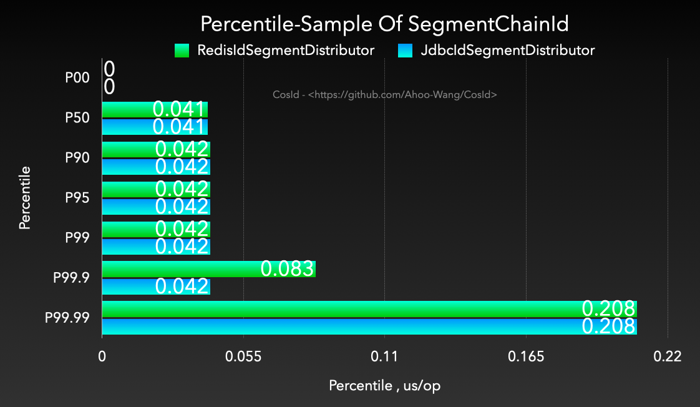

<p align="center" style="text-align:center">
  
</p>

# [CosId](https://cosid.ahoo.me/) Universal, flexible, high-performance distributed ID generator

[](https://www.apache.org/licenses/LICENSE-2.0.html)
[](https://github.com/Ahoo-Wang/CosId/releases)
[](https://app.codacy.com/gh/Ahoo-Wang/CosId?utm_source=github.com&utm_medium=referral&utm_content=Ahoo-Wang/CosId&utm_campaign=Badge_Grade_Settings)

> [中文文档](https://cosid.ahoo.me/)

## Introduction

*[CosId](https://github.com/Ahoo-Wang/CosId)* aims to provide a universal, flexible and high-performance distributed ID
generator.

- `SnowflakeId` : Stand-alone *TPS performance：4,096,000* [JMH Benchmark](#jmh-benchmark) , It mainly solves two major
  problems of `SnowflakeId`: machine number allocation problem and clock backwards problem and provide a more friendly
  and flexible experience.
- `SegmentId`: Get a segment (`Step`) ID every time to reduce the network IO request frequency of the `IdSegment`
  distributor and improve performance.
    - `IdSegmentDistributor`:
        - `RedisIdSegmentDistributor`: `IdSegment` distributor based on *Redis*.
        - `JdbcIdSegmentDistributor`: The *Jdbc-based* `IdSegment` distributor supports various relational databases.
    - `SegmentChainId`(**recommend**):`SegmentChainId` (*lock-free*) is an enhancement of `SegmentId`, the design
      diagram is as follows. `PrefetchWorker` maintains a `safe distance`, so that `SegmentChainId` achieves
      approximately `AtomicLong` *TPS performance (Step 1000): 127,439,148+/s* [JMH Benchmark](#jmh-benchmark) .
        - `PrefetchWorker` maintains a safe distance (`safeDistance`), and supports dynamic `safeDistance` expansion and
          contraction based on hunger status.

## SnowflakeId

<p align="center">
     
</p>

> *SnowflakeId* is a distributed ID algorithm that uses `Long` (64-bit) bit partition to generate ID.
> The general bit allocation scheme is : `timestamp` (41-bit) + `machineId` (10-bit) + `sequence` (12-bit) = 63-bit。

- 41-bit `timestamp` = (1L<<41)/(1000/3600/365) approximately 69 years of timestamp can be stored, that is, the usable
  absolute time is `EPOCH` + 69 years. Generally, we need to customize `EPOCH` as the product development time. In
  addition, we can increase the number of allocated bits by compressing other areas， The number of timestamp bits to
  extend the available time.
- 10-bit `machineId` = (1L<<10) = 1024 That is, 1024 copies of the same business can be deployed (there is no
  master-slave copy in the Kubernetes concept, and the definition of Kubernetes is directly used here) instances.
  Generally, there is no need to use so many, so it will be redefined according to the scale of deployment.
- 12-bit `sequence` = (1L<<12) * 1000 = 4096000 That is, a single machine can generate about 409W ID per second, and a
  global same-service cluster can generate `4096000*1024=4194304000=4.19 billion (TPS)`.

It can be seen from the design of SnowflakeId:

- :thumbsup: The first 41-bit are a `timestamp`,So *SnowflakeId* is local monotonically increasing, and affected by
  global clock synchronization *SnowflakeId* is global trend increasing.
- :thumbsup: `SnowflakeId` does not have a strong dependency on any third-party middleware, and its performance is also
  very high.
- :thumbsup: The bit allocation scheme can be flexibly configured according to the needs of the business system to
  achieve the optimal use effect.
- :thumbsdown: Strong reliance on the local clock, potential clock moved backwards problems will cause ID duplication.
- :thumbsdown: The `machineId` needs to be set manually. If the `machineId` is manually assigned during actual
  deployment, it will be very inefficient.

---

*[CosId-SnowflakeId](https://github.com/Ahoo-Wang/CosId/tree/main/cosid-core/src/main/java/me/ahoo/cosid/snowflake)*

It mainly solves two major problems of `SnowflakeId`: machine number allocation problem and clock backwards problem and
provide a more friendly and flexible experience.

### MachineIdDistributor

> Currently [CosId](https://github.com/Ahoo-Wang/CosId) provides the following three `MachineId` distributors.

#### ManualMachineIdDistributor

```yaml
cosid:
  snowflake:
    machine:
      distributor:
        type: manual
        manual:
          machine-id: 0
```

> Manually distribute `MachineId`

#### StatefulSetMachineIdDistributor

```yaml
cosid:
  snowflake:
    machine:
      distributor:
        type: stateful_set
```

> Use the stable identification ID provided by the `StatefulSet` of `Kubernetes` as the machine number.

#### RedisMachineIdDistributor

<p align="center">
     
</p>

```yaml
cosid:
  snowflake:
    machine:
      distributor:
        type: redis
```

> Use *Redis* as the distribution store for the machine number.

### ClockBackwardsSynchronizer

```yaml
cosid:
  snowflake:
    clock-backwards:
      spin-threshold: 10
      broken-threshold: 2000
```

The default `DefaultClockBackwardsSynchronizer` clock moved backwards synchronizer uses active wait synchronization
strategy, `spinThreshold` (default value 10 milliseconds) is used to set the spin wait threshold, when it is greater
than `spinThreshold`, use thread sleep to wait for clock synchronization, if it exceeds` BrokenThreshold` (default value
2 seconds) will directly throw a `ClockTooManyBackwardsException` exception.

### MachineStateStorage

```java
public class MachineState {
    public static final MachineState NOT_FOUND = of(-1, -1);
    private final int machineId;
    private final long lastTimeStamp;
    
    public MachineState(int machineId, long lastTimeStamp) {
        this.machineId = machineId;
        this.lastTimeStamp = lastTimeStamp;
    }
    
    public int getMachineId() {
        return machineId;
    }
    
    public long getLastTimeStamp() {
        return lastTimeStamp;
    }
    
    public static MachineState of(int machineId, long lastStamp) {
        return new MachineState(machineId, lastStamp);
    }
}
```

```yaml
cosid:
  snowflake:
    machine:
      state-storage:
        local:
          state-location: ./cosid-machine-state/
```

The default `LocalMachineStateStorage` local machine state storage uses a local file to store the machine number and the
most recent timestamp, which is used as a `MachineState` cache.

### ClockSyncSnowflakeId

```yaml
cosid:
  snowflake:
    share:
      clock-sync: true
```

The default `SnowflakeId` will directly throw a `ClockBackwardsException` when a clock moved backwards occurs, while
using the `ClockSyncSnowflakeId` will use the `ClockBackwardsSynchronizer` to actively wait for clock synchronization to
regenerate the ID, providing a more user-friendly experience.

### SafeJavaScriptSnowflakeId

```java
SnowflakeId snowflakeId=SafeJavaScriptSnowflakeId.ofMillisecond(1);
```

The `Number.MAX_SAFE_INTEGER` of `JavaScript` has only 53-bit. If the 63-bit `SnowflakeId` is directly returned to the
front end, the value will overflow. Usually we can convert `SnowflakeId` to String type or customize `SnowflakeId` Bit
allocation is used to shorten the number of bits of `SnowflakeId` so that `ID` does not overflow when it is provided to
the front end.

### SnowflakeFriendlyId (Can parse `SnowflakeId` into a more readable `SnowflakeIdState`)

```yaml
cosid:
  snowflake:
    share:
      friendly: true
```

```java
public class SnowflakeIdState {
    
    private final long id;
    
    private final int machineId;
    
    private final long sequence;
    
    private final LocalDateTime timestamp;
    /**
     * {@link #timestamp}-{@link #machineId}-{@link #sequence}
     */
    private final String friendlyId;
}
```

```java
public interface SnowflakeFriendlyId extends SnowflakeId {
    
    SnowflakeIdState friendlyId(long id);
    
    SnowflakeIdState ofFriendlyId(String friendlyId);
    
    default SnowflakeIdState friendlyId() {
        long id = generate();
        return friendlyId(id);
    }
}
```

```java
        SnowflakeFriendlyId snowflakeFriendlyId=new DefaultSnowflakeFriendlyId(snowflakeId);
    SnowflakeIdState idState=snowflakeFriendlyId.friendlyId();
    idState.getFriendlyId(); //20210623131730192-1-0
```

## SegmentId

<p align="center">
     
</p>

### RedisIdSegmentDistributor

```yaml
cosid:
  segment:
    enabled: true
    distributor:
      type: redis
```

### JdbcIdSegmentDistributor

> Initialize the `cosid` table

```mysql
create table if not exists cosid
(
    name            varchar(100) not null comment '{namespace}.{name}',
    last_max_id     bigint       not null default 0,
    last_fetch_time bigint       not null,
    constraint cosid_pk
        primary key (name)
) engine = InnoDB;
```

```yaml
spring:
  datasource:
    url: jdbc:mysql://localhost:3306/test_db
    username: root
    password: root
cosid:
  segment:
    enabled: true
    distributor:
      type: jdbc
      jdbc:
        enable-auto-init-cosid-table: false
        enable-auto-init-id-segment: true
```

After enabling `enable-auto-init-id-segment:true`, the application will try to create the `idSegment` record when it
starts to avoid manual creation. Similar to the execution of the following initialization sql script, there is no need
to worry about misoperation, because `name` is the primary key.

```mysql
insert into cosid
    (name, last_max_id, last_fetch_time)
    value
    ('namespace.name', 0, unix_timestamp());
```

### SegmentChainId


```yaml
cosid:
  segment:
    enabled: true
    mode: chain
    chain:
      safe-distance: 5
      prefetch-worker:
        core-pool-size: 2
        prefetch-period: 1s
    distributor:
      type: redis
    share:
      offset: 0
      step: 100
    provider:
      bizC:
        offset: 10000
        step: 100
      bizD:
        offset: 10000
        step: 100
```

## IdGeneratorProvider

```yaml
cosid:
  snowflake:
    provider:
      bizA:
        #      timestamp-bit:
        sequence-bit: 12
      bizB:
        #      timestamp-bit:
        sequence-bit: 12
```

```java
IdGenerator idGenerator=idGeneratorProvider.get("bizA");
```

In actual use, we generally do not use the same `IdGenerator` for all business services, but different businesses use
different `IdGenerator`, then `IdGeneratorProvider` exists to solve this problem, and it is the container
of `IdGenerator` , You can get the corresponding `IdGenerator` by the business name.

### CosIdPlugin (MyBatis Plugin)

> Kotlin DSL

``` kotlin
    implementation("me.ahoo.cosid:cosid-mybatis:${cosidVersion}")
```

```java

@Target({ElementType.FIELD})
@Documented
@Retention(RetentionPolicy.RUNTIME)
public @interface CosId {
    String value() default IdGeneratorProvider.SHARE;
    
    boolean friendlyId() default false;
}
```

```java
public class LongIdEntity {
    
    @CosId(value = "safeJs")
    private Long id;
    
    public Long getId() {
        return id;
    }
    
    public void setId(Long id) {
        this.id = id;
    }
}

public class FriendlyIdEntity {
    
    @CosId(friendlyId = true)
    private String id;
    
    public String getId() {
        return id;
    }
    
    public void setId(String id) {
        this.id = id;
    }
}
```

```java

@Mapper
public interface OrderRepository {
    @Insert("insert into t_table (id) value (#{id});")
    void insert(LongIdEntity order);
    
    @Insert({
        "<script>",
        "insert into t_friendly_table (id)",
        "VALUES" +
            "<foreach item='item' collection='list' open='' separator=',' close=''>" +
            "(#{item.id})" +
            "</foreach>",
        "</script>"})
    void insertList(List<FriendlyIdEntity> list);
}
```

```java
        LongIdEntity entity=new LongIdEntity();
    entityRepository.insert(entity);
    /**
     * {
     *   "id": 208796080181248
     * }
     */
    return entity;
```

### ShardingSphere Plugin

> Kotlin DSL

``` kotlin
    implementation("me.ahoo.cosid:cosid-shardingsphere:${cosidVersion}")
```

#### CosIdKeyGenerateAlgorithm (Distributed-Id)

```yaml
spring:
  shardingsphere:
    rules:
      sharding:
        key-generators:
          cosid:
            type: COSID
            props:
              id-name: __share__
```

#### Interval-based time range sharding algorithm

<p align="center">
     
</p>

- Ease of use: supports multiple data types (`Long`/`LocalDateTime`/`DATE`/ `String` / `SnowflakeId`),The official
  implementation is to first convert to a string and then convert to `LocalDateTime`, the conversion success rate is
  affected by the time formatting characters.
- Performance: Compared to  `org.apache.shardingsphere.sharding.algorithm.sharding.datetime.IntervalShardingAlgorithm`
  ,The performance is *1200~4000* times higher.

| **PreciseShardingValue**                                                                                                                                                                  | **RangeShardingValue**                                                                                                                                                                |
|-------------------------------------------------------------------------------------------------------------------------------------------------------------------------------------------|---------------------------------------------------------------------------------------------------------------------------------------------------------------------------------------|
|  |  |

- CosIdIntervalShardingAlgorithm
    - type: COSID_INTERVAL

```yaml
spring:
  shardingsphere:
    rules:
      sharding:
        sharding-algorithms:
          alg-name:
            type: COSID_INTERVAL
            props:
              logic-name-prefix: logic-name-prefix
              id-name: cosid-name
              datetime-lower: 2021-12-08 22:00:00
              datetime-upper: 2022-12-01 00:00:00
              sharding-suffix-pattern: yyyyMM
              datetime-interval-unit: MONTHS
              datetime-interval-amount: 1
```

#### CosIdModShardingAlgorithm

<p align="center">
     
</p>

- Performance: Compared to  `org.apache.shardingsphere.sharding.algorithm.sharding.datetime.IntervalShardingAlgorithm`
  ,The performance is *1200~4000* times higher.And it has higher stability and no serious performance degradation.

| **PreciseShardingValue**                                                                                                                                                        | **RangeShardingValue**                                                                                                                                                      |
|---------------------------------------------------------------------------------------------------------------------------------------------------------------------------------|-----------------------------------------------------------------------------------------------------------------------------------------------------------------------------|
|  |  |

```yaml
spring:
  shardingsphere:
    rules:
      sharding:
        sharding-algorithms:
          alg-name:
            type: COSID_MOD
            props:
              mod: 4
              logic-name-prefix: t_table_
```

## Examples

[CosId-Examples](https://github.com/Ahoo-Wang/CosId/tree/main/cosid-example)

> http://localhost:8008/swagger-ui/index.html#/

## Installation

### Gradle

> Kotlin DSL

``` kotlin
    val cosidVersion = "1.8.9";
    implementation("me.ahoo.cosid:cosid-spring-boot-starter:${cosidVersion}")
```

### Maven

```xml
<?xml version="1.0" encoding="UTF-8"?>

<project xmlns="http://maven.apache.org/POM/4.0.0"
         xmlns:xsi="http://www.w3.org/2001/XMLSchema-instance"
         xsi:schemaLocation="http://maven.apache.org/POM/4.0.0 http://maven.apache.org/xsd/maven-4.0.0.xsd">

    <modelVersion>4.0.0</modelVersion>
    <artifactId>demo</artifactId>
    <properties>
        <cosid.version>1.8.9</cosid.version>
    </properties>

    <dependencies>
        <dependency>
            <groupId>me.ahoo.cosid</groupId>
            <artifactId>cosid-spring-boot-starter</artifactId>
            <version>${cosid.version}</version>
        </dependency>
    </dependencies>

</project>
```

### application.yaml

```yaml
spring:
  shardingsphere:
    datasource:
      names: ds0,ds1
      ds0:
        type: com.zaxxer.hikari.HikariDataSource
        driver-class-name: com.mysql.cj.jdbc.Driver
        jdbcUrl: jdbc:mysql://localhost:3306/cosid_db_0
        username: root
        password: root
      ds1:
        type: com.zaxxer.hikari.HikariDataSource
        driver-class-name: com.mysql.cj.jdbc.Driver
        jdbcUrl: jdbc:mysql://localhost:3306/cosid_db_1
        username: root
        password: root
    props:
      sql-show: true
    rules:
      sharding:
        binding-tables:
          - t_order,t_order_item
        tables:
          cosid:
            actual-data-nodes: ds0.cosid
          t_table:
            actual-data-nodes: ds0.t_table_$->{0..1}
            table-strategy:
              standard:
                sharding-column: id
                sharding-algorithm-name: table-inline
          t_friendly_table:
            actual-data-nodes: ds0.t_friendly_table
          t_order:
            actual-data-nodes: ds$->{0..1}.t_order
            database-strategy:
              standard:
                sharding-column: order_id
                sharding-algorithm-name: order-db-inline
            key-generate-strategy:
              column: order_id
              key-generator-name: order
          t_order_item:
            actual-data-nodes: ds$->{0..1}.t_order_item
            database-strategy:
              standard:
                sharding-column: order_id
                sharding-algorithm-name: order-db-inline
          t_date_log:
            actual-data-nodes: ds0.t_date_log_202112
            key-generate-strategy:
              column: id
              key-generator-name: snowflake
            table-strategy:
              standard:
                sharding-column: create_time
                sharding-algorithm-name: data-log-interval
          t_date_time_log:
            actual-data-nodes: ds0.t_date_time_log_202112
            key-generate-strategy:
              column: id
              key-generator-name: snowflake
            table-strategy:
              standard:
                sharding-column: create_time
                sharding-algorithm-name: data-time-log-interval
          t_timestamp_log:
            actual-data-nodes: ds0.t_timestamp_log_202112
            key-generate-strategy:
              column: id
              key-generator-name: snowflake
            table-strategy:
              standard:
                sharding-column: create_time
                sharding-algorithm-name: timestamp-log-interval
          t_snowflake_log:
            actual-data-nodes: ds0.t_snowflake_log_202112
            table-strategy:
              standard:
                sharding-column: id
                sharding-algorithm-name: snowflake-log-interval
        sharding-algorithms:
          table-inline:
            type: COSID_MOD
            props:
              mod: 2
              logic-name-prefix: t_table_
          order-db-inline:
            type: COSID_MOD
            props:
              mod: 2
              logic-name-prefix: ds
          data-log-interval:
            type: COSID_INTERVAL
            props:
              logic-name-prefix: t_date_log_
              datetime-lower: 2021-12-08 22:00:00
              datetime-upper: 2022-12-01 00:00:00
              sharding-suffix-pattern: yyyyMM
              datetime-interval-unit: MONTHS
              datetime-interval-amount: 1
          data-time-log-interval:
            type: COSID_INTERVAL
            props:
              logic-name-prefix: t_date_time_log_
              datetime-lower: 2021-12-08 22:00:00
              datetime-upper: 2022-12-01 00:00:00
              sharding-suffix-pattern: yyyyMM
              datetime-interval-unit: MONTHS
              datetime-interval-amount: 1
          timestamp-log-interval:
            type: COSID_INTERVAL
            props:
              logic-name-prefix: t_timestamp_log_
              datetime-lower: 2021-12-08 22:00:00
              datetime-upper: 2022-12-01 00:00:00
              sharding-suffix-pattern: yyyyMM
              datetime-interval-unit: MONTHS
              datetime-interval-amount: 1
          snowflake-log-interval:
            type: COSID_INTERVAL
            props:
              logic-name-prefix: t_snowflake_log_
              id-name: snowflake
              datetime-lower: 2021-12-08 22:00:00
              datetime-upper: 2022-12-01 00:00:00
              sharding-suffix-pattern: yyyyMM
              datetime-interval-unit: MONTHS
              datetime-interval-amount: 1
        key-generators:
          snowflake:
            type: COSID
            props:
              id-name: snowflake
          order:
            type: COSID
            props:
              id-name: order

cosid:
  namespace: ${spring.application.name}
  snowflake:
    enabled: true
    #    epoch: 1577203200000
    clock-backwards:
      spin-threshold: 10
      broken-threshold: 2000
    machine:
      #      stable: true
      #      machine-bit: 10
      #      instance-id: ${HOSTNAME}
      distributor:
        type: redis
      #        manual:
      #          machine-id: 0
      state-storage:
        local:
          state-location: ./cosid-machine-state/
    share:
      clock-sync: true
      friendly: true
    provider:
      order_item:
        #        timestamp-bit:
        sequence-bit: 12
      snowflake:
        sequence-bit: 12
      safeJs:
        machine-bit: 3
        sequence-bit: 9
  segment:
    enabled: true
    mode: chain
    chain:
      safe-distance: 5
      prefetch-worker:
        core-pool-size: 2
        prefetch-period: 1s
    distributor:
      type: redis
    share:
      offset: 0
      step: 100
    provider:
      order:
        offset: 10000
        step: 100
      longId:
        offset: 10000
        step: 100
```

## JMH-Benchmark

- The development notebook : MacBook Pro (M1)
- All benchmark tests are carried out on the development notebook.
- Deploying Redis on the development notebook.

### SnowflakeId

``` shell
gradle cosid-core:jmh
# or
java -jar cosid-core/build/libs/cosid-core-1.8.9-jmh.jar -bm thrpt -wi 1 -rf json -f 1
```

```
Benchmark                                                    Mode  Cnt        Score   Error  Units
SnowflakeIdBenchmark.millisecondSnowflakeId_friendlyId      thrpt       4020311.665          ops/s
SnowflakeIdBenchmark.millisecondSnowflakeId_generate        thrpt       4095403.859          ops/s
SnowflakeIdBenchmark.safeJsMillisecondSnowflakeId_generate  thrpt        511654.048          ops/s
SnowflakeIdBenchmark.safeJsSecondSnowflakeId_generate       thrpt        539818.563          ops/s
SnowflakeIdBenchmark.secondSnowflakeId_generate             thrpt       4206843.941          ops/s
```

### Throughput (ops/s) of SegmentChainId

<p align="center" >
  
</p>

### Percentile-Sample (*P9999=0.208 us/op*)  of SegmentChainId

> In statistics, a [percentile](https://en.wikipedia.org/wiki/Percentile) (or a centile) is a score below which a given percentage of scores in its frequency distribution falls (exclusive definition) or a score at or below which a given percentage falls (inclusive definition). For example, the 50th percentile (the median) is the score below which (exclusive) or at or below which (inclusive) 50% of the scores in the distribution may be found.

<p align="center" >
  
</p>

## Community Partners and Sponsors

<a href="https://www.jetbrains.com/?from=CosId" target="_blank">
    
</a>
