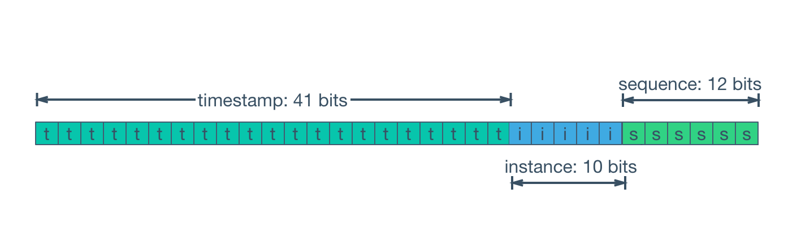
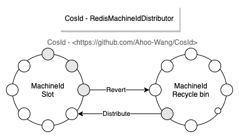

# [CosId](https://github.com/Ahoo-Wang/CosId) Universal, flexible, high-performance distributed ID generator

> [中文文档](https://github.com/Ahoo-Wang/CosId/blob/main/README.zh-CN.md)

## Introduction

*[CosId](https://github.com/Ahoo-Wang/CosId)* provide a universal, flexible and high-performance distributed ID generator. Two major types of ID generators are currently provided：*SnowflakeId* (Stand-alone TPS performance：4,090,000 [JMH Benchmark](#jmh-benchmark))、*SegmentId* (*RedisIdSegmentDistributor* Stand-alone TPS performance(Step 1000)：36,874,696 [JMH Benchmark](#jmh-benchmark))。

## SnowflakeId



> *SnowflakeId* is a distributed ID algorithm that uses `Long` (64 bits) bit partition to generate ID.
> The general bit allocation scheme is : `timestamp` (41 bits) + `machineId` (10 bits) + `sequence` (12 bits) = 63 bits 。

- 41 bits `timestamp` = (1L<<41)/(1000/3600/365) approximately 69 years of timestamp can be stored, that is, the usable absolute time is `EPOCH` + 69 years. Generally, we need to customize `EPOCH` as the product development time. In addition, we can increase the number of allocated bits by compressing other areas， The number of timestamp bits to extend the available time.
- 10 bits `machineId` = (1L<<10) = 1024 That is, 1024 copies of the same business can be deployed (there is no master-slave copy in the Kubernetes concept, and the definition of Kubernetes is directly used here) instances. Generally, there is no need to use so many, so it will be redefined according to the scale of deployment.
- 12 bits `sequence` = (1L<<12) * 1000 = 4096000 That is, a single machine can generate about 409W ID per second, and a global same-service cluster can generate 40960001024=419430W=4.19 billion (TPS).

It can be seen from the design of SnowflakeId:

- :thumbsup: The first 41 bits are a `timestamp`,So *SnowflakeId* is local monotonically increasing, and affected by global clock synchronization *SnowflakeId* is global trend increasing.
- :thumbsup: `SnowflakeId` does not have a strong dependency on any third-party middleware, and its performance is also very high.
- :thumbsup: The bit allocation scheme can be flexibly configured according to the needs of the business system to achieve the optimal use effect.
- :thumbsdown: Strong reliance on the local clock, potential clock moved backwards problems will cause ID duplication.
- :thumbsdown: The `machineId` needs to be set manually. If the `machineId` is manually assigned during actual deployment, it will be very inefficient.

---

*[CosId-SnowflakeId](https://github.com/Ahoo-Wang/CosId/tree/main/cosid-core/src/main/java/me/ahoo/cosid/snowflake)*

It mainly solves two major problems of `SnowflakeId`: machine number allocation problem and clock backwards problem. And provide a more friendly and flexible experience.

### MachineIdDistributor

> Currently [CosId](https:github.comAhoo-WangCosId) provides the following three `MachineId` distributors.

#### ManualMachineIdDistributor

```yaml
cosid:
  snowflake:
    machine:
      distributor:
        type: manual
        manual:
          machine-id: 0
```

> Manually distribute `MachineId`

#### StatefulSetMachineIdDistributor

```yaml
cosid:
  snowflake:
    machine:
      distributor:
        type: stateful_set
```

> Use the stable identification ID provided by the `StatefulSet` of `Kubernetes` as the machine number.

#### RedisMachineIdDistributor



```yaml
cosid:
  snowflake:
    machine:
      distributor:
        type: redis
```

> Use *Redis* as the distribution store for the machine number.

### ClockBackwardsSynchronizer

```yaml
cosid:
  snowflake:
    clock-backwards:
      spin-threshold: 10
      broken-threshold: 2000
```

The default `DefaultClockBackwardsSynchronizer` clock moved backwards synchronizer uses active wait synchronization strategy, `spinThreshold` (default value 10 milliseconds) is used to set the spin wait threshold, when it is greater than `spinThreshold`, use thread sleep to wait for clock synchronization, if it exceeds` BrokenThreshold` (default value 2 seconds) will directly throw a `ClockTooManyBackwardsException` exception.

### MachineStateStorage

```java
public class MachineState {
  public static final MachineState NOT_FOUND = of(-1, -1);
  private final int machineId;
  private final long lastTimeStamp;

  public MachineState(int machineId, long lastTimeStamp) {
    this.machineId = machineId;
    this.lastTimeStamp = lastTimeStamp;
  }

  public int getMachineId() {
    return machineId;
  }

  public long getLastTimeStamp() {
    return lastTimeStamp;
  }

  public static MachineState of(int machineId, long lastStamp) {
    return new MachineState(machineId, lastStamp);
  }
}
```

```yaml
cosid:
  snowflake:
    machine:
      state-storage:
        local:
          state-location: ./cosid-machine-state/
```

The default `LocalMachineStateStorage` local machine state storage uses a local file to store the machine number and the most recent timestamp, which is used as a `MachineState` cache.

### ClockSyncSnowflakeId

```yaml
cosid:
  snowflake:
    share:
      clock-sync: true
```

The default `SnowflakeId` will directly throw a `ClockBackwardsException` when a clock moved backwards occurs, while using the `ClockSyncSnowflakeId` will use the `ClockBackwardsSynchronizer` to actively wait for clock synchronization to regenerate the ID, providing a more user-friendly experience.

### SafeJavaScriptSnowflakeId

```java
SnowflakeId snowflakeId = SafeJavaScriptSnowflakeId.ofMillisecond(1);
```

The `Number.MAX_SAFE_INTEGER` of `JavaScript` has only 53 bits. If the 63-bit `SnowflakeId` is directly returned to the front end, the value will overflow. Usually we can convert `SnowflakeId` to String type or customize `SnowflakeId` Bit allocation is used to shorten the number of bits of `SnowflakeId` so that `ID` does not overflow when it is provided to the front end.

### SnowflakeFriendlyId (Can parse `SnowflakeId` into a more readable `SnowflakeIdState`)

```yaml
cosid:
  snowflake:
    share:
      friendly: true
```

```java
public class SnowflakeIdState {

    private final long id;

    private final int machineId;

    private final long sequence;

    private final LocalDateTime timestamp;
    /**
     * {@link #timestamp}-{@link #machineId}-{@link #sequence}
     */
    private final String friendlyId;
}
```

```java
public interface SnowflakeFriendlyId extends SnowflakeId {

    SnowflakeIdState friendlyId(long id);

    SnowflakeIdState ofFriendlyId(String friendlyId);

    default SnowflakeIdState friendlyId() {
        long id = generate();
        return friendlyId(id);
    }
}
```

```java
        SnowflakeFriendlyId snowflakeFriendlyId=new DefaultSnowflakeFriendlyId(snowflakeId);
        SnowflakeIdState idState = snowflakeFriendlyId.friendlyId();
        idState.getFriendlyId(); //20210623131730192-1-0
```
## SegmentId

## RedisIdSegmentDistributor

```yaml
cosid:
  segment:
    enabled: true
    distributor:
      type: redis
    share:
      offset: 0
      step: 100
    provider:
      bizC:
        offset: 10000
        step: 100
      bizD:
        offset: 10000
        step: 100
```

When the step size of `RedisIdSegmentDistributor` is set to 1 (one Redis network IO request is required for each generation of `ID`) TPS performance is about 21W+/s ([JMH benchmark](#jmh-benchmark)), if we are correct in some scenarios ID generated TPS performance has higher requirements, so you can choose to increase the step size of each `ID` distribution to reduce the frequency of network IO requests and improve the performance of `IdGenerator` (for example, increase the step size to 1000, and the performance can be increased to 3545W+/s [JMH benchmark](#jmh-benchmark)).

## IdGeneratorProvider

```yaml
cosid:
  snowflake:
    provider:
      bizA:
        #      timestamp-bit:
        sequence-bit: 12
      bizB:
        #      timestamp-bit:
        sequence-bit: 12
```

```java
IdGenerator idGenerator = idGeneratorProvider.get("bizA");
```

In actual use, we generally do not use the same `IdGenerator` for all business services, but different businesses use different `IdGenerator`, then `IdGeneratorProvider` exists to solve this problem, and it is the container of `IdGenerator` , You can get the corresponding `IdGenerator` by the business name.

## Examples

[CosId-Examples](https://github.com/Ahoo-Wang/CosId/tree/main/cosid-example)

## Installation

### Gradle

> Kotlin DSL

``` kotlin
    val cosidVersion = "1.1.2";
    implementation("me.ahoo.cosid:spring-boot-starter-cosid:${cosidVersion}")
```

### Maven

```xml
<?xml version="1.0" encoding="UTF-8"?>

<project xmlns="http://maven.apache.org/POM/4.0.0"
         xmlns:xsi="http://www.w3.org/2001/XMLSchema-instance"
         xsi:schemaLocation="http://maven.apache.org/POM/4.0.0 http://maven.apache.org/xsd/maven-4.0.0.xsd">

    <modelVersion>4.0.0</modelVersion>
    <artifactId>demo</artifactId>
    <properties>
        <cosid.version>1.1.2</cosid.version>
    </properties>

    <dependencies>
        <dependency>
            <groupId>me.ahoo.cosid</groupId>
            <artifactId>spring-boot-starter-cosid</artifactId>
            <version>${cosid.version}</version>
        </dependency>
    </dependencies>

</project>
```

### application.yaml

```yaml
cosid:
  namespace: ${spring.application.name}
  snowflake:
    enabled: true
    #    epoch: 1577203200000
    clock-backwards:
      spin-threshold: 10
      broken-threshold: 2000
    machine:
      #      stable: true
      #      machine-bit: 10
      #      instance-id: ${HOSTNAME}
      distributor:
        type: redis
      #        manual:
      #          machine-id: 0
      state-storage:
        local:
          state-location: ./cosid-machine-state/
    share:
      clock-sync: true
      friendly: true
    provider:
      bizA:
        #        timestamp-bit:
        sequence-bit: 12
      bizB:
        #        timestamp-bit:
        sequence-bit: 12
  segment:
    enabled: true
    distributor:
      type: redis
    share:
      offset: 0
      step: 100
    provider:
      bizC:
        offset: 10000
        step: 100
      bizD:
        offset: 10000
        step: 100
```

## JMH-Benchmark

- The development notebook : MacBook Pro (M1)
- All benchmark tests are carried out on the development notebook.
- Deploying Redis on the development notebook.

### SnowflakeId

```
Benchmark                                                    Mode  Cnt        Score   Error  Units
SnowflakeIdBenchmark.millisecondSnowflakeId_generate        thrpt       4093924.313          ops/s
SnowflakeIdBenchmark.safeJsMillisecondSnowflakeId_generate  thrpt        511542.292          ops/s
SnowflakeIdBenchmark.safeJsSecondSnowflakeId_generate       thrpt        511939.629          ops/s
SnowflakeIdBenchmark.secondSnowflakeId_generate             thrpt       4204761.870          ops/s
```

### RedisIdSegmentDistributorBenchmark

``` shell
gradle cosid-redis:jmh
```

```
Benchmark                                      Mode  Cnt         Score        Error  Units
RedisIdSegmentDistributorBenchmark.step_1     thrpt   25    220218.848 ±   2070.786  ops/s
RedisIdSegmentDistributorBenchmark.step_100   thrpt   25   3605422.967 ±  13479.405  ops/s
RedisIdSegmentDistributorBenchmark.step_1000  thrpt   25  36874696.252 ± 357214.292  ops/s
```
