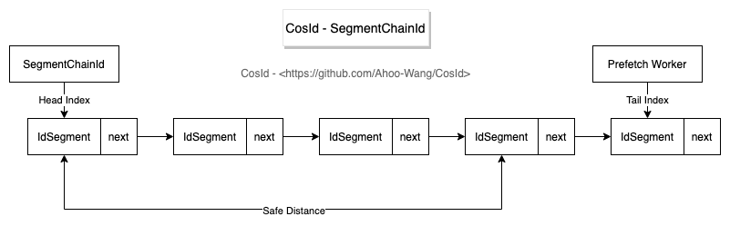
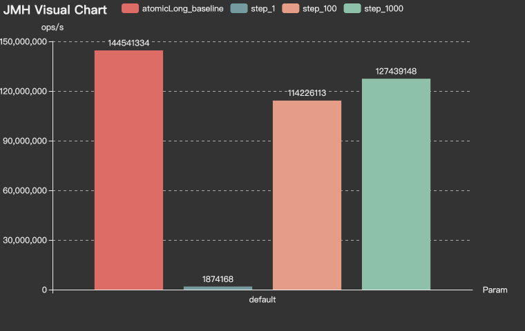
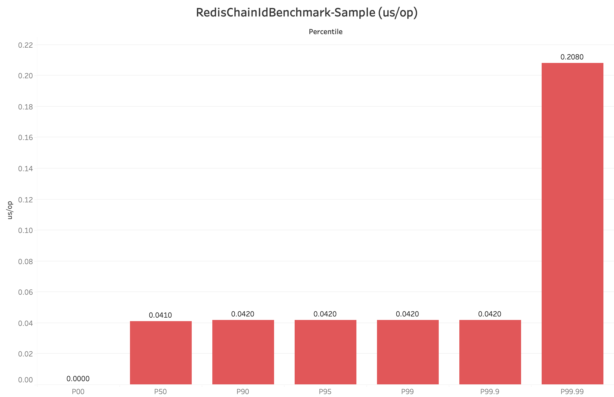
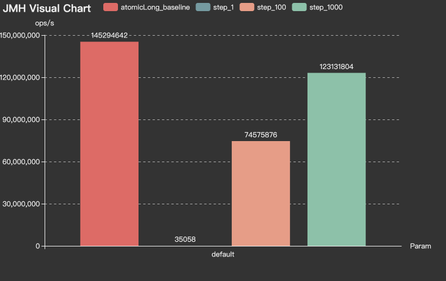
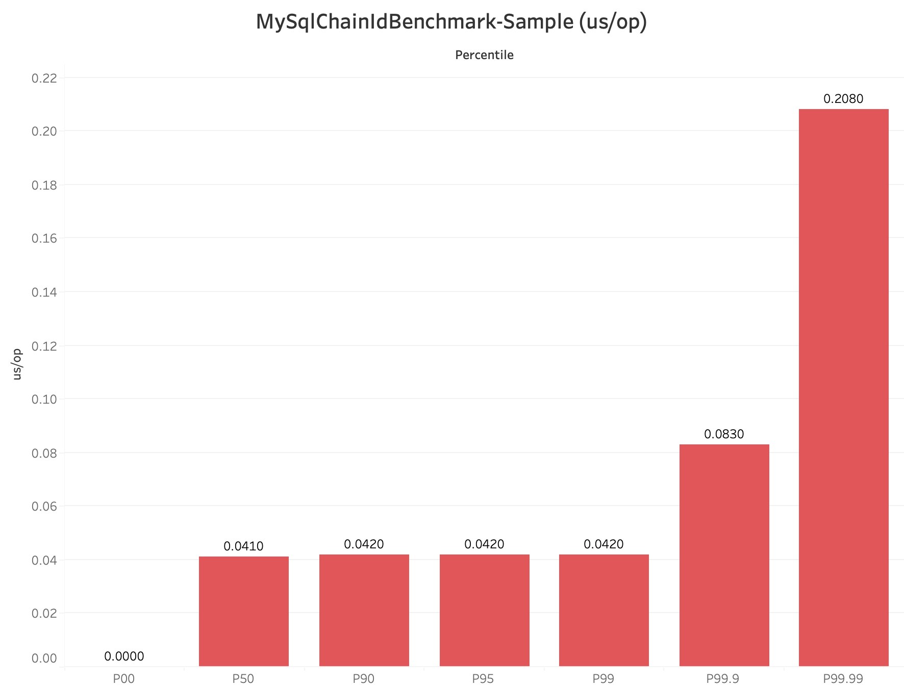

# [CosId](https://github.com/Ahoo-Wang/CosId) 通用、灵活、高性能的分布式 ID 生成器

> [English Document](https://github.com/Ahoo-Wang/CosId/blob/main/README.md)

## 介绍

*[CosId](https://github.com/Ahoo-Wang/CosId)* 旨在提供通用、灵活、高性能的分布式 ID 生成器。 目前提供了俩类 ID 生成器：

- `SnowflakeId` : *单机 TPS 性能：409W/s* [JMH 基准测试](https://github.com/Ahoo-Wang/CosId/blob/main/README.zh-CN.md#jmh-benchmark) , 主要解决 *时钟回拨问题* 、*机器号分配问题* 并且提供更加友好、灵活的使用体验。
- `SegmentId`: 每次获取一段 (`Step`) ID，来降低号段分发器的网络IO请求频次提升性能。
  - `IdSegmentDistributor`: 号段分发器（号段存储器）
    - `RedisIdSegmentDistributor`: 基于 *Redis* 的号段分发器。
    - `JdbcIdSegmentDistributor`: 基于 *Jdbc* 的号段分发器，支持各种关系型数据库。
  - `SegmentChainId`(**推荐**):`SegmentChainId` (*lock-free*) 是对 `SegmentId` 的增强。性能可达到近似 `AtomicLong` 的 *TPS 性能:12743W+/s* [JMH 基准测试](https://github.com/Ahoo-Wang/CosId/blob/main/README.zh-CN.md#jmh-benchmark) 。
    - `PrefetchWorker` 维护安全距离(`safeDistance`), 并且支持基于饥饿状态的动态`safeDistance`扩容/收缩。 

## SnowflakeId


> *SnowflakeId* 使用 `Long` （64 bits） 位分区来生成 ID 的一种分布式 ID 算法。
> 通用的位分配方案为：`timestamp` (41 bits) + `machineId` (10 bits) + `sequence` (12 bits) = 63 bits 。

- 41 位 `timestamp` = (1L<<41)/(1000/3600/365) 约可以存储 69 年的时间戳，即可以使用的绝对时间为 `EPOCH` + 69 年，一般我们需要自定义 `EPOCH`
  为产品开发时间，另外还可以通过压缩其他区域的分配位数，来增加时间戳位数来延长可用时间。
- 10 位 `machineId` = (1L<<10) = 1024 即相同业务可以部署 1024 个副本 (在 Kubernetes 概念里没有主从副本之分，这里直接沿用 Kubernetes 的定义)
  实例，一般情况下没有必要使用这么多位，所以会根据部署规模需要重新定义。
- 12 位 `sequence` = (1L<<12) * 1000 = 4096000 即单机每秒可生成约 409W 的 ID，全局同业务集群可产生 4096000*1024=419430W=41.9亿(TPS)。

从 *SnowflakeId* 设计上可以看出:

- :thumbsup: `timestamp` 在高位，所以 *SnowflakeId* 是本机单调递增的，受全局时钟同步影响 *SnowflakeId* 是全局趋势递增的。
- :thumbsup: *SnowflakeId* 不对任何第三方中间件有强依赖关系，并且性能也非常高。
- :thumbsup: 位分配方案可以按照业务系统需要灵活配置，来达到最优使用效果。
- :thumbsdown: 强依赖本机时钟，潜在的时钟回拨问题会导致 ID 重复。
- :thumbsdown: `machineId` 需要手动设置，实际部署时如果采用手动分配 `machineId`，会非常低效。

---

*[CosId-SnowflakeId](https://github.com/Ahoo-Wang/CosId/tree/main/cosid-core/src/main/java/me/ahoo/cosid/snowflake)*
主要解决 *SnowflakeId* 俩大问题：机器号分配问题、时钟回拨问题。 并且提供更加友好、灵活的使用体验。

### MachineIdDistributor (MachineId 分配器)

> 目前 *[CosId](https://github.com/Ahoo-Wang/CosId)* 提供了以下三种 `MachineId` 分配器。

#### ManualMachineIdDistributor

```yaml
cosid:
  snowflake:
    machine:
      distributor:
        type: manual
        manual:
          machine-id: 0
```

> 手动分配 `MachineId`。

#### StatefulSetMachineIdDistributor

```yaml
cosid:
  snowflake:
    machine:
      distributor:
        type: stateful_set
```

> 使用 `Kubernetes` 的 `StatefulSet` 提供的稳定的标识 ID 作为机器号。

#### RedisMachineIdDistributor


```yaml
cosid:
  snowflake:
    machine:
      distributor:
        type: redis
```

> 使用 `Redis` 作为机器号的分发存储。

### ClockBackwardsSynchronizer (时钟回拨同步器)

```yaml
cosid:
  snowflake:
    clock-backwards:
      spin-threshold: 10
      broken-threshold: 2000
```

默认提供的 `DefaultClockBackwardsSynchronizer` 时钟回拨同步器使用主动等待同步策略，`spinThreshold`(默认值 10 毫秒) 用于设置自旋等待阈值， 当大于`spinThreshold`
时使用线程休眠等待时钟同步，如果超过`brokenThreshold`(默认值 2 秒)时会直接抛出`ClockTooManyBackwardsException`异常。

### MachineStateStorage (机器状态存储)

```java
public class MachineState {
    public static final MachineState NOT_FOUND = of(-1, -1);
    private final int machineId;
    private final long lastTimeStamp;

    public MachineState(int machineId, long lastTimeStamp) {
        this.machineId = machineId;
        this.lastTimeStamp = lastTimeStamp;
    }

    public int getMachineId() {
        return machineId;
    }

    public long getLastTimeStamp() {
        return lastTimeStamp;
    }

    public static MachineState of(int machineId, long lastStamp) {
        return new MachineState(machineId, lastStamp);
    }
}
```

```yaml
cosid:
  snowflake:
    machine:
      state-storage:
        local:
          state-location: ./cosid-machine-state/
```

默认提供的 `LocalMachineStateStorage` 本地机器状态存储，使用本地文件存储机器号、最近一次时间戳，用作 `MachineState` 缓存。

### ClockSyncSnowflakeId (主动时钟同步 `SnowflakeId`)

```yaml
cosid:
  snowflake:
    share:
      clock-sync: true
```

默认 `SnowflakeId` 当发生时钟回拨时会直接抛出 `ClockBackwardsException` 异常，而使用 `ClockSyncSnowflakeId` 会使用 `ClockBackwardsSynchronizer` 主动等待时钟同步来重新生成 ID，提供更加友好的使用体验。

### SafeJavaScriptSnowflakeId (`JavaScript` 安全的 `SnowflakeId`)

```java
SnowflakeId snowflakeId=SafeJavaScriptSnowflakeId.ofMillisecond(1);
```

`JavaScript` 的 `Number.MAX_SAFE_INTEGER` 只有 53 位，如果直接将 63 位的 `SnowflakeId` 返回给前端，那么会值溢出的情况，通常我们可以将`SnowflakeId`
转换为 `String` 类型或者自定义 `SnowflakeId` 位分配来缩短 `SnowflakeId` 的位数 使 `ID` 提供给前端时不溢出。

### SnowflakeFriendlyId (可以将 `SnowflakeId` 解析成可读性更好的 `SnowflakeIdState` )

```yaml
cosid:
  snowflake:
    share:
      friendly: true
```

```java
public class SnowflakeIdState {

    private final long id;

    private final int machineId;

    private final long sequence;

    private final LocalDateTime timestamp;
    /**
     * {@link #timestamp}-{@link #machineId}-{@link #sequence}
     */
    private final String friendlyId;
}
```

```java
public interface SnowflakeFriendlyId extends SnowflakeId {

    SnowflakeIdState friendlyId(long id);

    SnowflakeIdState ofFriendlyId(String friendlyId);

    default SnowflakeIdState friendlyId() {
        long id = generate();
        return friendlyId(id);
    }
}
```

```java
        SnowflakeFriendlyId snowflakeFriendlyId=new DefaultSnowflakeFriendlyId(snowflakeId);
        SnowflakeIdState idState=snowflakeFriendlyId.friendlyId();
        idState.getFriendlyId(); //20210623131730192-1-0
```

## SegmentId (号段模式)


### RedisIdSegmentDistributor (使用`Redis`作为号段分发后端存储)

```yaml
cosid:
  segment:
    enabled: true
    distributor:
      type: redis
```

### JdbcIdSegmentDistributor (使用关系型数据库`Db`作为号段分发后端存储)

> 初始化 `cosid` table

```mysql
create table if not exists cosid
(
    name            varchar(100) not null comment '{namespace}.{name}',
    last_max_id     bigint       not null default 0,
    last_fetch_time bigint       not null,
    constraint cosid_pk
        primary key (name)
) engine = InnoDB;

```

```yaml
spring:
  datasource:
    url: jdbc:mysql://localhost:3306/test_db
    username: root
    password: root
cosid:
  segment:
    enabled: true
    distributor:
      type: jdbc
      jdbc:
        enable-auto-init-cosid-table: false
        enable-auto-init-id-segment: true
```

开启 `enable-auto-init-id-segment:true` 之后，应用启动时会尝试创建 `idSegment` 记录，避免手动创建。类似执行了以下初始化sql脚本，不用担心误操作，因为 `name` 是主键。

```mysql
insert into cosid
    (name, last_max_id, last_fetch_time)
    value
    ('namespace.name', 0, unix_timestamp());
```

### SegmentChainId (号段链模式)



```yaml
cosid:
  segment:
    enabled: true
    mode: chain
    chain:
      safe-distance: 5
      prefetch-worker:
        core-pool-size: 2
        prefetch-period: 1s
```

## IdGeneratorProvider

```yaml
cosid:
  snowflake:
    provider:
      bizA:
        #      epoch:
        #      timestamp-bit:
        sequence-bit: 12
      bizB:
        #      epoch:
        #      timestamp-bit:
        sequence-bit: 12
```

```java
IdGenerator idGenerator=idGeneratorProvider.get("bizA");
```

在实际使用中我们一般不会所有业务服务使用同一个 `IdGenerator` ，而是不同的业务使用不同的 `IdGenerator`，那么 `IdGeneratorProvider`就是为了解决这个问题而存在的，他是 `IdGenerator` 的容器，可以通过业务名来获取相应的 `IdGenerator`。

## Examples

[CosId-Examples](https://github.com/Ahoo-Wang/CosId/tree/main/cosid-rest-api)

> http://localhost:8080/swagger-ui/index.html#/

## 安装

### Gradle

> Kotlin DSL

``` kotlin
    val cosidVersion = "1.3.2";
    implementation("me.ahoo.cosid:spring-boot-starter-cosid:${cosidVersion}")
```

### Maven

```xml
<?xml version="1.0" encoding="UTF-8"?>

<project xmlns="http://maven.apache.org/POM/4.0.0"
         xmlns:xsi="http://www.w3.org/2001/XMLSchema-instance"
         xsi:schemaLocation="http://maven.apache.org/POM/4.0.0 http://maven.apache.org/xsd/maven-4.0.0.xsd">

    <modelVersion>4.0.0</modelVersion>
    <artifactId>demo</artifactId>
    <properties>
        <cosid.version>1.3.2</cosid.version>
    </properties>

    <dependencies>
        <dependency>
            <groupId>me.ahoo.cosid</groupId>
            <artifactId>spring-boot-starter-cosid</artifactId>
            <version>${cosid.version}</version>
        </dependency>
    </dependencies>

</project>
```

### application.yaml

```yaml
spring:
  application:
    name: ${service.name:cosid-example}
  datasource:
    url: jdbc:mysql://localhost:3306/test_db
    username: root
    password: root
  redis:
    url: redis://localhost:6379
cosid:
  namespace: ${spring.application.name}
  snowflake:
    enabled: true
    #    epoch: 1577203200000
    clock-backwards:
      spin-threshold: 10
      broken-threshold: 2000
    machine:
      #      stable: true
      #      machine-bit: 10
      #      instance-id: ${HOSTNAME}
      distributor:
        type: redis
      #        manual:
      #          machine-id: 0
      state-storage:
        local:
          state-location: ./cosid-machine-state/
    share:
      clock-sync: true
      friendly: true
    provider:
      bizA:
        #        timestamp-bit:
        sequence-bit: 12
      bizB:
        #        timestamp-bit:
        sequence-bit: 12
  segment:
    enabled: true
    mode: chain
    chain:
      safe-distance: 5
      prefetch-worker:
        core-pool-size: 2
        prefetch-period: 1s
    distributor:
      type: redis
    share:
      offset: 0
      step: 100
    provider:
      bizC:
        offset: 10000
        step: 100
      bizD:
        offset: 10000
        step: 100
```

## JMH-Benchmark

- 基准测试运行环境：笔记本开发机 ( MacBook Pro (M1) )
- 所有基准测试都在开发笔记本上执行。
- Redis 部署环境也在该笔记本开发机上。

### SnowflakeId

``` shell
gradle cosid-core:jmh
# or
java -jar cosid-core/build/libs/cosid-core-1.3.2-jmh.jar -bm thrpt -wi 1 -rf json -f 1
```

```
Benchmark                                                    Mode  Cnt        Score   Error  Units
SnowflakeIdBenchmark.millisecondSnowflakeId_friendlyId      thrpt       4020311.665          ops/s
SnowflakeIdBenchmark.millisecondSnowflakeId_generate        thrpt       4095403.859          ops/s
SnowflakeIdBenchmark.safeJsMillisecondSnowflakeId_generate  thrpt        511654.048          ops/s
SnowflakeIdBenchmark.safeJsSecondSnowflakeId_generate       thrpt        539818.563          ops/s
SnowflakeIdBenchmark.secondSnowflakeId_generate             thrpt       4206843.941          ops/s
```

### RedisChainIdBenchmark

#### Throughput (ops/s)



``` shell
gradle cosid-redis:jmh
# or
java -jar cosid-redis/build/libs/cosid-redis-1.3.2-jmh.jar -bm thrpt -wi 1 -rf json -f 1 RedisChainIdBenchmark
```

```
Benchmark                                   Mode  Cnt          Score          Error  Units
RedisChainIdBenchmark.atomicLong_baseline  thrpt    5  144541334.198 ±  5578137.471  ops/s
RedisChainIdBenchmark.step_1               thrpt    5    1874168.687 ±   310274.706  ops/s
RedisChainIdBenchmark.step_100             thrpt    5  114226113.524 ± 15789563.078  ops/s
RedisChainIdBenchmark.step_1000            thrpt    5  127439148.104 ±  1833743.699  ops/s
```

#### Percentile-Sample (*P9999=0.208微秒*)

> [百分位数](https://zh.wikipedia.org/wiki/%E7%99%BE%E5%88%86%E4%BD%8D%E6%95%B0) ，统计学术语，若将一组数据从小到大排序，并计算相应的累计百分点，则某百分点所对应数据的值，就称为这百分点的百分位数，以Pk表示第k百分位数。百分位数是用来比较个体在群体中的相对地位量数。



```shell
java -jar cosid-redis/build/libs/cosid-redis-1.3.2-jmh.jar -bm sample -wi 1 -rf json -f 1 -tu us step_1000
```

```
Benchmark                                            Mode      Cnt   Score    Error  Units
RedisChainIdBenchmark.step_1000                    sample  1336271   0.024 ±  0.001  us/op
RedisChainIdBenchmark.step_1000:step_1000·p0.00    sample              ≈ 0           us/op
RedisChainIdBenchmark.step_1000:step_1000·p0.50    sample            0.041           us/op
RedisChainIdBenchmark.step_1000:step_1000·p0.90    sample            0.042           us/op
RedisChainIdBenchmark.step_1000:step_1000·p0.95    sample            0.042           us/op
RedisChainIdBenchmark.step_1000:step_1000·p0.99    sample            0.042           us/op
RedisChainIdBenchmark.step_1000:step_1000·p0.999   sample            0.042           us/op
RedisChainIdBenchmark.step_1000:step_1000·p0.9999  sample            0.208           us/op
RedisChainIdBenchmark.step_1000:step_1000·p1.00    sample           37.440           us/op
```

### MySqlChainIdBenchmark

#### Throughput (ops/s)



``` shell
gradle cosid-jdbc:jmh
# or
java -jar cosid-jdbc/build/libs/cosid-jdbc-1.3.2-jmh.jar -bm thrpt -wi 1 -rf json -f 1 MySqlChainIdBenchmark
```

```
Benchmark                                   Mode  Cnt          Score         Error  Units
MySqlChainIdBenchmark.atomicLong_baseline  thrpt    5  145294642.937 ±  224876.284  ops/s
MySqlChainIdBenchmark.step_1               thrpt    5      35058.790 ±   36226.041  ops/s
MySqlChainIdBenchmark.step_100             thrpt    5   74575876.804 ± 5590390.811  ops/s
MySqlChainIdBenchmark.step_1000            thrpt    5  123131804.260 ± 1488004.409  ops/s
```

#### Percentile-Sample (*P9999=0.208微秒*)



```shell
java -jar cosid-jdbc/build/libs/cosid-jdbc-1.3.2-jmh.jar -bm sample -wi 1 -rf json -f 1 -tu us step_1000
```
```
Benchmark                                            Mode      Cnt    Score   Error  Units
MySqlChainIdBenchmark.step_1000                    sample  1286774    0.024 ± 0.001  us/op
MySqlChainIdBenchmark.step_1000:step_1000·p0.00    sample               ≈ 0          us/op
MySqlChainIdBenchmark.step_1000:step_1000·p0.50    sample             0.041          us/op
MySqlChainIdBenchmark.step_1000:step_1000·p0.90    sample             0.042          us/op
MySqlChainIdBenchmark.step_1000:step_1000·p0.95    sample             0.042          us/op
MySqlChainIdBenchmark.step_1000:step_1000·p0.99    sample             0.042          us/op
MySqlChainIdBenchmark.step_1000:step_1000·p0.999   sample             0.083          us/op
MySqlChainIdBenchmark.step_1000:step_1000·p0.9999  sample             0.208          us/op
MySqlChainIdBenchmark.step_1000:step_1000·p1.00    sample           342.528          us/op
```
