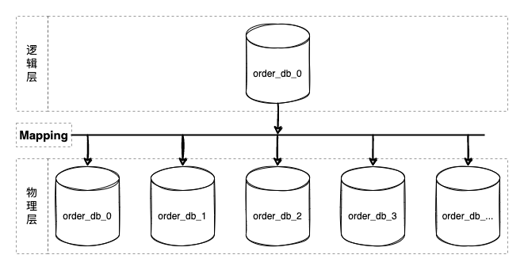
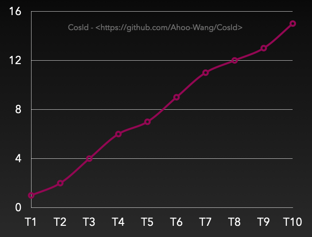
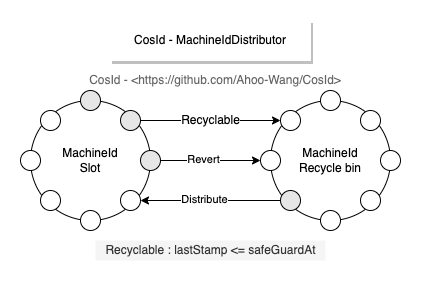
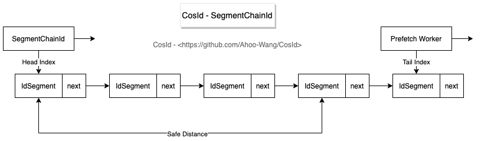
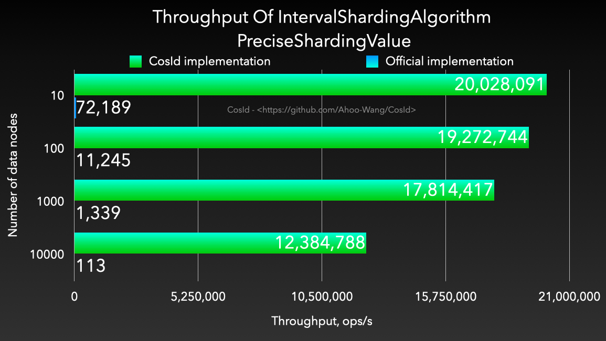
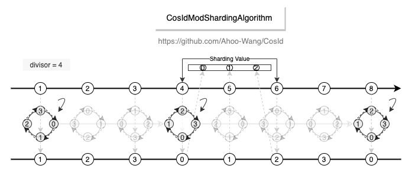
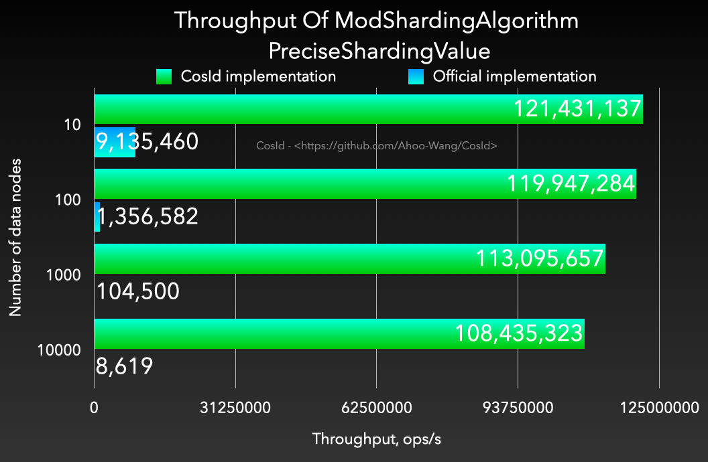
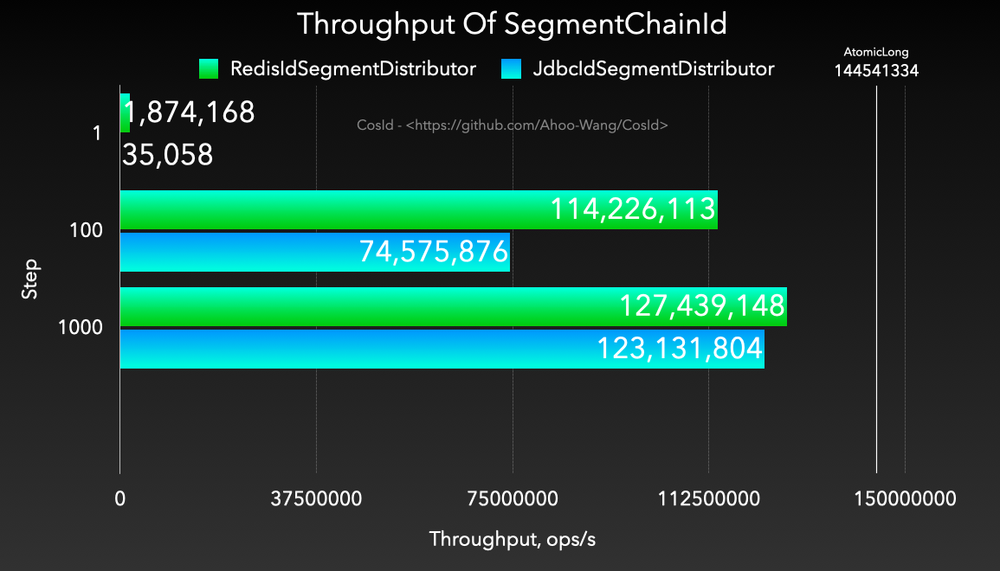
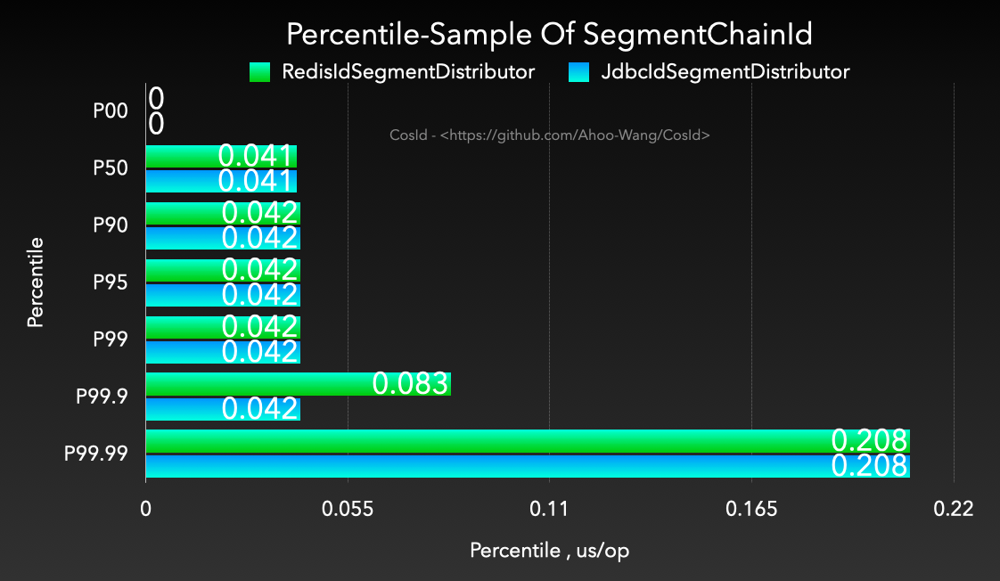

<p align="center" style="text-align:center">
  
</p>

# [CosId](https://cosid.ahoo.me/) 通用、灵活、高性能分布式 ID 生成器

[](https://www.apache.org/licenses/LICENSE-2.0.html)
[](https://github.com/Ahoo-Wang/CosId/releases)
[](https://maven-badges.herokuapp.com/maven-central/me.ahoo.cosid/cosid-core)
[](https://app.codacy.com/gh/Ahoo-Wang/CosId?utm_source=github.com&utm_medium=referral&utm_content=Ahoo-Wang/CosId&utm_campaign=Badge_Grade_Settings)
[](https://codecov.io/gh/Ahoo-Wang/CosId)


> [English Document](https://github.com/Ahoo-Wang/CosId/blob/main/README.md)

## 简介

*[CosId](https://github.com/Ahoo-Wang/CosId)* 旨在提供通用、灵活、高性能的分布式 ID 生成器。 

- `CosIdGenerator` : *单机 TPS 性能：1557W/s*，三倍于 `UUID.randomUUID()`，基于时钟的全局趋势递增ID。
- `SnowflakeId` : *单机 TPS 性能：409W/s* [JMH 基准测试](https://cosid.ahoo.me/guide/perf-test.html) , 主要解决 *时钟回拨问题* 、*机器号分配问题*、*取模分片不均匀问题* 并且提供更加友好、灵活的使用体验。
- `SegmentId`: 每次获取一段 (`Step`) ID，来降低号段分发器的网络IO请求频次提升性能。
  - `IdSegmentDistributor`: 号段分发器（号段存储器）
    - `RedisIdSegmentDistributor`: 基于 *Redis* 的号段分发器。
    - `JdbcIdSegmentDistributor`: 基于 *Jdbc* 的号段分发器，支持各种关系型数据库。
    - `ZookeeperIdSegmentDistributor`: 基于 *Zookeeper* 的号段分发器。
- `SegmentChainId`(**推荐**):`SegmentChainId` (*lock-free*) 是对 `SegmentId` 的增强。性能可达到近似 `AtomicLong` 的 *TPS 性能:12743W+/s* [JMH 基准测试](https://cosid.ahoo.me/guide/perf-test.html) 。
  - `PrefetchWorker` 维护安全距离(`safeDistance`), 并且支持基于饥饿状态的动态`safeDistance`扩容/收缩。

## [快速开始](https://cosid.ahoo.me/guide/getting-started.html)

## 背景（为什么需要*分布式ID*）

在软件系统演进过程中，随着业务规模的增长 (TPS/存储容量)，我们需要通过集群化部署来分摊计算、存储压力。
应用服务的无状态设计使其具备了伸缩性。在使用 **Kubernetes** 部署时我们只需要一行命令即可完成服务伸缩
(`kubectl scale --replicas=5 deployment/order-service`)。

但对于有状态的数据库就不那么容易了，此时数据库变成系统的性能瓶颈是显而易见的。

### 分库分表

> 从微服务的角度来理解垂直拆分其实就是微服务拆分。以限界上下文来定义服务边界将大服务/单体应用拆分成多个自治的粒度更小的服务，因为自治性规范要求，数据库也需要进行业务拆分。
> 但垂直拆分后的单个微服务依然会面临 TPS/存储容量 的挑战，所以这里我们重点讨论水平拆分的方式。

<p align="center" >
  
</p>

数据库分库分表方案是逻辑统一，物理分区自治的方案。其核心设计在于中间层映射方案的设计 (上图 **Mapping**)，即分片算法的设计。
几乎所有编程语言都内置实现了散列表(java:`HashMap`/csharp:`Dictionary`/python:`dict`/go:`map` ...)。分片算法跟散列表高度相似(`hashCode`)，都得通过 `key`/`shardingValue` 映射到对应的槽位(`slot`)。

那么 `shardingValue` 从哪里来呢？**CosId**！！！

> 当然还有很多分布式场景需要*分布式ID*，这里不再一一列举。

## 分布式ID方案的核心指标

- **全局（相同业务）唯一性**：唯一性保证是**ID**的必要条件，假设ID不唯一就会产生主键冲突，这点很容易可以理解。
  - 通常所说的全局唯一性并不是指所有业务服务都要唯一，而是相同业务服务不同部署副本唯一。
    比如 Order 服务的多个部署副本在生成`t_order`这张表的`Id`时是要求全局唯一的。至于`t_order_item`生成的`ID`与`t_order`是否唯一，并不影响唯一性约束，也不会产生什么副作用。
    不同业务模块间也是同理。即唯一性主要解决的是ID冲突问题。
- **有序性**：有序性保证是面向查询的数据结构算法（除了Hash算法）所必须的，是**二分查找法**(分而治之)的前提。
  - MySq-InnoDB B+树是使用最为广泛的，假设 Id 是无序的，B+ 树 为了维护 ID 的有序性，就会频繁的在索引的中间位置插入而挪动后面节点的位置，甚至导致频繁的页分裂，这对于性能的影响是极大的。那么如果我们能够保证ID的有序性这种情况就完全不同了，只需要进行追加写操作。所以 ID 的有序性是非常重要的，也是ID设计不可避免的特性。
- **吞吐量/性能(ops/time)**：即单位时间（每秒）能产生的ID数量。生成ID是非常高频的操作，也是最为基本的。假设ID生成的性能缓慢，那么不管怎么进行系统优化也无法获得更好的性能。
  - 一般我们会首先生成ID，然后再执行写入操作，假设ID生成缓慢，那么整体性能上限就会受到限制，这一点应该不难理解。
- **稳定性(time/op)**：稳定性指标一般可以采用**每个操作的时间进行百分位采样**来分析，比如 *[CosId](https://github.com/Ahoo-Wang/CosId)* 百分位采样 **P9999=0.208 us/op**，即 **0% ~ 99.99%** 的单位操作时间小于等于  **0.208 us/op**。
  - [百分位数 WIKI](https://zh.wikipedia.org/wiki/%E7%99%BE%E5%88%86%E4%BD%8D%E6%95%B0) ：统计学术语，若将一组数据从小到大排序，并计算相应的累计百分点，则某百分点所对应数据的值，就称为这百分点的百分位数，以Pk表示第k百分位数。百分位数是用来比较个体在群体中的相对地位量数。
  - 为什么不用平均*每个操作的时间*：马老师的身价跟你的身价能平均么？平均后的值有意义不？
  - 可以使用最小*每个操作的时间*、最大*每个操作的时间*作为参考吗？因为最小、最大值只说明了零界点的情况，虽说可以作为稳定性的参考，但依然不够全面。而且*百分位数*已经覆盖了这俩个指标。
- **自治性（依赖）**：主要是指对外部环境有无依赖，比如**号段模式**会强依赖第三方存储中间件来获取`NexMaxId`。自治性还会对可用性造成影响。
- **可用性**：分布式ID的可用性主要会受到自治性影响，比如**SnowflakeId**会受到时钟回拨影响，导致处于短暂时间的不可用状态。而**号段模式**会受到第三方发号器（`NexMaxId`）的可用性影响。
  - [可用性 WIKI](https://zh.wikipedia.org/wiki/%E5%8F%AF%E7%94%A8%E6%80%A7) ：在一个给定的时间间隔内，对于一个功能个体来讲，总的可用时间所占的比例。
  - MTBF：平均故障间隔
  - MDT：平均修复/恢复时间
  - Availability=MTBF/(MTBF+MDT)
  - 假设MTBF为1年，MDT为1小时，即`Availability=(365*24)/(365*24+1)=0.999885857778792≈99.99%`，也就是我们通常所说对可用性4个9。
- **适应性**：是指在面对外部环境变化的自适应能力，这里我们主要说的是面对流量突发时动态伸缩分布式ID的性能，
  - **SegmentChainId**可以基于**饥饿状态**进行**安全距离**的动态伸缩。
  - **SnowflakeId**常规位分配方案性能恒定409.6W，虽然可以通过调整位分配方案来获得不同的TPS性能，但是位分配方法的变更是破坏性的，一般根据业务场景确定位分配方案后不再变更。
- **存储空间**：还是用MySq-InnoDB B+树来举例，普通索引（二级索引）会存储主键值，主键越大占用的内存缓存、磁盘空间也会越大。Page页存储的数据越少，磁盘IO访问的次数会增加。总之在满足业务需求的情况下，尽可能小的存储空间占用在绝大多数场景下都是好的设计原则。

### 不同分布式ID方案核心指标对比

|     分布式ID      | 全局唯一性 |             有序性             |              吞吐量 | 稳定性（1s=1000,000us）  |    自治性     |                   可用性                    | 适应性 |  存储空间   |
|:--------------:|:-----:|:---------------------------:|-----------------:|:--------------------|:----------:|:----------------------------------------:|:---:|:-------:|
|   UUID/GUID    |   是   |            完全无序             |   3078638(ops/s) | P9999=0.325(us/op)  |    完全自治    |                   100%                   |  否  | 128-bit |
|  SnowflakeId   |   是   |   本地单调递增，全局趋势递增(受全局时钟影响)    |   4096000(ops/s) | P9999=0.244(us/op)  |    依赖时钟    |               时钟回拨会导致短暂不可用               |  否  | 64-bit  |
|   SegmentId    |   是   |   本地单调递增，全局趋势递增(受Step影响)    |  29506073(ops/s) | P9999=46.624(us/op) | 依赖第三方号段分发器 |               受号段分发器可用性影响                |  否  | 64-bit  |
| SegmentChainId |   是   | 本地单调递增，全局趋势递增(受Step、安全距离影响) | 127439148(ops/s) | P9999=0.208(us/op)  | 依赖第三方号段分发器 | 受号段分发器可用性影响，但因安全距离存在，预留ID段，所以高于SegmentId |  是  | 64-bit  |

### 有序性(要想分而治之·二分查找法，必须要维护我)

刚刚我们已经讨论了ID有序性的重要性，所以我们设计ID算法时应该尽可能地让ID是单调递增的，比如像表的自增主键那样。但是很遗憾，因全局时钟、性能等分布式系统问题，我们通常只能选择局部单调递增、全局趋势递增的组合（就像我们在分布式系统中不得不的选择最终一致性那样）以获得多方面的权衡。下面我们来看一下什么是单调递增与趋势递增。

#### 有序性之单调递增

<p align="center">
     
</p>

单调递增：T表示全局绝对时点，假设有T<sub>n+1</sub>>T<sub>n</sub>（绝对时间总是往前进的，这里不考虑相对论、时间机器等），那么必然有F(T<sub>n+1</sub>)>F(T<sub>n</sub>)，数据库自增主键就属于这一类。
另外需要特别说明的是单调递增跟连续性递增是不同的概念。 连续性递增：`F(n+1)=(F(n)+step)`即下一次获取的ID一定等于当前`ID+Step`，当`Step=1`时类似于这样一个序列:`1->2->3->4->5`。

> 扩展小知识：数据库的自增主键也不是连续性递增的，相信你一定遇到过这种情况，请思考一下数据库为什么这样设计？

#### 有序性之趋势递增

<p align="center">
     
</p>

趋势递增：T<sub>n</sub>>T<sub>n-s</sub>，那么大概率有F(T<sub>n</sub>)>F(T<sub>n-s</sub>)。虽然在一段时间间隔内有乱序，但是整体趋势是递增。从上图上看，是有上升趋势的（趋势线）。
- 在**SnowflakeId**中<sub>n-s</sub>受到全局时钟同步影响。
- 在号段模式(**SegmentId**)中<sub>n-s</sub>受到号段可用区间(`Step`)影响。

## 分布式ID分配方案

### UUID/GUID

- :thumbsup:不依赖任何第三方中间件
- :thumbsup:性能高
- :thumbsdown:完全无序
- :thumbsdown:空间占用大，需要占用128位存储空间。

UUID最大的缺陷是随机的、无序的，当用于主键时会导致数据库的主键索引效率低下（为了维护索引树，频繁的索引中间位置插入数据，而不是追加写）。这也是UUID不适用于数据库主键的最为重要的原因。

### SnowflakeId

<p align="center">
     
</p>

> *SnowflakeId*使用`Long`（64-bit）位分区来生成ID的一种分布式ID算法。
> 通用的位分配方案为：`timestamp`(41-bit)+`machineId`(10-bit)+`sequence`(12-bit)=63-bit。

- 41-bit`timestamp`=(1L<<41)/(1000/3600/24/365)，约可以存储69年的时间戳，即可以使用的绝对时间为`EPOCH`+69年，一般我们需要自定义`EPOCH`为产品开发时间，另外还可以通过压缩其他区域的分配位数，来增加时间戳位数来延长可用时间。
- 10-bit`machineId`=(1L<<10)=1024，即相同业务可以部署1024个副本(在Kubernetes概念里没有主从副本之分，这里直接沿用Kubernetes的定义)。一般情况下没有必要使用这么多位，所以会根据部署规模需要重新定义。
- 12-bit`sequence`=(1L<<12)*1000=4096000，即单机每秒可生成约409W的ID，全局同业务集群可产生`4096000*1024=419430W=41.9亿(TPS)`。

从 *SnowflakeId* 设计上可以看出:

- :thumbsup:`timestamp`在高位，单实例*SnowflakeId*是会保证时钟总是向前的（校验本机时钟回拨），所以是本机单调递增的。受全局时钟同步/时钟回拨影响*SnowflakeId*是全局趋势递增的。
- :thumbsup:*SnowflakeId*不对任何第三方中间件有强依赖关系，并且性能也非常高。
- :thumbsup:位分配方案可以按照业务系统需要灵活配置，来达到最优使用效果。
- :thumbsdown:强依赖本机时钟，潜在的时钟回拨问题会导致ID重复、处于短暂的不可用状态。
- :thumbsdown:`machineId`需要手动设置，实际部署时如果采用手动分配`machineId`，会非常低效。

#### SnowflakeId之机器号分配问题

在**SnowflakeId**中根据业务设计的位分配方案确定了基本上就不再有变更了，也很少需要维护。但是`machineId`总是需要配置的，而且集群中是不能重复的，否则分区原则就会被破坏而导致ID唯一性原则破坏，当集群规模较大时`machineId`的维护工作是非常繁琐，低效的。
> 有一点需要特别说明的，**SnowflakeId**的**MachineId**是逻辑上的概念，而不是物理概念。
> 想象一下假设**MachineId**是物理上的，那么意味着一台机器拥有只能拥有一个**MachineId**，那会产生什么问题呢？

> 目前 *[CosId](https://github.com/Ahoo-Wang/CosId)* 提供了以下五种 `MachineId` 分配器。

- ManualMachineIdDistributor: 手动配置`machineId`，一般只有在集群规模非常小的时候才有可能使用，不推荐。
- StatefulSetMachineIdDistributor: 使用`Kubernetes`的`StatefulSet`提供的稳定的标识ID（HOSTNAME=service-01）作为机器号。
- RedisMachineIdDistributor: 使用**Redis**作为机器号的分发存储，同时还会存储`MachineId`的上一次时间戳，用于**启动时时钟回拨**的检查。
- JdbcMachineIdDistributor: 使用**关系型数据库**作为机器号的分发存储，同时还会存储`MachineId`的上一次时间戳，用于**启动时时钟回拨**的检查。
- ZookeeperMachineIdDistributor: 使用**ZooKeeper**作为机器号的分发存储，同时还会存储`MachineId`的上一次时间戳，用于**启动时时钟回拨**的检查。

<p align="center">
     
</p>

<p align="center">
     
</p>

#### SnowflakeId之时钟回拨问题

时钟回拨的致命问题是会导致ID重复、冲突（这一点不难理解），ID重复显然是不能被容忍的。
在**SnowflakeId**算法中，按照**MachineId**分区ID，我们不难理解的是不同**MachineId**是不可能产生相同ID的。所以我们解决的时钟回拨问题是指当前**MachineId**的时钟回拨问题，而不是所有集群节点的时钟回拨问题。

**MachineId**时钟回拨问题大体可以分为俩种情况：

- 运行时时钟回拨：即在运行时获取的当前时间戳比上一次获取的时间戳小。这个场景的时钟回拨是很容易处理的，一般**SnowflakeId**代码实现时都会存储`lastTimestamp`用于运行时时钟回拨的检查，并抛出时钟回拨异常。
  - 时钟回拨时直接抛出异常是不太好地实践，因为下游使用方几乎没有其他处理方案（噢，我还能怎么办呢，等吧），时钟同步是唯一的选择，当只有一种选择时就不要再让用户选择了。
  - `ClockSyncSnowflakeId`是`SnowflakeId`的包装器，当发生时钟回拨时会使用`ClockBackwardsSynchronizer`主动等待时钟同步来重新生成ID，提供更加友好的使用体验。
- 启动时时钟回拨：即在启动服务实例时获取的当前时钟比上次关闭服务时小。此时的`lastTimestamp`是无法存储在进程内存中的。当获取的外部存储的**机器状态**大于当前时钟时钟时，会使用`ClockBackwardsSynchronizer`主动同步时钟。
  - LocalMachineStateStorage：使用本地文件存储`MachineState`(机器号、最近一次时间戳)。因为使用的是本地文件所以只有当实例的部署环境是稳定的，`LocalMachineStateStorage`才适用。
  - RedisMachineIdDistributor：将`MachineState`存储在**Redis**分布式缓存中，这样可以保证总是可以获取到上次服务实例停机时**机器状态**。

#### SnowflakeId之JavaScript数值溢出问题

`JavaScript`的`Number.MAX_SAFE_INTEGER`只有53-bit，如果直接将63位的`SnowflakeId`返回给前端，那么会产生值溢出的情况（所以这里我们应该知道后端传给前端的`long`值溢出问题，**迟早**会出现，只不过SnowflakeId出现得更快而已）。
很显然溢出是不能被接受的，一般可以使用以下俩种处理方案：
- 将生成的63-bit`SnowflakeId`转换为`String`类型。
  - 直接将`long`转换成`String`。
  - 使用`SnowflakeFriendlyId`将`SnowflakeId`转换成比较友好的字符串表示：`{timestamp}-{machineId}-{sequence} -> 20210623131730192-1-0`
- 自定义`SnowflakeId`位分配来缩短`SnowflakeId`的位数（53-bit）使 `ID` 提供给前端时不溢出
  - 使用`SafeJavaScriptSnowflakeId`(`JavaScript` 安全的 `SnowflakeId`)

## 号段模式（SegmentId）

<p align="center">
     
</p>

从上面的设计图中，不难看出**号段模式**基本设计思路是通过每次获取一定长度（Step）的可用ID（Id段/号段），来降低网络IO请求次数，提升性能。

- :thumbsdown:强依赖第三方号段分发器，可用性受到第三方分发器影响。
- :thumbsdown:每次号段用完时获取`NextMaxId`需要进行网络IO请求，此时的性能会比较低。
- 单实例ID单调递增，全局趋势递增。
  - 从设计图中不难看出**Instance 1**每次获取的`NextMaxId`，一定比上一次大，意味着下一次的号段一定比上一次大，所以从单实例上来看是单调递增的。
  - 多实例各自持有的不同的号段，意味着同一时刻不同实例生成的ID是乱序的，但是整体趋势的递增的，所以全局趋势递增。
- ID乱序程度受到Step长度以及集群规模影响（从趋势递增图中不难看出）。
  - 假设集群中只有一个实例时**号段模式**就是单调递增的。
  - `Step`越小，乱序程度越小。当`Step=1`时，将无限接近单调递增。需要注意的是这里是无限接近而非等于单调递增，具体原因你可以思考一下这样一个场景：
    - 号段分发器T<sub>1</sub>时刻给**Instance 1**分发了`ID=1`,T<sub>2</sub>时刻给**Instance 2**分发了`ID=2`。因为机器性能、网络等原因，`Instance 2`网络IO写请求先于`Instance 1`到达。那么这个时候对于数据库来说，ID依然是乱序的。

## 号段链模式（SegmentChainId）

[分布式ID(CosId)之号段链模式性能(1.2亿/s)解析](https://cosid.ahoo.me/guide/segment-chain.html)

<p align="center">
     
</p>

**SegmentChainId**是**SegmentId**增强版，相比于**SegmentId**有以下优势：

- 稳定性：**SegmentId**的稳定性问题（P9999=46.624(us/op)）主要是因为号段用完之后同步进行`NextMaxId`的获取导致的（会产生网络IO）。
  - **SegmentChainId** （P9999=0.208(us/op)）引入了新的角色**PrefetchWorker**用以维护和保证**安全距离**，理想情况下使得获取ID的线程几乎完全不需要进行同步的等待`NextMaxId`获取，性能可达到近似 `AtomicLong` 的 *TPS 性能:12743W+/s* [JMH 基准测试](https://github.com/Ahoo-Wang/CosId/blob/main/README.zh-CN.md#jmh-benchmark) 。
- 适应性：从**SegmentId**介绍中我们知道了影响**ID乱序**的因素有俩个：集群规模、`Step`大小。集群规模是我们不能控制的，但是`Step`是可以调节的。
  - `Step`应该近可能小才能使得**ID单调递增**的可能性增大。
  - `Step`太小会影响吞吐量，那么我们如何合理设置`Step`呢？答案是我们无法准确预估所有时点的吞吐量需求，那么最好的办法是吞吐量需求高时，Step自动增大，吞吐量低时Step自动收缩。
  - **SegmentChainId**引入了**饥饿状态**的概念，**PrefetchWorker**会根据**饥饿状态**检测当前**安全距离**是否需要膨胀或者收缩，以便获得吞吐量与有序性之间的权衡，这便是**SegmentChainId**的自适应性。

## 集成

### CosIdPlugin（MyBatis 插件）

> Kotlin DSL

``` kotlin
    implementation("me.ahoo.cosid:cosid-mybatis:${cosidVersion}")
```

```java
public class Order {

    @CosId(value = "order")
    private Long orderId;
    private Long userId;

    public Long getOrderId() {
        return orderId;
    }

    public void setOrderId(Long orderId) {
        this.orderId = orderId;
    }

    public Long getUserId() {
        return userId;
    }

    public void setUserId(Long userId) {
        this.userId = userId;
    }
}
```

### ShardingSphere 插件

> [cosid-shardingsphere](https://github.com/apache/shardingsphere/tree/master/features/sharding/plugin/cosid)

#### CosIdKeyGenerateAlgorithm (分布式主键)

```yaml
spring:
  shardingsphere:
    rules:
      sharding:
        key-generators:
          cosid:
            type: COSID
            props:
              id-name: __share__
```

#### 基于间隔的时间范围分片算法

<p align="center">
     
</p>

- 易用性: 支持多种数据类型 (`Long`/`LocalDateTime`/`DATE`/ `String` / `SnowflakeId`)，而官方实现是先转换成字符串再转换成`LocalDateTime`，转换成功率受时间格式化字符影响。
- 性能 : 相比于 `org.apache.shardingsphere.sharding.algorithm.sharding.datetime.IntervalShardingAlgorithm` 性能高出 *1200~4000* 倍。

| **PreciseShardingValue**                                                                                                                                                                  | **RangeShardingValue**                                                                                                                                                                |
|-------------------------------------------------------------------------------------------------------------------------------------------------------------------------------------------|---------------------------------------------------------------------------------------------------------------------------------------------------------------------------------------|
|  |  |

- CosIdIntervalShardingAlgorithm
  - type: COSID_INTERVAL
- SnowflakeIntervalShardingAlgorithm
  - type: COSID_INTERVAL_SNOWFLAKE

```yaml
spring:
  shardingsphere:
    rules:
      sharding:
        sharding-algorithms:
          alg-name:
            type: COSID_INTERVAL_{type_suffix}
            props:
              logic-name-prefix: logic-name-prefix
              id-name: cosid-name
              datetime-lower: 2021-12-08 22:00:00
              datetime-upper: 2022-12-01 00:00:00
              sharding-suffix-pattern: yyyyMM
              datetime-interval-unit: MONTHS
              datetime-interval-amount: 1
```

#### 取模分片算法

<p align="center">
     
</p>

- 性能 : 相比于 `org.apache.shardingsphere.sharding.algorithm.sharding.mod.ModShardingAlgorithm` 性能高出 *1200~4000* 倍。并且稳定性更高，不会出现严重的性能退化。

| **PreciseShardingValue**                                                                                                                                                        | **RangeShardingValue**                                                                                                                                                      |
|---------------------------------------------------------------------------------------------------------------------------------------------------------------------------------|-----------------------------------------------------------------------------------------------------------------------------------------------------------------------------|
|  |  |

```yaml
spring:
  shardingsphere:
    rules:
      sharding:
        sharding-algorithms:
          alg-name:
            type: COSID_MOD
            props:
              mod: 4
              logic-name-prefix: t_table_
```

## 性能测试报告

### SegmentChainId-吞吐量 (ops/s)

<p align="center" >
  
</p>

### SegmentChainId-每次操作耗时的百分位数(us/op)

> [百分位数](https://zh.wikipedia.org/wiki/%E7%99%BE%E5%88%86%E4%BD%8D%E6%95%B0) ，统计学术语，若将一组数据从小到大排序，并计算相应的累计百分点，则某百分点所对应数据的值，就称为这百分点的百分位数，以Pk表示第k百分位数。百分位数是用来比较个体在群体中的相对地位量数。

<p align="center" >
  
</p>
