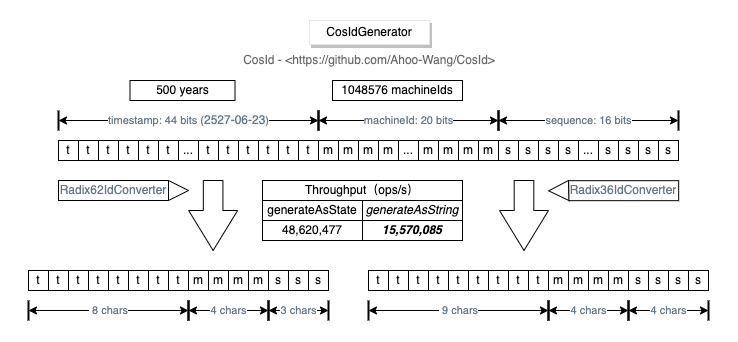

# CosIdGenerator

_CosIdGenerator_ *Single-machine TPS performance: 1557W/s*, three times that of `UUID.randomUUID()`, clock-based globally trend-increasing ID, can support one million instances simultaneously.

  

## Feature Introduction

- Globally trend-increasing
- Locally monotonically increasing
- High performance: 15,570,085 ops/s (generateAsString), 3 times that of `UUID.randomUUID()`
- Reverse parse ID state (timestamp, machine ID, sequence number)
- Easy to extend
- Smaller storage space: 15 characters
- Supports one million instances simultaneously

Based on the above features, _CosIdGenerator_ is particularly suitable for globally unique ID generation in large-scale cluster scenarios.

## Radix36CosIdGenerator

*CosId generator* formatted using base-36

`[timestamp(44)]-[machineId(20)]-[sequence(16)] = 80 BITS = 17 CHARS=[timestamp(8)]-[machineId(4)]-[sequence(3)]`

- Timestamp reduced from original 44 bits to 8 bits
- Machine ID reduced from original 20 bits to 4 bits
- Sequence number reduced from original 16 bits to 3 bits

## Radix62CosIdGenerator

*CosId generator* formatted using base-62

`[timestamp(44)]-[machineId-(20)]-[sequence-(16)] = 80 BITS = 15 CHARS=[timestamp(9)]-[machineId(4)]-[sequence(4)]`

- Timestamp reduced from original 44 bits to 9 bits
- Machine ID reduced from original 20 bits to 4 bits
- Sequence number reduced from original 16 bits to 3 bits

## Configuration

[CosIdGenerator Configuration](../reference/config/cosid-generator.md)
