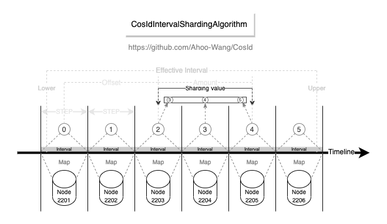
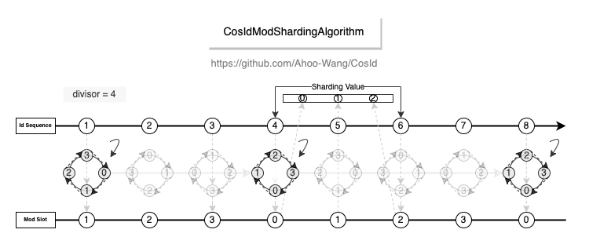

# CosId-ShardingSphere Module

::: tip Maintenance Note
`CosIdKeyGenerateAlgorithm`, `CosIdModShardingAlgorithm`, `CosIdIntervalShardingAlgorithm` have been merged into the official [ShardingSphere](https://github.com/apache/shardingsphere/pull/14132), and the maintenance of this module may be primarily handled by the official team.
:::

## Installation

::: code-group
```kotlin [Gradle(Kotlin)]
    val cosidVersion = "latestVersion"
    implementation("me.ahoo.cosid:cosid-shardingsphere:${cosidVersion}")
```
```xml [Maven]
    <dependencies>
        <dependency>
            <groupId>me.ahoo.cosid</groupId>
            <artifactId>cosid-shardingsphere</artifactId>
            <version>${cosid.version}</version>
        </dependency>
    </dependencies>
```
:::

## Distributed Primary Key

```yaml
spring:
  shardingsphere:
    rules:
      sharding:
        key-generators:
          cosid:
            type: COSID
            props:
              id-name: __share__
```

## Interval-based Time Range Sharding Algorithm

<p align="center" >
  
</p>

- Usability: Supports multiple data types (`Long`/`LocalDateTime`/`DATE`/ `String` / `SnowflakeId`), while the official implementation converts to string first then to `LocalDateTime`, and the conversion success rate is affected by time formatting characters.
- Performance: Compared to `org.apache.shardingsphere.sharding.algorithm.sharding.datetime.IntervalShardingAlgorithm`, performance is *1200~4000* times higher.

| **PreciseShardingValue**                                                                                        | **RangeShardingValue**                                                                                        |
|-----------------------------------------------------------------------------------------------------------------|---------------------------------------------------------------------------------------------------------------|
|  |  |

- CosIdIntervalShardingAlgorithm
    - type: COSID_INTERVAL
- SnowflakeIntervalShardingAlgorithm
    - type: COSID_INTERVAL_SNOWFLAKE

```yaml
spring:
  shardingsphere:
    rules:
      sharding:
        sharding-algorithms:
          alg-name:
            type: COSID_INTERVAL_{type_suffix}
            props:
              logic-name-prefix: logic-name-prefix
              id-name: cosid-name
              datetime-lower: 2021-12-08 22:00:00
              datetime-upper: 2022-12-01 00:00:00
              sharding-suffix-pattern: yyyyMM
              datetime-interval-unit: MONTHS
              datetime-interval-amount: 1
```

## Modulo Sharding Algorithm

<p align="center" >
  
</p>

- Performance: Compared to `org.apache.shardingsphere.sharding.algorithm.sharding.mod.ModShardingAlgorithm`, performance is *1200~4000* times higher. And it has higher stability, without severe performance degradation.

| **PreciseShardingValue**                                                                                   | **RangeShardingValue**                                                                                   |
|------------------------------------------------------------------------------------------------------------|----------------------------------------------------------------------------------------------------------|
|  |  |

```yaml
spring:
  shardingsphere:
    rules:
      sharding:
        sharding-algorithms:
          alg-name:
            type: COSID_MOD
            props:
              mod: 4
              logic-name-prefix: t_table_
```
