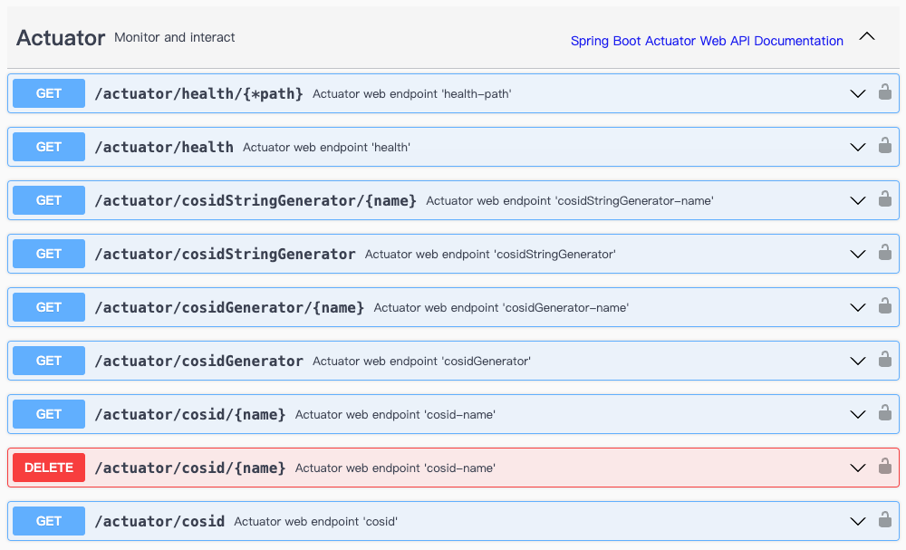

# CosId-Spring-Boot-Starter Module

The _Spring-Boot-Starter_ module integrates all _CosId_ extensions and provides auto-configuration capabilities, making the _CosId_ framework more convenient to use in _Spring Boot_ projects.

::: tip
For the configuration documentation of this module, please refer to [Configuration](../../reference/config/basic).
:::

## Installation

::: code-group
```kotlin [Gradle(Kotlin)]
    val cosidVersion = "latestVersion"
    implementation("me.ahoo.cosid:cosid-spring-boot-starter:${cosidVersion}")
```
```xml [Maven]
    <dependencies>
        <dependency>
            <groupId>me.ahoo.cosid</groupId>
            <artifactId>cosid-spring-boot-starter</artifactId>
            <version>${cosid.version}</version>
        </dependency>
    </dependencies>
```
:::

## Actuator

The CosId-Spring-Boot-Starter module provides actuator support, allowing you to view the CosId status through actuator endpoints.



### CosIdEndpoint

Used to view the status information of all defined ID generators.

:::code-group
```shell [curl]
curl -X GET "http://localhost:8080/actuator/cosid" -H  "accept: */*"
```
```json [Response Content]
{
  "cosid": {
    "kind": "ClockSyncCosIdGenerator",
    "actual": {
      "kind": "Radix62CosIdGenerator",
      "machineId": 252,
      "lastTimestamp": 1704183358593,
      "converter": {
        "kind": "RadixCosIdStateParser",
        "actual": null
      }
    },
    "converter": {
      "kind": "RadixCosIdStateParser",
      "actual": null
    }
  },
  "user": {
    "kind": "StringSegmentId",
    "actual": {
      "kind": "SegmentChainId",
      "fetchTime": 1703401907,
      "maxId": 91658,
      "offset": 91638,
      "sequence": 91638,
      "step": 20,
      "isExpired": false,
      "isOverflow": false,
      "isAvailable": true,
      "converter": {
        "kind": "Radix62IdConverter",
        "radix": 62,
        "charSize": 11,
        "padStart": true,
        "maxId": 9223372036854776000
      }
    },
    "converter": {
      "kind": "Radix62IdConverter",
      "radix": 62,
      "charSize": 6,
      "padStart": true,
      "maxId": 56800235584
    }
  }
}
```
:::

### CosIdGeneratorEndpoint

Provides an API interface for generating `long` type IDs.

### CosIdStringGeneratorEndpoint

Provides an API interface for generating `string` type IDs.

### Configuration

```yaml {6-8}
management:
  endpoints:
    web:
      exposure:
        include:
          - cosid
          - cosidGenerator
          - cosidStringGenerator
```