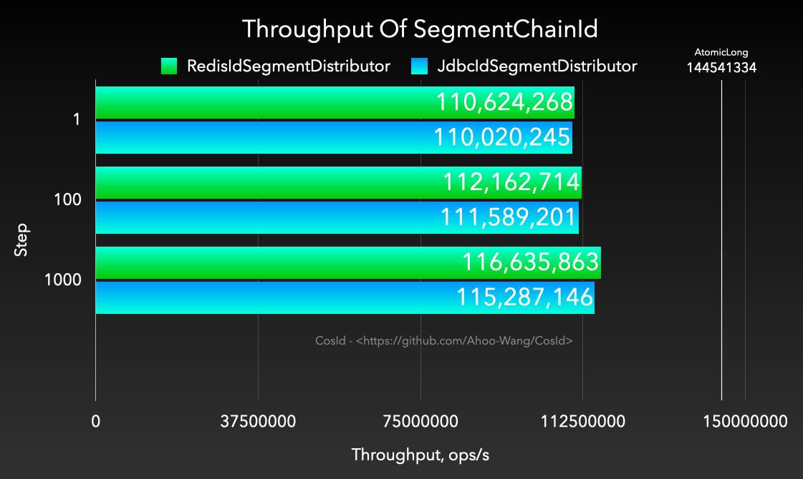
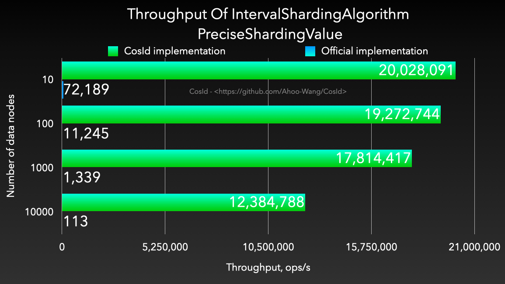

# JMH-Benchmark

## Runtime Environment Description

- Benchmark runtime environment: Laptop development machine (MacBook Pro (M1))
- All benchmarks are executed on the development laptop.
- **Redis**, **MySql** deployment environments are also on this development laptop.

## SegmentChainId

### Throughput (ops/s)

<p align="center" >
  
</p>

::: code-group
```shell [Gradle]
gradle cosid-redis:jmh
```
```shell [Java]
java -jar cosid-redis/build/libs/cosid-redis-1.8.6-jmh.jar -bm thrpt -wi 1 -rf json -f 1 RedisChainIdBenchmark
```
:::

```
Benchmark                       (step)   Mode  Cnt          Score          Error  Units
RedisChainIdBenchmark.generate       1  thrpt    5  106188349.580 ± 26035022.285  ops/s
RedisChainIdBenchmark.generate     100  thrpt    5  112276460.950 ±  4091990.852  ops/s
RedisChainIdBenchmark.generate    1000  thrpt    5  110181522.770 ± 15531341.449  ops/s
```

::: code-group
```shell [Gradle]
gradle cosid-jdbc:jmh
```
```shell [Java]
java -jar cosid-jdbc/build/libs/cosid-jdbc-1.8.6-jmh.jar -bm thrpt -wi 1 -rf json -f 1 MySqlChainIdBenchmark
```
:::


```
Benchmark                       (step)   Mode  Cnt          Score         Error  Units
MySqlChainIdBenchmark.generate       1  thrpt    5  110020245.619 ± 4514432.472  ops/s
MySqlChainIdBenchmark.generate     100  thrpt    5  111589201.024 ± 1565714.192  ops/s
MySqlChainIdBenchmark.generate    1000  thrpt    5  115287146.614 ± 4471990.880  ops/s
```

### Percentile of each operation time (us/op)

> [Percentile](https://en.wikipedia.org/wiki/Percentile), a statistical term. If a set of data is sorted from small to large, and the corresponding cumulative percentage is calculated, the value corresponding to a certain percentage is called the percentile of that percentage, denoted as Pk for the k-th percentile. Percentile is a measure used to compare the relative position of an individual in a group.

<p align="center" >
  
</p>

```shell
java -jar cosid-redis/build/libs/cosid-redis-1.8.6-jmh.jar -bm sample -wi 1 -rf json -f 1 -tu us step_1000
```

```
Benchmark                                            Mode      Cnt   Score    Error  Units
RedisChainIdBenchmark.step_1000                    sample  1336271   0.024 ±  0.001  us/op
RedisChainIdBenchmark.step_1000:step_1000·p0.00    sample              ≈ 0           us/op
RedisChainIdBenchmark.step_1000:step_1000·p0.50    sample            0.041           us/op
RedisChainIdBenchmark.step_1000:step_1000·p0.90    sample            0.042           us/op
RedisChainIdBenchmark.step_1000:step_1000·p0.95    sample            0.042           us/op
RedisChainIdBenchmark.step_1000:step_1000·p0.99    sample            0.042           us/op
RedisChainIdBenchmark.step_1000:step_1000·p0.999   sample            0.042           us/op
RedisChainIdBenchmark.step_1000:step_1000·p0.9999  sample            0.208           us/op
RedisChainIdBenchmark.step_1000:step_1000·p1.00    sample           37.440           us/op
```

```shell
java -jar cosid-jdbc/build/libs/cosid-jdbc-1.8.6-jmh.jar -bm sample -wi 1 -rf json -f 1 -tu us step_1000
```

```
Benchmark                                            Mode      Cnt    Score   Error  Units
MySqlChainIdBenchmark.step_1000                    sample  1286774    0.024 ± 0.001  us/op
MySqlChainIdBenchmark.step_1000:step_1000·p0.00    sample               ≈ 0          us/op
MySqlChainIdBenchmark.step_1000:step_1000·p0.50    sample             0.041          us/op
MySqlChainIdBenchmark.step_1000:step_1000·p0.90    sample             0.042          us/op
MySqlChainIdBenchmark.step_1000:step_1000·p0.95    sample             0.042          us/op
MySqlChainIdBenchmark.step_1000:step_1000·p0.99    sample             0.042          us/op
MySqlChainIdBenchmark.step_1000:step_1000·p0.999   sample             0.083          us/op
MySqlChainIdBenchmark.step_1000:step_1000·p0.9999  sample             0.208          us/op
MySqlChainIdBenchmark.step_1000:step_1000·p1.00    sample           342.528          us/op
```

## SnowflakeId

::: code-group
```shell [Gradle]
gradle cosid-core:jmh
```
```shell [Java]
java -jar cosid-core/build/libs/cosid-core-1.8.6-jmh.jar -bm thrpt -wi 1 -rf json -f 1
```
:::

```
Benchmark                                                    Mode  Cnt        Score   Error  Units
SnowflakeIdBenchmark.millisecondSnowflakeId_friendlyId      thrpt       4020311.665          ops/s
SnowflakeIdBenchmark.millisecondSnowflakeId_generate        thrpt       4095403.859          ops/s
SnowflakeIdBenchmark.safeJsMillisecondSnowflakeId_generate  thrpt        511654.048          ops/s
SnowflakeIdBenchmark.safeJsSecondSnowflakeId_generate       thrpt        539818.563          ops/s
SnowflakeIdBenchmark.secondSnowflakeId_generate             thrpt       4206843.941          ops/s
```

## CosIdIntervalShardingAlgorithm

| **PreciseShardingValue**                                                                                           | **RangeShardingValue**                                                                                           |
|--------------------------------------------------------------------------------------------------------------------|------------------------------------------------------------------------------------------------------------------|
|  |  |


``` shell
gradle cosid-shardingsphere:jmh
```

```
# JMH version: 1.29
# VM version: JDK 11.0.13, OpenJDK 64-Bit Server VM, 11.0.13+8-LTS
# VM options: -Dfile.encoding=UTF-8 -Djava.io.tmpdir=/work/CosId/cosid-shardingsphere/build/tmp/jmh -Duser.country=CN -Duser.language=zh -Duser.variant
# Blackhole mode: full + dont-inline hint
# Warmup: 1 iterations, 10 s each
# Measurement: 1 iterations, 10 s each
# Timeout: 10 min per iteration
# Threads: 1 thread, will synchronize iterations
# Benchmark mode: Throughput, ops/time
Benchmark                                                         (days)   Mode  Cnt         Score   Error  Units
IntervalShardingAlgorithmBenchmark.cosid_precise_local_date_time      10  thrpt       53279788.772          ops/s
IntervalShardingAlgorithmBenchmark.cosid_precise_local_date_time     100  thrpt       38114729.365          ops/s
IntervalShardingAlgorithmBenchmark.cosid_precise_local_date_time    1000  thrpt       32714318.129          ops/s
IntervalShardingAlgorithmBenchmark.cosid_precise_local_date_time   10000  thrpt       22317905.643          ops/s
IntervalShardingAlgorithmBenchmark.cosid_precise_timestamp            10  thrpt       20028091.211          ops/s
IntervalShardingAlgorithmBenchmark.cosid_precise_timestamp           100  thrpt       19272744.794          ops/s
IntervalShardingAlgorithmBenchmark.cosid_precise_timestamp          1000  thrpt       17814417.856          ops/s
IntervalShardingAlgorithmBenchmark.cosid_precise_timestamp         10000  thrpt       12384788.025          ops/s
IntervalShardingAlgorithmBenchmark.cosid_range_local_date_time        10  thrpt       18716732.080          ops/s
IntervalShardingAlgorithmBenchmark.cosid_range_local_date_time       100  thrpt        8436553.492          ops/s
IntervalShardingAlgorithmBenchmark.cosid_range_local_date_time      1000  thrpt        1655952.254          ops/s
IntervalShardingAlgorithmBenchmark.cosid_range_local_date_time     10000  thrpt         185348.831          ops/s
IntervalShardingAlgorithmBenchmark.cosid_range_timestamp              10  thrpt        9410931.643          ops/s
IntervalShardingAlgorithmBenchmark.cosid_range_timestamp             100  thrpt        5792861.181          ops/s
IntervalShardingAlgorithmBenchmark.cosid_range_timestamp            1000  thrpt        1585344.761          ops/s
IntervalShardingAlgorithmBenchmark.cosid_range_timestamp           10000  thrpt         196663.812          ops/s
IntervalShardingAlgorithmBenchmark.office_precise_timestamp           10  thrpt          72189.800          ops/s
IntervalShardingAlgorithmBenchmark.office_precise_timestamp          100  thrpt          11245.324          ops/s
IntervalShardingAlgorithmBenchmark.office_precise_timestamp         1000  thrpt           1339.128          ops/s
IntervalShardingAlgorithmBenchmark.office_precise_timestamp        10000  thrpt            113.396          ops/s
IntervalShardingAlgorithmBenchmark.office_range_timestamp             10  thrpt          64679.422          ops/s
IntervalShardingAlgorithmBenchmark.office_range_timestamp            100  thrpt           4267.860          ops/s
IntervalShardingAlgorithmBenchmark.office_range_timestamp           1000  thrpt            227.817          ops/s
IntervalShardingAlgorithmBenchmark.office_range_timestamp          10000  thrpt              7.579          ops/s
```

## CosIdModShardingAlgorithm

| **PreciseShardingValue**                                                                                      | **RangeShardingValue**                                                                                      |
|---------------------------------------------------------------------------------------------------------------|-------------------------------------------------------------------------------------------------------------|
|  |  |

``` shell
gradle cosid-shardingsphere:jmh
```

```
# JMH version: 1.29
# VM version: JDK 11.0.13, OpenJDK 64-Bit Server VM, 11.0.13+8-LTS
# VM options: -Dfile.encoding=UTF-8 -Djava.io.tmpdir=/work/CosId/cosid-shardingsphere/build/tmp/jmh -Duser.country=CN -Duser.language=zh -Duser.variant
# Blackhole mode: full + dont-inline hint
# Warmup: 1 iterations, 10 s each
# Measurement: 1 iterations, 10 s each
# Timeout: 10 min per iteration
# Threads: 1 thread, will synchronize iterations
# Benchmark mode: Throughput, ops/time
Benchmark                                     (divisor)   Mode  Cnt          Score   Error  Units
ModShardingAlgorithmBenchmark.cosid_precise          10  thrpt       121431137.111          ops/s
ModShardingAlgorithmBenchmark.cosid_precise         100  thrpt       119947284.141          ops/s
ModShardingAlgorithmBenchmark.cosid_precise        1000  thrpt       113095657.321          ops/s
ModShardingAlgorithmBenchmark.cosid_precise       10000  thrpt       108435323.537          ops/s
ModShardingAlgorithmBenchmark.cosid_precise      100000  thrpt        84657505.579          ops/s
ModShardingAlgorithmBenchmark.cosid_range            10  thrpt        37397323.508          ops/s
ModShardingAlgorithmBenchmark.cosid_range           100  thrpt        16905691.783          ops/s
ModShardingAlgorithmBenchmark.cosid_range          1000  thrpt         2969820.981          ops/s
ModShardingAlgorithmBenchmark.cosid_range         10000  thrpt          312881.488          ops/s
ModShardingAlgorithmBenchmark.cosid_range        100000  thrpt           31581.396          ops/s
ModShardingAlgorithmBenchmark.office_precise         10  thrpt         9135460.160          ops/s
ModShardingAlgorithmBenchmark.office_precise        100  thrpt         1356582.418          ops/s
ModShardingAlgorithmBenchmark.office_precise       1000  thrpt          104500.125          ops/s
ModShardingAlgorithmBenchmark.office_precise      10000  thrpt            8619.933          ops/s
ModShardingAlgorithmBenchmark.office_precise     100000  thrpt             629.353          ops/s
ModShardingAlgorithmBenchmark.office_range           10  thrpt         5535645.737          ops/s
ModShardingAlgorithmBenchmark.office_range          100  thrpt           83271.925          ops/s
ModShardingAlgorithmBenchmark.office_range         1000  thrpt             911.534          ops/s
ModShardingAlgorithmBenchmark.office_range        10000  thrpt               9.133          ops/s
ModShardingAlgorithmBenchmark.office_range       100000  thrpt               0.208          ops/s
```
