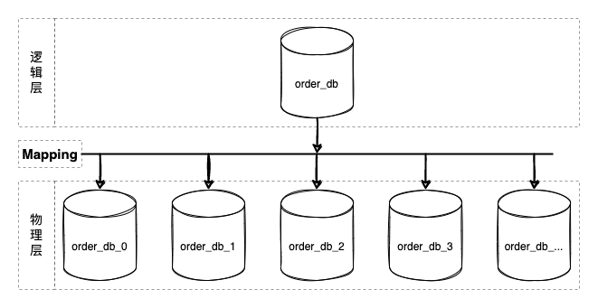

# Introduction

*[CosId](https://github.com/Ahoo-Wang/CosId)* aims to provide universal, flexible, high-performance distributed ID generators.

- `CosIdGenerator` : *Single-machine TPS performance: 1557W/s*, three times that of `UUID.randomUUID()`, clock-based globally trend-increasing ID, can support one million instances simultaneously.
- `SnowflakeId` : *Single-machine TPS performance: 409W/s* [JMH benchmark test](faq/perf-test.md) , mainly solves problems like *clock rollback*, *machine ID allocation*, *uneven modulo sharding*, etc., and provides a more user-friendly and flexible experience.
- `SegmentId`: Each time obtains a segment (`Step`) of IDs to reduce the network IO request frequency of the segment distributor and improve performance. And provides multiple segment distributor implementations.
- `SegmentChainId`:`SegmentChainId` (*lock-free*) is an enhancement to `SegmentId`. Performance can reach TPS performance close to `AtomicLong` *TPS performance:12743W+/s* [JMH benchmark test](faq/perf-test.md) .
  - `PrefetchWorker` maintains safe distance (`safeDistance`), and supports dynamic `safeDistance` expansion/contraction based on starvation state.
  - Adaptability: Compared to `SegmentId`, `SegmentChainId` can dynamically adjust `Step` according to business scenarios to improve performance.

## Background (Why do we need *Distributed ID*)

In the process of software system evolution, as the business scale grows (TPS/storage capacity), we need to distribute computing and storage pressure through clustered deployment.
The stateless design of application services makes them scalable. When deploying with **Kubernetes**, we only need one command to complete service scaling
(`kubectl scale --replicas=5 deployment/order-service`).

But for stateful databases, it's not that easy, and at this point, the database becoming the system's performance bottleneck is obvious.

### Database Sharding

:::info
From the perspective of microservices, vertical splitting is actually microservice splitting. Defining service boundaries with bounded contexts splits large services/monolithic applications into multiple autonomous smaller-grained services, and because of autonomy specifications, databases also need business splitting.

But after vertical splitting, individual microservices still face TPS/storage capacity challenges, so here we focus on horizontal splitting methods.
:::

  

Database sharding is a scheme that is logically unified and physically partitioned autonomous. Its core design lies in the middle layer mapping scheme design (Mapping in the figure above), that is, the sharding algorithm design.
Almost all programming languages have built-in hash table implementations (java:`HashMap`/csharp:`Dictionary`/python:`dict`/go:`map` ...). Sharding algorithms are highly similar to hash tables (`hashCode`), both mapping through `key`/`shardingValue` to corresponding slots (`slot`).

So where does `shardingValue` come from? **CosId**!!!

:::tip
Of course, there are many distributed scenarios that need *distributed ID*, not listed here one by one.
:::

## Core Metrics of Distributed ID Solutions

- **Global (same business) uniqueness**: Uniqueness guarantee is a necessary condition for **ID**, assuming ID is not unique will cause primary key conflicts, this is easy to understand.
  - The so-called global uniqueness usually does not mean all business services must be unique, but different deployment replicas of the same business service must be unique.
    For example, multiple deployment replicas of the Order service generating `Id` for the `t_order` table require global uniqueness. As for whether the `ID` generated by `t_order_item` is unique with `t_order`, it does not affect uniqueness constraints and will not produce side effects.
    The same applies to different business modules. That is, uniqueness mainly solves the ID conflict problem.
- **Orderliness**: Orderliness guarantee is necessary for query-oriented data structure algorithms (except Hash algorithms), it is the premise of **binary search** (divide and conquer).
  - MySQL-InnoDB B+ tree is the most widely used, assuming Id is unordered, the B+ tree to maintain ID orderliness will frequently insert in the middle of the index and move subsequent nodes, even leading to frequent page splits, which has a huge impact on performance. If we can guarantee ID orderliness, this situation is completely different, only append write operations are needed. So ID orderliness is very important and an inevitable characteristic of ID design.
- **Throughput/Performance (ops/time)**: The number of IDs that can be generated per unit time (per second). Generating IDs is a very high-frequency operation and the most basic. Assuming ID generation is slow, no matter how system optimization is done, better performance cannot be obtained.
  - Generally, we generate IDs first, then perform write operations, assuming ID generation is slow, the overall performance upper limit will be limited, this should be easy to understand.
- **Stability (time/op)**: Stability metrics generally use **percentile sampling of each operation time** for analysis, for example *[CosId](https://github.com/Ahoo-Wang/CosId)* percentile sampling **P9999=0.208 us/op**, that is **0% ~ 99.99%** of unit operation time is less than or equal to **0.208 us/op**.
  - [Percentile WIKI](https://zh.wikipedia.org/wiki/%E7%99%BE%E5%88%86%E4%BD%8D%E6%95%B0) : Statistical term, if a set of data is sorted from small to large and the corresponding cumulative percentage is calculated, the value corresponding to a certain percentage is called the percentile of that percentage, denoted as Pk for the k-th percentile. Percentile is used to compare the relative position of individuals in the population.
  - Why not use average *time per operation*: Can Ma Yun's net worth be averaged with yours? Is the averaged value meaningful?
  - Can minimum *time per operation*, maximum *time per operation* be used as reference? Because min and max only explain the boundary point situation, although they can be used as stability reference, they are still not comprehensive. And *percentile* already covers these two metrics.
- **Autonomy (dependency)**: Mainly refers to whether there is dependency on external environment, for example **segment mode** will strongly depend on third-party storage middleware to obtain `NextMaxId`. Autonomy will also affect availability.
- **Availability**: The availability of distributed ID is mainly affected by autonomy, for example **SnowflakeId** is affected by clock rollback, leading to short-term unavailability. And **segment mode** is affected by the availability of third-party distributors (`NextMaxId`).
  - [Availability WIKI](https://zh.wikipedia.org/wiki/%E5%8F%AF%E7%94%A8%E6%80%A7) : In a given time interval, for a functional individual, the total available time proportion.
  - _MTBF_: Mean Time Between Failures
  - _MDT_: Mean Time To Repair/Recovery
  - `Availability=MTBF/(MTBF+MDT)`
  - Assuming *MTBF* is 1 year, *MDT* is 1 hour, that is `Availability=(365*24)/(365*24+1)=0.999885857778792≈99.99%`, which is what we usually call 4 nines availability.
- **Adaptability**: Refers to the adaptive ability when facing external environment changes, here we mainly talk about dynamically scaling the performance of distributed ID when facing traffic bursts,
  - **SegmentChainId** can dynamically scale **safe distance** based on **starvation state**.
  - **SnowflakeId** conventional bit allocation scheme has constant performance of 409.6W, although TPS performance can be obtained by adjusting bit allocation scheme, but changing bit allocation method is destructive, generally determined according to business scenario and no longer changed.
- **Storage space**: Still using MySQL-InnoDB B+ tree as example, secondary index will store primary key values, larger primary key will occupy more memory cache, disk space. Fewer data stored in Page pages, disk IO access times will increase. In short, under the premise of meeting business needs, smaller storage space occupation is a good design principle in most scenarios.

### Comparison of Core Metrics of Different Distributed ID Solutions

|     Distributed ID      | Global Uniqueness |             Orderliness             |              Throughput | Stability (1s=1000,000us)  |    Autonomy     |                   Availability                    | Adaptability |  Storage Space   |
|:--------------:|:-----:|:---------------------------:|-----------------:|:--------------------|:----------:|:----------------------------------------:|:---:|:-------:|
|   UUID/GUID    |   Yes   |            Completely unordered             |   3078638(ops/s) | P9999=0.325(us/op)  |    Fully autonomous    |                   100%                   |  No  | 128-bit |
|  SnowflakeId   |   Yes   |   Locally monotonically increasing, globally trend increasing (affected by global clock)    |   4096000(ops/s) | P9999=0.244(us/op)  |    Depends on clock    |               Clock rollback causes short unavailability               |  No  | 64-bit  |
|   SegmentId    |   Yes   |   Locally monotonically increasing, globally trend increasing (affected by Step)    |  29506073(ops/s) | P9999=46.624(us/op) | Depends on third-party segment distributor |               Affected by segment distributor availability                |  No  | 64-bit  |
| SegmentChainId |   Yes   | Locally monotonically increasing, globally trend increasing (affected by Step, safe distance) | 127439148(ops/s) | P9999=0.208(us/op)  | Depends on third-party segment distributor | Affected by segment distributor availability, but due to safe distance existence, reserved ID segment, so higher than SegmentId |  Yes  | 64-bit  |

### Orderliness (To divide and conquer · binary search, must maintain order)

Just now we discussed the importance of ID orderliness, so when designing ID algorithms, we should try to make IDs monotonically increasing as much as possible, like table auto-increment primary keys. But unfortunately, due to distributed system issues like global clock, performance, we usually can only choose a combination of locally monotonically increasing and globally trend increasing (just like we have to choose eventual consistency in distributed systems) to obtain multi-faceted trade-offs. Below let's see what monotonically increasing and trend increasing are.

#### Orderliness of Monotonically Increasing

  

Monotonically increasing: T represents global absolute time point, assuming Tn+1>Tn (absolute time always moves forward, not considering relativity, time machines, etc.), then necessarily F(Tn+1)>F(Tn), database auto-increment primary key belongs to this category.
Additionally, it needs special explanation that monotonically increasing is different from continuously increasing. Continuously increasing: `F(n+1)=(F(n)+step)` i.e. the next obtained ID must equal current `ID+Step`, when `Step=1` it's like this sequence: `1->2->3->4->5`.

:::tip
Extended knowledge: Database auto-increment primary keys are not continuously increasing either, I believe you've encountered this situation, think why the database designed this way?
:::

#### Orderliness of Trend Increasing

  

Trend increasing: Tn>Tn-s, then likely F(Tn)>F(Tn-s). Although there is disorder in a time interval, the overall trend is increasing. From the figure, there is an upward trend (trend line).
- In **SnowflakeId**, n-s is affected by global clock synchronization.
- In segment mode (**SegmentId**), n-s is affected by segment available range (`Step`).

## Distributed ID Allocation Schemes

### UUID/GUID

- :thumbsup: Does not depend on any third-party middleware
- :thumbsup: High performance
- :thumbsdown: Completely unordered
- :thumbsdown: Large space occupation, needs 128-bit storage space.

UUID's biggest flaw is randomness, disorder, when used as primary key it leads to low database primary key index efficiency (to maintain index tree, frequent insertions in middle of index, not append writes). This is also the most important reason UUID is not suitable for database primary keys.

### SnowflakeId

*SnowflakeId* is a distributed ID algorithm that uses `Long` (64-bit) bit partitioning to generate IDs.
The general bit allocation scheme is: `timestamp`(41-bit)+`machineId`(10-bit)+`sequence`(12-bit)=63-bit.

  

- 41-bit `timestamp`=(1L<<41)/(1000/3600/24/365), can store about 69 years of timestamps, that is, the usable absolute time is `EPOCH`+69 years, generally we need to customize `EPOCH` as product development time, additionally can extend timestamp bits by compressing other area allocation bits to prolong available time.
- 10-bit `machineId`=(1L<<10)=1024, that is, same business can deploy 1024 replicas (in Kubernetes concept there is no master-slave replica distinction, directly using Kubernetes definition here). Generally no need to use so many bits, so will redefine according to deployment scale needs.
- 12-bit `sequence`=(1L<<12)*1000=4096000, that is, single machine can generate about 409W IDs per second, global same business cluster can produce `4096000*1024=419430W=4.194 billion (TPS)`.

From *SnowflakeId* design we can see:

- :thumbsup: `timestamp` in high bits, single instance *SnowflakeId* guarantees clock always moves forward (checks local clock rollback), so is locally monotonically increasing. Affected by global clock synchronization/clock rollback *SnowflakeId* is globally trend increasing.
- :thumbsup: *SnowflakeId* has no strong dependency on any third-party middleware, and performance is also very high.
- :thumbsup: Bit allocation scheme can be flexibly configured according to business system needs to achieve optimal effect.
- :thumbsdown: Strongly depends on local clock, potential clock rollback problem will cause ID duplication, in short-term unavailability state.
- :thumbsdown: `machineId` needs manual setting, when cluster scale is large, `machineId` maintenance work is very cumbersome and inefficient.

#### SnowflakeId Machine ID Allocation Problem

In **SnowflakeId**, once determined according to business design bit allocation scheme, basically no longer changes, rarely needs maintenance. But `machineId` always needs configuration, and in cluster cannot repeat, otherwise partitioning principle will be broken leading to ID uniqueness principle destruction, when cluster scale is large `machineId` maintenance work is very cumbersome and inefficient.

:::tip
One point needs special explanation, **SnowflakeId**'s **MachineId** is a logical concept, not physical concept, so calling it `WorkerId` is more accurate.

Imagine if **MachineId** is physical, meaning one machine can only have one **MachineId**, what problems would arise?
:::

Currently *[CosId](https://github.com/Ahoo-Wang/CosId)* provides the following five `MachineId` distributors.

- ManualMachineIdDistributor: Manually configure `machineId`, generally only possible when cluster scale is very small, not recommended.
- StatefulSetMachineIdDistributor: Use `Kubernetes`'s `StatefulSet` provided stable identity ID (HOSTNAME=service-01) as machine ID.
- RedisMachineIdDistributor: Use **Redis** as machine ID distribution storage, also stores `MachineId`'s last timestamp, for **startup clock rollback** check.
- JdbcMachineIdDistributor: Use **relational database** as machine ID distribution storage, also stores `MachineId`'s last timestamp, for **startup clock rollback** check.
- ZookeeperMachineIdDistributor: Use **ZooKeeper** as machine ID distribution storage, also stores `MachineId`'s last timestamp, for **startup clock rollback** check.

  

  

#### SnowflakeId Clock Rollback Problem

Clock rollback's fatal problem is causing ID duplication, conflict (this is not hard to understand), ID duplication obviously cannot be tolerated.
In **SnowflakeId** algorithm, according to **MachineId** partitioning IDs, we easily understand different **MachineId** cannot produce same ID. So the clock rollback problem we solve refers to current **MachineId**'s clock rollback problem, not all cluster nodes' clock rollback problem.

**MachineId** clock rollback problem can be roughly divided into two situations:

- Runtime clock rollback: That is, during runtime the current timestamp obtained is smaller than the last obtained timestamp. This scenario's clock rollback is easy to handle, generally **SnowflakeId** code implementations all store `lastTimestamp` for runtime clock rollback check, and throw clock rollback exception.
  - Directly throwing exception when clock rollback is not good practice, because downstream users almost have no other handling options (oh, what can I do, wait), clock synchronization is the only choice, when there is only one choice, don't let users choose again.
  - `ClockSyncSnowflakeId` is `SnowflakeId`'s wrapper, when clock rollback occurs it uses `ClockBackwardsSynchronizer` to actively wait for clock synchronization to regenerate ID, providing more user-friendly experience.
- Startup clock rollback: That is, when starting service instance the current clock obtained is smaller than when last closed service. At this time `lastTimestamp` cannot be stored in process memory. When obtained external storage **machine state** is greater than current clock, will use `ClockBackwardsSynchronizer` to actively synchronize clock.
  - LocalMachineStateStorage: Use local file to store `MachineState` (machine ID, last timestamp). Because using local file so only applicable when instance deployment environment is stable, `LocalMachineStateStorage` is applicable.
  - RedisMachineIdDistributor: Store `MachineState` in **Redis** distributed cache, this way can guarantee always can get last service instance shutdown **machine state**.

#### SnowflakeId JavaScript Numerical Overflow Problem

`JavaScript`'s `Number.MAX_SAFE_INTEGER` is only 53-bit, if directly return 63-bit `SnowflakeId` to frontend, will produce value overflow situation (so here we should know backend passing `long` value overflow problem to frontend, **sooner or later** will appear, only SnowflakeId appears faster).
Obviously overflow cannot be accepted, generally can use the following two handling schemes:
- Convert generated 63-bit `SnowflakeId` to `String` type.
  - Directly convert `long` to `String`.
  - Use `SnowflakeFriendlyId` to convert `SnowflakeId` to more friendly string representation: `{timestamp}-{machineId}-{sequence} -> 20210623131730192-1-0`
- Customize `SnowflakeId` bit allocation to shorten `SnowflakeId` bit count (53-bit) so `ID` provided to frontend does not overflow
  - Use `SafeJavaScriptSnowflakeId` (`JavaScript` safe `SnowflakeId`)

### Segment Mode (SegmentId)

  

From the design diagram above, not hard to see **segment mode** basic design idea is by obtaining certain length (Step) available IDs (Id segment/segment) each time, to reduce network IO request times, improve performance.

- :thumbsdown: Strongly depends on third-party segment distributor, availability affected by third-party distributor.
- :thumbsdown: Each time segment used up obtaining `NextMaxId` needs network IO request, at this time performance will be relatively low.
- Single instance ID monotonically increasing, globally trend increasing.
  - From design diagram not hard to see **Instance 1** each time obtained `NextMaxId`, must be larger than last time, meaning next segment must be larger than last time, so from single instance perspective is monotonically increasing.
  - Multiple instances each hold different segments, meaning at same moment different instances generated IDs are out of order, but overall trend is increasing, so globally trend increasing.
- ID disorder degree affected by Step length and cluster scale (not hard to see from trend increasing diagram).
  - Assuming only one instance in cluster, **segment mode** is monotonically increasing.
  - `Step` smaller, disorder degree smaller. When `Step=1`, will infinitely approach monotonically increasing. Need note here is infinitely approach not equal monotonically increasing, specific reason you can think about this scenario:
    - Segment distributor T1 moment gave **Instance 1** distributed `ID=1`, T2 moment gave **Instance 2** distributed `ID=2`. Because machine performance, network etc. reasons, `Instance 2` network IO write request arrived before `Instance 1`. Then at this time for database, ID is still out of order.

### Segment Chain Mode (SegmentChainId)

  

**SegmentChainId** is **SegmentId** enhanced version, compared to **SegmentId** has following advantages:

- Stability: **SegmentId** stability problem (P9999=46.624(us/op)) mainly because after segment used up synchronously obtain `NextMaxId` leading to (will produce network IO).
  - **SegmentChainId** (P9999=0.208(us/op)) introduces new role **PrefetchWorker** to maintain and guarantee **safe distance**, ideally making ID obtaining threads almost completely not need synchronous waiting `NextMaxId` obtaining, performance can reach close to `AtomicLong` *TPS performance:12743W+/s* [JMH benchmark test](faq/perf-test.md) .
- Adaptability: From **SegmentId** introduction we knew affecting **ID disorder** factors have two: cluster scale, `Step` size. Cluster scale is what we cannot control, but `Step` is adjustable.
  - `Step` should be as small as possible to increase possibility of **ID monotonically increasing**.
  - `Step` too small will affect throughput, then how to reasonably set `Step`? Answer is we cannot accurately estimate all time point throughput demand, so best method is when throughput demand high, Step automatically increases, when throughput low Step automatically contracts.
  - **SegmentChainId** introduces **starvation state** concept, **PrefetchWorker** will detect according to **starvation state** whether current **safe distance** needs expansion or contraction, to obtain trade-off between throughput and orderliness, this is **SegmentChainId**'s adaptability.
