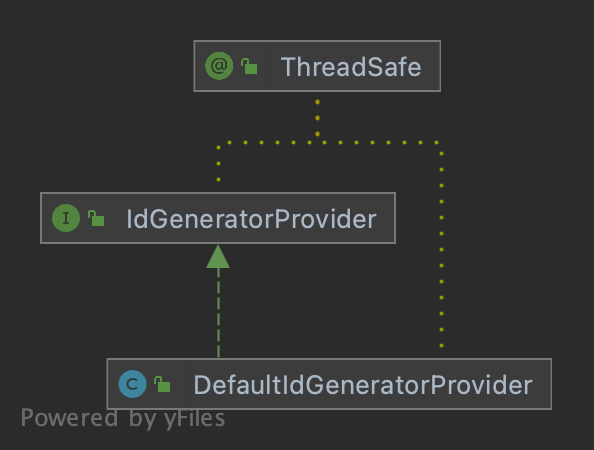

# IdGeneratorProvider

> `IdGenerator` container

<p align="center">
  
</p>

## DefaultIdGeneratorProvider

`DefaultIdGeneratorProvider` is the default `IdGenerator` container implementation. It is a thread-safe registry that manages named ID generator instances using a `ConcurrentHashMap`.

### Key Features

- **Thread-safe**: Uses `ConcurrentHashMap` for concurrent access
- **Singleton**: Shared instance available via `INSTANCE`
- **Named generators**: Supports multiple named ID generators

### Usage

#### Get Shared Generator

```java
IdGenerator share = DefaultIdGeneratorProvider.INSTANCE.getShare();
long id = share.generate();
```

#### Get Named Generator

```java
Optional<IdGenerator> orderGenerator = DefaultIdGeneratorProvider.INSTANCE.get("order");
orderGenerator.ifPresent(gen -> {
    long id = gen.generate();
});
```

#### Register Generator

```java
DefaultIdGeneratorProvider.INSTANCE.set("order", segmentChainId);
```

#### Remove Generator

```java
IdGenerator removed = DefaultIdGeneratorProvider.INSTANCE.remove("order");
```

## LazyIdGenerator

`LazyIdGenerator` provides lazy loading of ID generators. The generator is only created when first accessed.

### Usage

```java
LazyIdGenerator lazyGenerator = new LazyIdGenerator(() -> {
    // Create generator on first access
    return new SegmentChainId(distributor);
});
```

### Use Cases

- Defer expensive generator initialization
- Conditional generator creation based on configuration
- Testing scenarios where generator creation needs to be controlled
