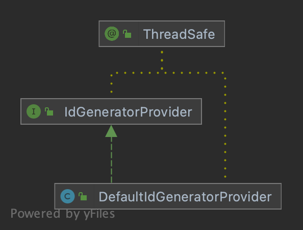

# IdGeneratorProvider

> `IdGenerator` container

  

## DefaultIdGeneratorProvider

> Default `IdGenerator` container, all `IdGenerator` will be injected into `DefaultIdGeneratorProvider.INSTANCE`.

## LazyIdGenerator

> Lazy loading `IdGenerator`

