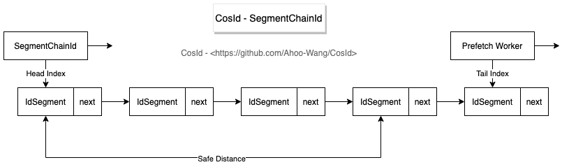

# Segment Chain Mode

  

**SegmentChainId** is **SegmentId** enhanced version, compared to **SegmentId** has following advantages:

- Stability: **SegmentId** stability problem (P9999=46.624(us/op)) mainly because after segment used up synchronously obtain `NextMaxId` leading to (will produce network IO).
  - **SegmentChainId** (P9999=0.208(us/op)) introduces new role **PrefetchWorker** to maintain and guarantee **safe distance**, ideally making ID obtaining threads almost completely not need synchronous waiting `NextMaxId` obtaining, performance can reach close to `AtomicLong` *TPS performance:12743W+/s* [JMH benchmark test](faq/perf-test.md) .
- Adaptability: From **SegmentId** introduction we knew affecting **ID disorder** factors have two: cluster scale, `Step` size. Cluster scale is what we cannot control, but `Step` is adjustable.
  - `Step` should be as small as possible to increase possibility of **ID monotonically increasing**.
  - `Step` too small will affect throughput, then how to reasonably set `Step`? Answer is we cannot accurately estimate all time point throughput demand, so best method is when throughput demand high, Step automatically increases, when throughput low Step automatically contracts.
  - **SegmentChainId** introduces **starvation state** concept, **PrefetchWorker** will detect according to **starvation state** whether current **safe distance** needs expansion or contraction, to obtain trade-off between throughput and orderliness, this is **SegmentChainId**'s adaptability.

## Why need *SegmentChainId*

  

Through **SegmentChainId** design diagram we can see, segment chain mode adds a new role **PrefetchWorker**.
**PrefetchWorker**'s main responsibility is to maintain and guarantee **safe distance** from segment chain head to tail, can also approximately understand as buffer distance.
With safe distance guarantee not hard to conclude that all ID obtaining threads only need to get next ID from process memory segment, ideally no need to perform `NextMaxId` (request `NextMaxId` to segment distributor, network IO), so performance can reach close to `AtomicLong` *TPS performance:12743W+/s* level.

**SegmentChainId** is **SegmentId** enhanced version, compared to **SegmentId** has following advantages:

- TPS performance: Can reach close to `AtomicLong` *TPS performance:12743W+/s* [JMH benchmark test](faq/perf-test). By introducing new role **PrefetchWorker** to maintain and guarantee **safe distance**, ideally making ID obtaining threads almost completely not need synchronous waiting `NextMaxId` obtaining.
- Stability: P9999=0.208(us/op), through above TPS performance description we can see, **SegmentChainId** eliminates synchronous waiting problem, so stability problem also solved.
- Adaptability: From **SegmentId** introduction we knew affecting **ID disorder** factors have two: cluster scale, `Step` size. Cluster scale is what we cannot control, but `Step` is adjustable.
    - `Step` should be as small as possible to increase possibility of **ID monotonically increasing**.
    - `Step` too small will affect throughput, then how to reasonably set `Step`? Answer is we cannot accurately estimate all time point throughput demand, so best method is when throughput demand high, Step automatically increases, when throughput low Step automatically contracts.
    - **SegmentChainId** introduces **starvation state** concept, **PrefetchWorker** will detect according to **starvation state** whether current **safe distance** needs expansion or contraction, to obtain trade-off between throughput and orderliness, this is **SegmentChainId**'s adaptability.
    - So when using **SegmentChainId** we can configure a relatively small `Step` step length, then by **PrefetchWorker** automatically adjust **safe distance** according to throughput demand, to automatically scale step length.

## Can RedisIdSegmentDistributor, JdbcIdSegmentDistributor both reach TPS=120 million/s?

  

The two figures above brought confusion to many students, why when `Step=1000` *RedisIdSegmentDistributor*, *JdbcIdSegmentDistributor* TPS performance almost consistent (TPS=120 million/s).
*RedisIdSegmentDistributor* should be higher performance than *JdbcIdSegmentDistributor*, why can both reach *AtomicLong* performance upper limit?
If I say when `Step=1`, as long as benchmark test time is long enough, they can still reach *AtomicLong* performance level (TPS=120 million/s), would you be more confused.
Actually the *sleight of hand* here is **PrefetchWorker**'s **starvation expansion** leading to, *SegmentChainId* ultimate performance has no direct relation to distributor TPS performance, because ultimately can expand to performance upper limit due to starvation expansion, as long as give enough time to expand.
And why in the figure above when `Step=1` TPS difference is still obvious, this is because *RedisIdSegmentDistributor* expands faster, and benchmark test did not give enough test time.

**SegmentChainId** benchmark test *TPS ultimate performance* can approximately use the following formula representation:

`TPS(SegmentChainId) ultimate value=(Step*Expansion)*TPS(IdSegmentDistributor)*T/s<=TPS(AtomicLong)`

1. `<=TPS(AtomicLong)`: Because *SegmentChainId* internal segment uses `AtomicLong`, so this is performance upper limit.
2. `Step*Expansion`: *Expansion* can understand as starvation expansion coefficient, default starvation expansion coefficient is 2. In *MySqlChainIdBenchmark*, *MySqlChainIdBenchmark* benchmark test this value is same.
3. `TPS(IdSegmentDistributor)`: This is the only difference in formula. Refers to requesting segment distributor `NextMaxId` TPS.
4. `T`: Can understand as benchmark test run duration.

From above formula not hard to see *RedisChainIdBenchmark*, *MySqlChainIdBenchmark* main difference is distributor TPS performance.
Distributor `TPS(IdSegmentDistributor)` larger, reaching `TPS(AtomicLong)` needed `T` smaller. But as long as `T` long enough, any distributor can reach close to `TPS(AtomicLong)`.
This also explains why different TPS performance level segment distributors (**IdSegmentDistributor**) can all reach TPS=120 million/s.
