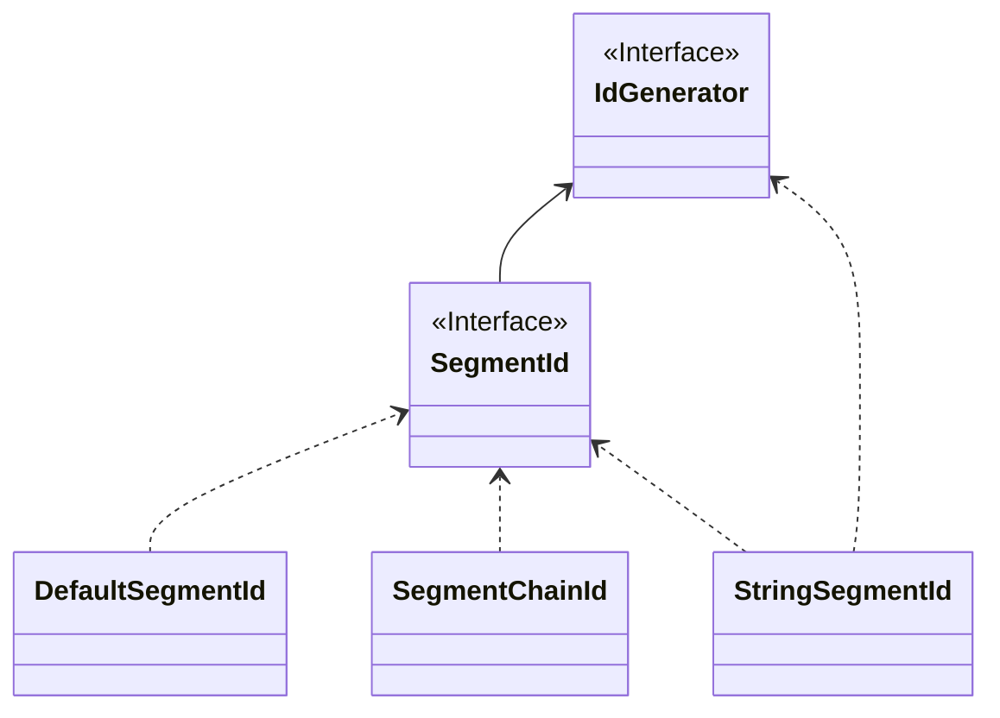

# SegmentId

  

From the design diagram above, it's not hard to see that the basic design idea of **segment mode** is to reduce network IO requests and improve performance by obtaining a certain length (Step) of available IDs (Id segments/segments) each time.

- :thumbsdown: Strongly dependent on third-party segment distributors, availability is affected by third-party distributors.
- :thumbsdown: When each segment is used up, obtaining `NextMaxId` requires a network IO request, and performance will be relatively low at this time.
- Single-instance ID monotonically increasing, globally trending increasing.
  - From the design diagram, it's not hard to see that each time **Instance 1** obtains `NextMaxId`, it is definitely larger than the previous one, meaning the next segment is definitely larger than the previous one, so from a single instance perspective, it is monotonically increasing.
  - Multiple instances each hold different segments, meaning that IDs generated by different instances at the same moment are out of order, but the overall trend is increasing, so globally trending increasing.
- The degree of ID disorder is affected by Step length and cluster scale (as can be seen from the trending increasing diagram).
  - Assuming there is only one instance in the cluster, **segment mode** is monotonically increasing.
  - The smaller the `Step`, the smaller the degree of disorder. When `Step=1`, it will infinitely approach monotonically increasing. Note that here it is infinitely approaching rather than equal to monotonically increasing. The specific reason you can think about a scenario like this:
    - The segment distributor at time T1 distributes `ID=1` to **Instance 1**, at time T2 distributes `ID=2` to **Instance 2**. Due to machine performance, network, etc., the network IO write request of `Instance 2` arrives before `Instance 1`. At this time, for the database, the IDs are still out of order.

## Specific Implementation

## IdSegmentDistributor

## GroupedIdSegmentDistributor

## Configuration
