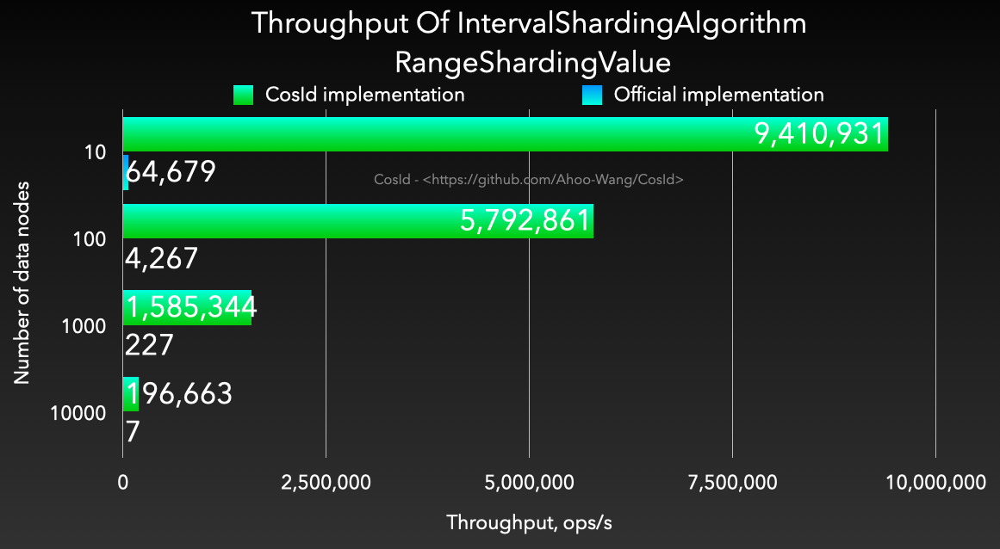

# Interval-Based Time Range Sharding Algorithm

  

- Algorithm complexity: O(1)
- Usability: Supports multiple data types (`Long`/`LocalDateTime`/`DATE`/ `String` / `SnowflakeId`), while the official implementation converts to string first then to `LocalDateTime`, success rate affected by time formatting characters.
- Performance: Compared to `org.apache.shardingsphere.sharding.algorithm.sharding.datetime.IntervalShardingAlgorithm`, performance is *1200~4000* times higher.

| **PreciseShardingValue**                                                                                           | **RangeShardingValue**                                                                                           |
|--------------------------------------------------------------------------------------------------------------------|------------------------------------------------------------------------------------------------------------------|
|  |  |

