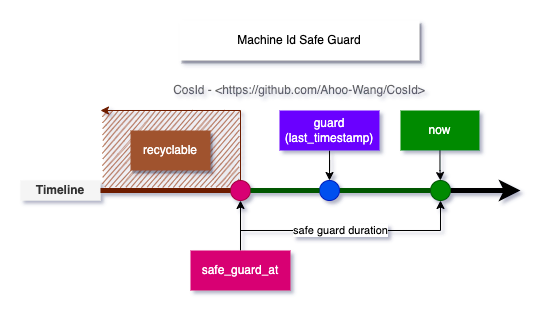

# SnowflakeId

_SnowflakeId_ is a distributed unique ID generation algorithm developed by *Twitter*, widely used in distributed systems. Its design goal is to generate trend-increasing, globally unique IDs to meet the needs of large-scale systems.

<p align="center" >
  
</p>

## Introduction

:::info
*SnowflakeId* is a distributed ID algorithm that uses `Long` (64-bit) bit partitioning to generate IDs.

The general bit allocation scheme is: `timestamp`(41-bit)+`machineId`(10-bit)+`sequence`(12-bit)=63-bit.
:::

- 41-bit `timestamp`=(1L<<41)/(1000/3600/24/365), can store about 69 years of timestamps, that is, the usable absolute time is `EPOCH`+69 years, generally we need to customize `EPOCH` as product development time, additionally can extend timestamp bits by compressing other area allocation bits to prolong available time.
- 10-bit `machineId`=(1L<<10)=1024, that is, same business can deploy 1024 replicas (in Kubernetes concept there is no master-slave replica distinction, directly using Kubernetes definition here). Generally no need to use so many bits, so will redefine according to deployment scale needs.
- 12-bit `sequence`=(1L<<12)*1000=4096000, that is, single machine can generate about 409W IDs per second, global same business cluster can produce `4096000*1024=419430W=4.194 billion (TPS)`.

From *SnowflakeId* design we can see:

- :thumbsup: `timestamp` in high bits, single instance *SnowflakeId* guarantees clock always moves forward (checks local clock rollback), so is locally monotonically increasing. Affected by global clock synchronization/clock rollback *SnowflakeId* is globally trend increasing.
- :thumbsup: *SnowflakeId* has no strong dependency on any third-party middleware, and performance is also very high.
- :thumbsup: Bit allocation scheme can be flexibly configured according to business system needs to achieve optimal effect.
- :thumbsdown: Strongly depends on local clock, potential clock rollback problem will cause ID duplication, in short-term unavailability state.
- :thumbsdown: `machineId` needs manual setting, when cluster scale is large, `machineId` maintenance work is very cumbersome and inefficient.

## Challenges

### Machine ID Allocation

In **SnowflakeId**, once determined according to business design bit allocation scheme, basically no longer changes, rarely needs maintenance. But `machineId` always needs configuration, and in cluster cannot repeat, otherwise partitioning principle will be broken leading to ID uniqueness principle destruction, when cluster scale is large `machineId` maintenance work is very cumbersome and inefficient.

:::tip
One point needs special explanation, **SnowflakeId**'s **MachineId** is a logical concept, not physical concept, so calling it `WorkerId` is more accurate.

Imagine if **MachineId** is physical, meaning one machine can only have one **MachineId**, what problems would arise?
:::

### Clock Rollback

Clock rollback's fatal problem is causing ID duplication, conflict (this is not hard to understand), ID duplication obviously cannot be tolerated.
In **SnowflakeId** algorithm, according to **MachineId** partitioning IDs, we easily understand different **MachineId** cannot produce same ID. So the clock rollback problem we solve refers to current **MachineId**'s clock rollback problem, not all cluster nodes' clock rollback problem.

**MachineId** clock rollback problem can be roughly divided into two situations:

- Runtime clock rollback: That is, during runtime the current timestamp obtained is smaller than the last obtained timestamp. This scenario's clock rollback is easy to handle, generally **SnowflakeId** code implementations all store `lastTimestamp` for runtime clock rollback check, and throw clock rollback exception.
  - Directly throwing exception when clock rollback is not good practice, because downstream users almost have no other handling options (oh, what can I do, wait), clock synchronization is the only choice, when there is only one choice, don't let users choose again.
  - `ClockSyncSnowflakeId` is `SnowflakeId`'s wrapper, when clock rollback occurs it uses `ClockBackwardsSynchronizer` to actively wait for clock synchronization to regenerate ID, providing more user-friendly experience.
- Startup clock rollback: That is, when starting service instance the current clock obtained is smaller than when last closed service. At this time `lastTimestamp` cannot be stored in process memory. When obtained external storage **machine state** is greater than current clock, will use `ClockBackwardsSynchronizer` to actively synchronize clock.
  - LocalMachineStateStorage: Use local file to store `MachineState` (machine ID, last timestamp). Because using local file so only applicable when instance deployment environment is stable, `LocalMachineStateStorage` is applicable.
  - RedisMachineIdDistributor: Store `MachineState` in **Redis** distributed cache, this way can guarantee always can get last service instance shutdown **machine state**.

### Uneven Modulo Sharding

_CosId_ cleverly solves the uneven modulo sharding problem by introducing the `sequenceResetThreshold` property, this design provides users with a better experience without sacrificing performance.

### JavaScript Numerical Overflow

`JavaScript`'s `Number.MAX_SAFE_INTEGER` is only 53-bit, if directly return 63-bit `SnowflakeId` to frontend, will produce value overflow situation (so here we should know backend passing `long` value overflow problem to frontend, **sooner or later** will appear, only SnowflakeId appears faster).
Obviously overflow cannot be accepted, generally can use the following two handling schemes:
- Convert generated 63-bit `SnowflakeId` to `String` type.
  - Directly convert `long` to `String`.
  - Use `SnowflakeFriendlyId` to convert `SnowflakeId` to more friendly string representation: `{timestamp}-{machineId}-{sequence} -> 20210623131730192-1-0`
- Customize `SnowflakeId` bit allocation to shorten `SnowflakeId` bit count (53-bit) so `ID` provided to frontend does not overflow
  - Use `SafeJavaScriptSnowflakeId` (`JavaScript` safe `SnowflakeId`)

## Specific Implementation


### MillisecondSnowflakeId

`MillisecondSnowflakeId` is the default implementation of `SnowflakeId`, it uses `System.currentTimeMillis()` as timestamp, accurate to millisecond level.

### SecondSnowflakeId

`SecondSnowflakeId` is another implementation of `SnowflakeId`, it uses `System.currentTimeMillis() / 1000` as timestamp, accurate to second level.

### DefaultSnowflakeFriendlyId

`DefaultSnowflakeFriendlyId` is `SnowflakeId`'s wrapper, it converts `SnowflakeId` to more friendly string representation: `{timestamp}-{machineId}-{sequence} -> 20210623131730192-1-0`

### ClockSyncSnowflakeId

`ClockSyncSnowflakeId` is `SnowflakeId`'s wrapper, when clock rollback occurs it uses `ClockBackwardsSynchronizer` to actively wait for clock synchronization to regenerate ID, providing more user-friendly experience.

## MachineIdDistributor

`MachineIdDistributor` is `SnowflakeId`'s machine ID distributor, it is responsible for allocating machine ID, also stores `MachineId`'s last timestamp, for **startup clock rollback** check.

<p align="center" >
  
</p>

Currently *CosId* provides the following six `MachineId` distributors.

- `ManualMachineIdDistributor`: Manually configure `machineId`, generally only possible when cluster scale is very small, not recommended.
- `StatefulSetMachineIdDistributor`: Use `Kubernetes`'s `StatefulSet` provided stable identity ID (HOSTNAME=service-01) as machine ID.
- `RedisMachineIdDistributor`: Use **Redis** as machine ID distribution storage, also stores `MachineId`'s last timestamp, for **startup clock rollback** check.
- `JdbcMachineIdDistributor`: Use **relational database** as machine ID distribution storage, also stores `MachineId`'s last timestamp, for **startup clock rollback** check.
- `ZookeeperMachineIdDistributor`: Use **ZooKeeper** as machine ID distribution storage, also stores `MachineId`'s last timestamp, for **startup clock rollback** check.
- `MongoMachineIdDistributor`: Use **MongoDB** as machine ID distribution storage, also stores `MachineId`'s last timestamp, for **startup clock rollback** check.

## MachineIdGuarder

<p align="center">
  
</p>

## Configuration

[SnowflakeId Configuration](../reference/config/snowflake)

### Configuration Example

```yaml
cosid:
  namespace: ${spring.application.name}
  machine:
    enabled: true
    distributor:
      type: jdbc # Machine ID distributor
    guarder:
      enabled: true # Enable machine ID guarder
  snowflake:
    enabled: true
    zone-id: Asia/Shanghai
    epoch: 1577203200000
    share:
      clock-sync: true # Enable clock rollback sync
      friendly: true 
    provider:
      short_id:
        converter:
          prefix: cosid_
          type: radix
          radix:
            char-size: 11
            pad-start: false
      safe-js:
        machine-bit: 3
        sequence-bit: 9
```

