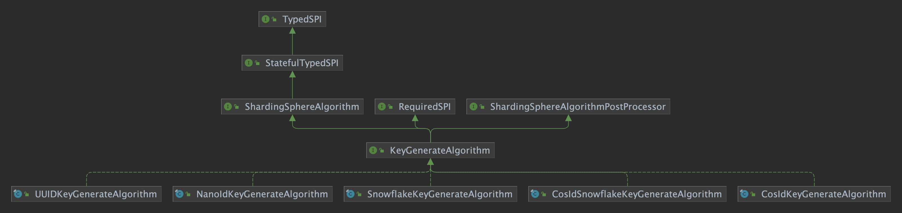
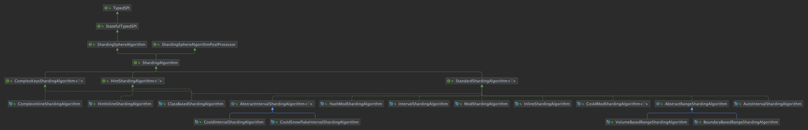

<p align="center" >
  
</p>

# ShardingSphere Integration with CosId

## Background

In the evolution of software systems, as business scale grows (TPS/storage capacity), we need to deploy applications in clusters to share computing and storage pressure.
The stateless design of application services enables them to be scalable. When deploying with **Kubernetes**, we can complete service scaling with just one command (`kubectl scale --replicas=5 deployment/order-service`).

However, databases are not that easy when they become stateful. Database sharding becomes the obvious bottleneck for system performance.

### Database Sharding

> From a microservices perspective, vertical splitting is essentially microservice splitting. Defining service boundaries with bounded contexts splits large services/monolithic applications into multiple autonomous smaller-grained services. Because of the autonomy requirement, databases also need to be split by business.
> But after vertical splitting, individual microservices still face TPS/storage capacity challenges, so here we focus on horizontal splitting approaches.

<p align="center" >
  
</p>

Database sharding solutions are logically unified and physically partitioned. The core design lies in the middle-layer mapping scheme (Mapping in the figure above), i.e., the design of sharding algorithms.
Almost all programming languages have built-in hash tables (java:`HashMap`/csharp:`Dictionary`/python:`dict`/go:`map`...). Sharding algorithms are highly similar to hash tables (`hashCode`), mapping `key`/`shardingValue` to corresponding slots (`slot`).

So where does `shardingValue` come from? **CosId**!!!

### CosId: Distributed ID Generator

*[CosId](https://github.com/Ahoo-Wang/CosId)* aims to provide universal, flexible, high-performance distributed ID generators. **CosId** currently provides three algorithms:

- `SnowflakeId`: *Single-machine TPS performance: 409W/s*, mainly solves *clock backward issues*, *machine ID allocation issues*, and provides more user-friendly and flexible usage experience.
- `SegmentId`: Obtains a segment (`Step`) of IDs each time to reduce network IO request frequency of segment distributors and improve performance. Provides multiple storage backends: relational databases, **Redis**, **Zookeeper** for users to choose.
- `SegmentChainId`(**Recommended**): `SegmentChainId` (*lock-free*) is an enhancement to `SegmentId`. Performance can reach near `AtomicLong` *TPS performance: 12743W+/s*.

The `shardingValue` problem is solved, but is that enough? **ShardingSphere**!!!

> Excerpt from **CosId** official website: <https://github.com/Ahoo-Wang/CosId>

### ShardingSphere

Apache ShardingSphere is an open-source distributed database ecosystem project consisting of JDBC, Proxy, and Sidecar (planned) products. It adopts a pluggable architecture, extending functionality through components. It provides various enhanced functions for databases and SQL on the upper layer, including data sharding, access routing, data security, etc.; on the lower layer, it natively supports multiple data storage engines such as MySQL, PostgreSQL, SQL Server, Oracle. The Apache ShardingSphere project philosophy is to provide database enhancement computing services, and build an ecosystem around it. By fully utilizing the computing and storage capabilities of existing databases, core capabilities are enhanced through plugin methods to help enterprises solve various difficulties encountered in digital transformation and accelerate digital application development.

> Excerpt from **Apache ShardingSphere** official website: <https://shardingsphere.apache.org/index_zh.html>

Next, the main content of this article: How to integrate **CosId** based on **ShardingSphere**'s pluggable architecture (SPI), and application configuration guide.

## Installation

> Taking **Spring-Boot application** as an example

- ShardingSphere v5.1.0+

> Because `ShardingSphere v5.1.0` [PR](https://github.com/apache/shardingsphere/pull/14132) has merged [cosid-shardingsphere](https://github.com/Ahoo-Wang/CosId/tree/main/cosid-shardingsphere), you only need to reference the `ShardingSphere` dependency.

``` xml
<dependency>
    <groupId>org.apache.shardingsphere</groupId>
    <artifactId>shardingsphere-jdbc-core-spring-boot-starter</artifactId>
    <version>5.1.1</version>
</dependency>
```

- ShardingSphere v5.0.0

``` xml
<dependency>
    <groupId>org.apache.shardingsphere</groupId>
    <artifactId>shardingsphere-jdbc-core-spring-boot-starter</artifactId>
    <version>5.0.0</version>
</dependency>
<dependency>
    <groupId>me.ahoo.cosid</groupId>
    <artifactId>cosid-shardingsphere</artifactId>
    <version>1.8.15</version>
</dependency>
```

## Distributed ID

> `KeyGenerateAlgorithm`

### UML Class Diagram

<p align="center" >
  
</p>

> The figure shows all current `ShardingSphere` built-in `KeyGenerateAlgorithm` implementations. Here we only discuss `CosIdKeyGenerateAlgorithm`, please read <https://shardingsphere.apache.org/document/current/cn/features/sharding/concept/key-generator/> for other implementations.

### CosIdKeyGenerateAlgorithm

#### Configuration

> type: COSID

| Name        | Data Type     | Description                                              | Default Value         |
|-----------|----------|-------------------------------------------------|-------------|
| id-name   | `String` | Name of the `IdGenerator` (registered in `IdGeneratorProvider`) | `__share__` |
| as-string | `String` | Whether to generate string-type IDs                                    | `false`     |

```yaml
spring:
  shardingsphere:
    rules:
      sharding:
        key-generators:
          cosid:
            type: COSID
            props:
              id-name: __share__
```

## Sharding Algorithms

> `ShardingAlgorithm`

### UML Class Diagram

<p align="center" >
  
</p>

### CosIdModShardingAlgorithm

CosId modulo sharding algorithm

#### Algorithm Description

<p align="center" >
  
</p>

> Single-value sharding key (`PreciseShardingValue`) algorithm complexity: `O(1)`.
> 
> Range-value sharding key (`RangeShardingValue`) algorithm complexity: `O(N)`, where `N` is the number of range values.

#### Performance Benchmark

| Precise Value/Single Value (**PreciseShardingValue**)                                                                           | Range Value/Multi Value (**RangeShardingValue**)                                                                           |
|------------------------------------------------------------------------------------------------------------|----------------------------------------------------------------------------------------------------------|
|  |  |

#### Configuration

> type: COSID_MOD

| Name                | Data Type     | Description         | Default Value |
|-------------------|----------|------------|-----|
| logic-name-prefix | `String` | Logical table/datasource name prefix |     |
| mod               | `int`    | Divisor         |     |

```yaml
spring:
  shardingsphere:
    rules:
      sharding:
        sharding-algorithms:
          alg-name:
            type: COSID_MOD
            props:
              mod: 4
              logic-name-prefix: t_table_
```

### CosIdIntervalShardingAlgorithm

Interval-based time range sharding algorithm.

#### Algorithm Description

<p align="center" >
  
</p>

> Precise value/single value sharding key (`PreciseShardingValue`) algorithm complexity: `O(1)`.
> 
> Range value/multi value sharding key (`RangeShardingValue`) algorithm complexity: `O(N)`, where `N` is the number of range value time units.

#### Performance Benchmark

| Precise Value/Single Value (**PreciseShardingValue**)                                                                                | Range Value/Multi Value (**RangeShardingValue**)                                                                                |
|-----------------------------------------------------------------------------------------------------------------|---------------------------------------------------------------------------------------------------------------|
|  |  |

#### Configuration

> type: COSID_INTERVAL

| Name                       | Data Type         | Description                                  | Default Value                              |
|--------------------------|--------------|-------------------------------------|----------------------------------|
| logic-name-prefix        | `String`     | Logical table/datasource name prefix                          |                                  |
| datetime-lower           | `String`     | Lower bound of time sharding, timestamp format: `yyyy-MM-dd HH:mm:ss` |                                  |
| datetime-upper           | `String`     | Upper bound of time sharding, timestamp format: `yyyy-MM-dd HH:mm:ss` |                                  |
| sharding-suffix-pattern  | `String`     | Sharding real table/datasource suffix pattern                       |                                  |
| datetime-interval-unit   | `ChronoUnit` | Sharding key time interval unit                           |                                  |
| datetime-interval-amount | `int`        | Sharding key time interval                             |                                  |
| ts-unit                  | `String`     | Timestamp unit: `SECOND`/`MILLISECOND`        | `MILLISECOND`                    |
| zone-id                  | `String`     | Sharding key time zone                               | `ZoneId.systemDefault().getId()` |

```yaml
spring:
  shardingsphere:
    rules:
      sharding:
        sharding-algorithms:
          alg-name:
            type: COSID_INTERVAL
            props:
              logic-name-prefix: logic-name-prefix
              datetime-lower: 2021-12-08 22:00:00
              datetime-upper: 2022-12-01 00:00:00
              sharding-suffix-pattern: yyyyMM
              datetime-interval-unit: MONTHS
              datetime-interval-amount: 1
```

### CosIdSnowflakeIntervalShardingAlgorithm

#### Algorithm Description

We know the bit partitioning method of *SnowflakeId*, *SnowflakeId* can parse out the timestamp, that is, *SnowflakeId* can be used as time, so *SnowflakeId* can be used as the sharding value for the *INTERVAL* sharding algorithm.
(When there is no `CreateTime` available for sharding [this is an extremely rare case], or when there are extremely demanding performance requirements, using *distributed ID primary key* as the query range may be a better choice for persistence layer performance.)

#### Configuration

> type: COSID_INTERVAL_SNOWFLAKE

| Name                       | Data Type         | Description                                              | Default Value         |
|--------------------------|--------------|-------------------------------------------------|-------------|
| logic-name-prefix        | `String`     | Logical table/datasource name prefix                                      |             |
| datetime-lower           | `String`     | Lower bound of time sharding, timestamp format: `yyyy-MM-dd HH:mm:ss`             |             |
| datetime-upper           | `String`     | Upper bound of time sharding, timestamp format: `yyyy-MM-dd HH:mm:ss`             |             |
| sharding-suffix-pattern  | `String`     | Sharding real table/datasource suffix pattern                                   |             |
| datetime-interval-unit   | `ChronoUnit` | Sharding key time interval unit                                       |             |
| datetime-interval-amount | `int`        | Sharding key time interval                                         |             |
| id-name                  | `String`     | Name of the `IdGenerator` (registered in `IdGeneratorProvider`) | `__share__` |

```yaml
spring:
  shardingsphere:
    rules:
      sharding:
        sharding-algorithms:
          alg-name:
            type: COSID_INTERVAL_SNOWFLAKE
            props:
              logic-name-prefix: logic-name-prefix
              datetime-lower: 2021-12-08 22:00:00
              datetime-upper: 2022-12-01 00:00:00
              sharding-suffix-pattern: yyyyMM
              datetime-interval-unit: MONTHS
              datetime-interval-amount: 1
              id-name: cosid-name
```

## Summary

This article mainly discusses the background of database sharding and how to integrate **CosId** based on **ShardingSphere**'s pluggable architecture for practical applications.
**ShardingSphere** adopts a pluggable architecture, making it very convenient for developers to customize functions that meet their application scenarios. If you are also interested in contributing to the **ShardingSphere** community, please refer to <https://shardingsphere.apache.org/community/cn/contribute/contributor/>.

## Reading Source Code Tips: Class Diagrams

Many partners get lost in the details when reading source code, traversing line by line based on methods, getting lost in the details (if you can persist, I admire your tenacity!). This reading method is very bad and inefficient.
Reading source code is very similar to reading books: first establish an overview map (index), then drill down layer by layer. (Top-down approach is more conducive to not getting lost in specific details during reading)
We recommend using the IntelliJ IDEA plugin *Diagrams* to generate source code level overview diagrams: UML class diagrams.

> - IntelliJ IDEA: <https://www.jetbrains.com/help/idea/class-diagram.html>

## References

- ShardingSphere Official Documentation: <https://shardingsphere.apache.org/document/current/cn/overview/>
- IntelliJ IDEA: <https://www.jetbrains.com/help/idea/class-diagram.html>
- CosId-ShardingSphere: <https://cosid.ahoo.me/guide/cosid-shardingsphere.html>
