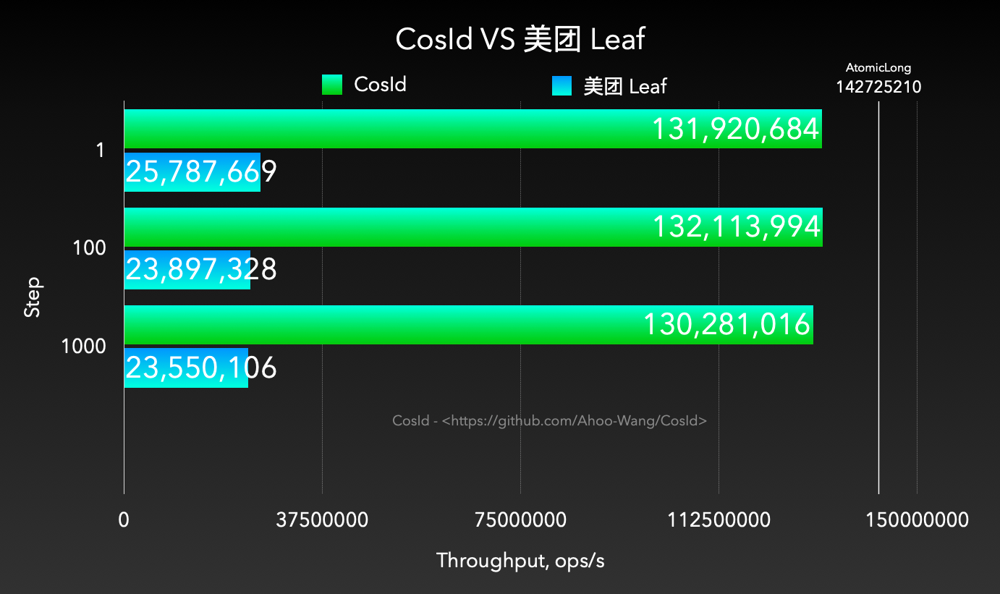

# 分布式ID性能评测：CosId VS 美团 Leaf

## 环境

- MacBook Pro (M1)
- JDK 17
- JMH 1.36
- 运行在本机 Docker 内的 mariadb:10.6.4 

## 运行

> 基准测试代码： [cosid-benchmark](https://github.com/Ahoo-Wang/CosId/tree/main/cosid-benchmark)

``` shell
git clone git@github.com:Ahoo-Wang/CosId.git
cd cosid-benchmark
./gradlew jmh
```
or
```shell
gradle jmhJar
java -jar build/libs/cosid-benchmark-2.2.6-jmh.jar -wi 1 -rf json -f 1
```

## 报告

```
# JMH version: 1.36
# VM version: JDK 17.0.7, OpenJDK 64-Bit Server VM, 17.0.7+7-LTS
# Warmup: 1 iterations, 10 s each
# Measurement: 1 iterations, 10 s each
# Timeout: 10 min per iteration
# Threads: 1 thread, will synchronize iterations

Benchmark                     (step)   Mode  Cnt          Score   Error  Units
AtomicLongBenchmark.generate     N/A  thrpt       142725210.565          ops/s
CosIdBenchmark.generate            1  thrpt       131920684.604          ops/s
CosIdBenchmark.generate          100  thrpt       132113994.232          ops/s
CosIdBenchmark.generate         1000  thrpt       130281016.155          ops/s
LeafBenchmark.generate             1  thrpt        25787669.815          ops/s
LeafBenchmark.generate           100  thrpt        23897328.183          ops/s
LeafBenchmark.generate          1000  thrpt        23550106.538          ops/s
```

<p align="center" >
  
</p>

> GitHub Action 环境测试报告: [Performance: CosId vs Leaf](https://github.com/Ahoo-Wang/CosId/issues/22)
> 
> 因受到 GitHub Runner 资源限制，运行在 GitHub Runner 中的基准测试与真实环境基准测试对比有非常大的差距（近2倍），
但是对于运行在同一环境配置资源情况下（都运行在 GitHub Runner），进行 commit 前后的基准对比、以及第三方库的对比依然是有价值的。

## 结论

1. CosId (`SegmentChainId`) 性能是 Leaf (`segment`) 的 5 倍。
2. CosId 、Leaf 的性能与号段步长(Step) 无关。
3. CosId TPS 基本接近 `AtomicLong` 。