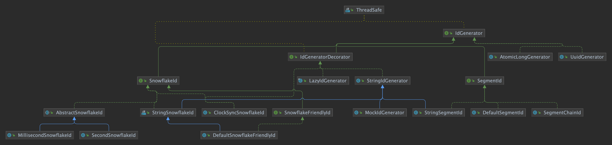

# IdGenerator

> **分布式ID**生成器

```java

@ThreadSafe
public interface IdGenerator {
    
    /**
     * ID converter, used to convert {@link long} type ID to {@link String}
     *
     * @return ID converter
     */
    default IdConverter idConverter() {
        return ToStringIdConverter.INSTANCE;
    }
    
    /**
     * Generate distributed ID
     *
     * @return distributed ID
     */
    long generate();
    
    /**
     * Generate distributed ID as String
     *
     * @return distributed ID as String
     */
    default String generateAsString() {
        return idConverter().asString(generate());
    }
}
```

## IdGenerator implementation class diagram

<p align="center">
  
</p>
