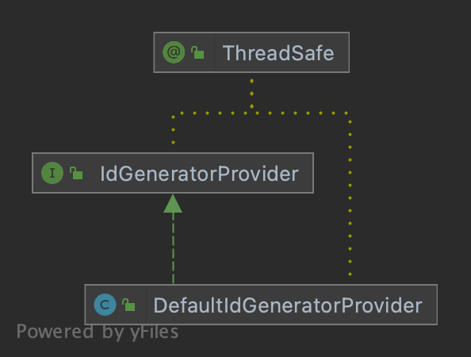

# IdGeneratorProvider

> `IdGenerator` 容器

  

## DefaultIdGeneratorProvider

> 默认的 `IdGenerator` 容器，所有`IdGenerator`都将注入到 `DefaultIdGeneratorProvider.INSTANCE`中。

## LazyIdGenerator

> 懒加载 `IdGenerator`

