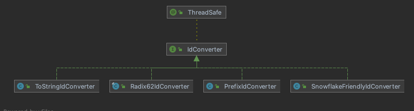

# IdConverter

> **ID转换器**，用于将 `long` 类型ID转换为 `String`，反之亦然。

```java
@ThreadSafe
public interface IdConverter {

    /**
     * convert {@link long} type ID to {@link String}
     *
     * @param id {@link long} type ID
     * @return {@link String} type ID
     */
    String asString(long id);

    /**
     * convert {@link String} type ID to {@link long}
     *
     * @param idString {@link String} type ID
     * @return {@link long} type ID
     */
    long asLong(String idString);
}
```

## IdConverter implementation class diagram

<p align="center">
  
</p>

## ToStringIdConverter

> String 转换器，用于将 `long` 转换成String 或者将 String 转换成 long 类型

- 规则
  - long 转 String：String.valueOf
  - String 转 long： Long.parseLong

## Radix62IdConverter

> 62进制转换器，用于将 `long` 类型转换成 `62进制字符串`，或者将 `62进制字符串` 转换成`long` 类型

- 规则：`[0-9][A-Z][a-z]{11}`

## SnowflakeFriendlyIdConverter

> 雪花Id转换器，将符合雪花规则的字符串，转换成 long ，或者long 转换成雪花规则字符串

## PrefixIdConverter

> 将带有前缀的字符串转换成long，或者将long转换成带前缀字符串

- 规则
  - 例如：前缀为：`no_`, 转换器选用`ToStringIdConverter`，数字`1` 经过转换得到`no_1`,反之亦然。
