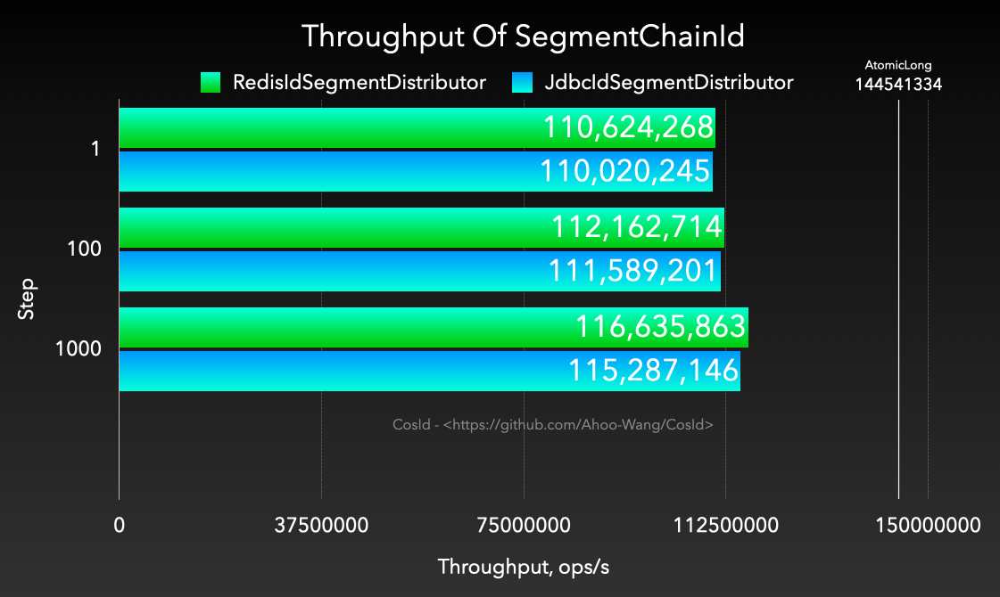

# 号段链模式

  

**SegmentChainId**是**SegmentId**增强版，相比于**SegmentId**有以下优势：

- 稳定性：**SegmentId**的稳定性问题（P9999=46.624(us/op)）主要是因为号段用完之后同步进行`NextMaxId`的获取导致的（会产生网络IO）。
  - **SegmentChainId** （P9999=0.208(us/op)）引入了新的角色**PrefetchWorker**用以维护和保证**安全距离**，理想情况下使得获取ID的线程几乎完全不需要进行同步的等待`NextMaxId`获取，性能可达到近似 `AtomicLong` 的 *TPS 性能:12743W+/s* [JMH 基准测试](faq/perf-test.md) 。
- 适应性：从**SegmentId**介绍中我们知道了影响**ID乱序**的因素有俩个：集群规模、`Step`大小。集群规模是我们不能控制的，但是`Step`是可以调节的。
  - `Step`应该近可能小才能使得**ID单调递增**的可能性增大。
  - `Step`太小会影响吞吐量，那么我们如何合理设置`Step`呢？答案是我们无法准确预估所有时点的吞吐量需求，那么最好的办法是吞吐量需求高时，Step自动增大，吞吐量低时Step自动收缩。
  - **SegmentChainId**引入了**饥饿状态**的概念，**PrefetchWorker**会根据**饥饿状态**检测当前**安全距离**是否需要膨胀或者收缩，以便获得吞吐量与有序性之间的权衡，这便是**SegmentChainId**的自适应性。

## 为什么需要*SegmentChainId*

  

通过**SegmentChainId**设计图中我们可以看到，号段链模式新增了一个角色**PrefetchWorker**。
**PrefetchWorker**主要的职责是维护和保证号段链头部到尾部的**安全距离**，也可以近似理解为缓冲距离。
有了安全距离的保障不难得出的结论是所有获取ID的线程只要从进程内存的号段里边获取下次ID即可，理想情况下不需要再进行`NextMaxId`（向号段分发器请求`NextMaxId`，网络IO）的，所以性能可以达到近似`AtomicLong` 的 *TPS 性能:12743W+/s*的级别。

**SegmentChainId**是**SegmentId**的增强版，相比于**SegmentId**有以下优势：

- TPS性能：可达到近似 `AtomicLong` 的 *TPS 性能:12743W+/s* [JMH 基准测试](faq/perf-test)。通过引入了新的角色**PrefetchWorker**用以维护和保证**安全距离**，理想情况下使得获取ID的线程几乎完全不需要进行同步的等待`NextMaxId`获取。
- 稳定性：P9999=0.208(us/op)，通过上面的TPS性能描述中我们可以看到，**SegmentChainId**消除了同步等待的问题，所以稳定性问题也因此迎刃而解。
- 适应性：从**SegmentId**介绍中我们知道了影响**ID乱序**的因素有俩个：集群规模、`Step`大小。集群规模是我们不能控制的，但是`Step`是可以调节的。
    - `Step`应该尽可能小才能使得**ID单调递增**的可能性增大。
    - `Step`太小会影响吞吐量，那么我们如何合理设置`Step`呢？答案是我们无法准确预估所有时点的吞吐量需求，那么最好的办法是吞吐量需求高时，Step自动增大，吞吐量低时Step自动收缩。
    - **SegmentChainId**引入了**饥饿状态**的概念，**PrefetchWorker**会根据**饥饿状态**检测当前**安全距离**是否需要膨胀或者收缩，以便获得吞吐量与有序性之间的权衡，这便是**SegmentChainId**的自适应性。
    - 所以在使用**SegmentChainId**时我们可以配置一个比较小的`Step`步长，然后由**PrefetchWorker**根据吞吐量需求自动调节**安全距离**，来自动伸缩步长。

## RedisIdSegmentDistributor、JdbcIdSegmentDistributor 均能够达到TPS=1.2亿/s？

  

上面的两张图给许多同学带来了困扰，为什么在`Step=1000`的时候*RedisIdSegmentDistributor*、*JdbcIdSegmentDistributor*TPS性能几乎一致(TPS=1.2亿/s)。
*RedisIdSegmentDistributor*应该要比*JdbcIdSegmentDistributor*性能更高才对啊，为什么都能达到*AtomicLong*性能上限呢？
如果我说当`Step=1`时，只要基准测试的时间够长，那么他们依然能够达到*AtomicLong*性能级别(TPS=1.2亿/s)，你会不会更加困惑。
其实这里的*障眼法*是**PrefetchWorker**的**饥饿膨胀**导致的，*SegmentChainId*的极限性能跟分发器的TPS性能没有直接关系，因为最终都可以因饥饿膨胀到性能上限，只要给足够的时间膨胀。
而为什么在上图的`Step=1`时TPS差异还是很明显的，这是因为*RedisIdSegmentDistributor*膨胀得更快，而基准测试又没有给足测试时间而已。

**SegmentChainId**基准测试*TPS极限性能*可以近似使用以下的公式的表示：

`TPS(SegmentChainId)极限值=(Step*Expansion)*TPS(IdSegmentDistributor)*T/s<=TPS(AtomicLong)`

1. `<=TPS(AtomicLong)`：因为*SegmentChainId*的内部号段就是使用的`AtomicLong`，所以这是性能上限。
2. `Step*Expansion`：*Expansion*可以理解为饥饿膨胀系数，默认的饥饿膨胀系数是2。在*MySqlChainIdBenchmark*、*MySqlChainIdBenchmark*基准测试中这个值是一样的。
3. `TPS(IdSegmentDistributor)`: 这是公式中唯一的不同。指的是请求号段分发器`NextMaxId`的TPS。
4. `T`: 可以理解为基准测试运行时常。

从上面的公式中不难看出*RedisChainIdBenchmark*、*MySqlChainIdBenchmark*主要差异是分发器的TPS性能。
分发器的`TPS(IdSegmentDistributor)`越大，达到`TPS(AtomicLong)`所需的`T`就越少。但只要`T`足够长，那么任何分发器都可以达到近似`TPS(AtomicLong)`。
这也就解释了为什么不同TPS性能级别的号段分发器(**IdSegmentDistributor**)都可以达到TPS=1.2亿/s。
