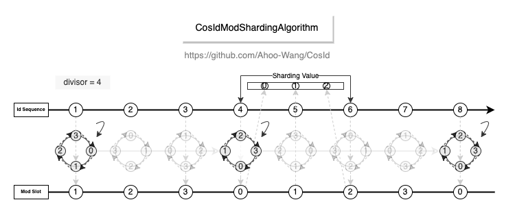
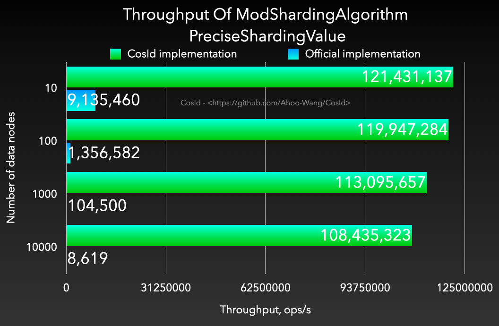
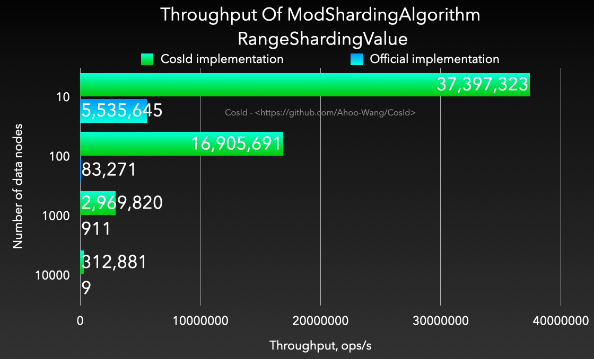

# 取模分片算法

  

- 算法复杂度：O(1)
- 性能 : 相比于 `org.apache.shardingsphere.sharding.algorithm.sharding.mod.ModShardingAlgorithm` 性能高出 *1200~4000* 倍。并且稳定性更高，不会出现严重的性能退化。

| **PreciseShardingValue**                                                                                   | **RangeShardingValue**                                                                                   |
|------------------------------------------------------------------------------------------------------------|----------------------------------------------------------------------------------------------------------|
|  |  |

