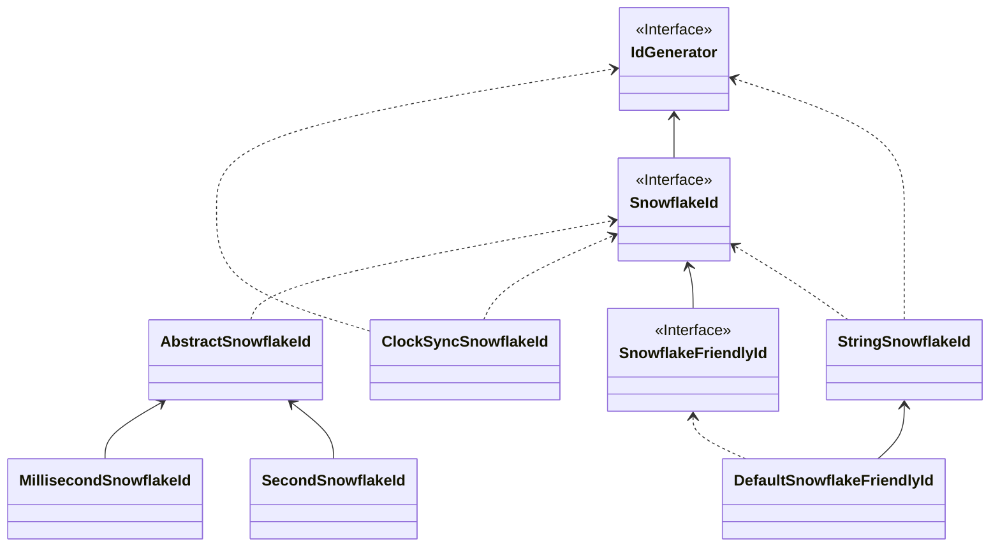

# SnowflakeId

_SnowflakeId_ 是*Twitter*开发的一种分布式唯一ID生成算法，被广泛应用于分布式系统中。它的设计目标是生成趋势递增、全局唯一的ID，以应对大规模系统的需求。

<p align="center" >
  
</p>

## 简介

:::info
*SnowflakeId* 使用`Long`（64-bit）位分区来生成ID的一种分布式ID算法。

通用的位分配方案为：`timestamp`(41-bit)+`machineId`(10-bit)+`sequence`(12-bit)=63-bit。
:::

- 41-bit`timestamp`=(1L<<41)/(1000/3600/24/365)，约可以存储69年的时间戳，即可以使用的绝对时间为`EPOCH`+69年，一般我们需要自定义`EPOCH`为产品开发时间，另外还可以通过压缩其他区域的分配位数，来增加时间戳位数来延长可用时间。
- 10-bit`machineId`=(1L<<10)=1024，即相同业务可以部署1024个副本(在Kubernetes概念里没有主从副本之分，这里直接沿用Kubernetes的定义)。一般情况下没有必要使用这么多位，所以会根据部署规模需要重新定义。
- 12-bit`sequence`=(1L<<12)*1000=4096000，即单机每秒可生成约409W的ID，全局同业务集群可产生`4096000*1024=419430W=41.9亿(TPS)`。

从 *SnowflakeId* 设计上可以看出:

- :thumbsup: `timestamp`在高位，单实例*SnowflakeId*是会保证时钟总是向前的（校验本机时钟回拨），所以是本机单调递增的。受全局时钟同步/时钟回拨影响*SnowflakeId*是全局趋势递增的。
- :thumbsup: *SnowflakeId*不对任何第三方中间件有强依赖关系，并且性能也非常高。
- :thumbsup: 位分配方案可以按照业务系统需要灵活配置，来达到最优使用效果。
- :thumbsdown: 强依赖本机时钟，潜在的时钟回拨问题会导致ID重复、处于短暂的不可用状态。
- :thumbsdown: `machineId`需要手动设置，实际部署时如果采用手动分配`machineId`，会非常低效。

## 挑战

### 机器号分配

在**SnowflakeId**中根据业务设计的位分配方案确定了基本上就不再有变更了，也很少需要维护。但是`machineId`总是需要配置的，而且集群中是不能重复的，否则分区原则就会被破坏而导致ID唯一性原则破坏，当集群规模较大时`machineId`的维护工作是非常繁琐，低效的。

:::tip
有一点需要特别说明的，**SnowflakeId** 的 **MachineId** 是逻辑上的概念，而不是物理概念，所以称之为 `WorkerId` 更为准确。

想象一下假设 **MachineId** 是物理上的，那么意味着一台机器拥有只能拥有一个 **MachineId**，那会产生什么问题呢？
:::

目前 *[CosId](https://github.com/Ahoo-Wang/CosId)* 提供了以下五种 `MachineId` 分配器。

- `ManualMachineIdDistributor`: 手动配置`machineId`，一般只有在集群规模非常小的时候才有可能使用，不推荐。
- `StatefulSetMachineIdDistributor`: 使用`Kubernetes`的`StatefulSet`提供的稳定的标识ID（HOSTNAME=service-01）作为机器号。
- `RedisMachineIdDistributor`: 使用**Redis**作为机器号的分发存储，同时还会存储`MachineId`的上一次时间戳，用于**启动时时钟回拨**的检查。
- `JdbcMachineIdDistributor`: 使用**关系型数据库**作为机器号的分发存储，同时还会存储`MachineId`的上一次时间戳，用于**启动时时钟回拨**的检查。
- `ZookeeperMachineIdDistributor`: 使用**ZooKeeper**作为机器号的分发存储，同时还会存储`MachineId`的上一次时间戳，用于**启动时时钟回拨**的检查。
- `MongoMachineIdDistributor`: 使用**MongoDB**作为机器号的分发存储，同时还会存储`MachineId`的上一次时间戳，用于**启动时时钟回拨**的检查。

<p align="center" >
  
</p>

<p align="center">
  
</p>

### 时钟回拨

时钟回拨的致命问题是会导致ID重复、冲突（这一点不难理解），ID重复显然是不能被容忍的。
在**SnowflakeId**算法中，按照**MachineId**分区ID，我们不难理解的是不同**MachineId**是不可能产生相同ID的。所以我们解决的时钟回拨问题是指当前**MachineId**的时钟回拨问题，而不是所有集群节点的时钟回拨问题。

**MachineId**时钟回拨问题大体可以分为俩种情况：

- 运行时时钟回拨：即在运行时获取的当前时间戳比上一次获取的时间戳小。这个场景的时钟回拨是很容易处理的，一般**SnowflakeId**代码实现时都会存储`lastTimestamp`用于运行时时钟回拨的检查，并抛出时钟回拨异常。
  - 时钟回拨时直接抛出异常是不太好地实践，因为下游使用方几乎没有其他处理方案（噢，我还能怎么办呢，等吧），时钟同步是唯一的选择，当只有一种选择时就不要再让用户选择了。
  - `ClockSyncSnowflakeId`是`SnowflakeId`的包装器，当发生时钟回拨时会使用`ClockBackwardsSynchronizer`主动等待时钟同步来重新生成ID，提供更加友好的使用体验。
- 启动时时钟回拨：即在启动服务实例时获取的当前时钟比上次关闭服务时小。此时的`lastTimestamp`是无法存储在进程内存中的。当获取的外部存储的**机器状态**大于当前时钟时钟时，会使用`ClockBackwardsSynchronizer`主动同步时钟。
  - LocalMachineStateStorage：使用本地文件存储`MachineState`(机器号、最近一次时间戳)。因为使用的是本地文件所以只有当实例的部署环境是稳定的，`LocalMachineStateStorage`才适用。
  - RedisMachineIdDistributor：将`MachineState`存储在**Redis**分布式缓存中，这样可以保证总是可以获取到上次服务实例停机时**机器状态**。

### 取模分片不均匀

_CosId_ 通过引入 `sequenceResetThreshold` 属性，巧妙地解决了取模分片不均匀的问题，这一设计在无需牺牲性能的同时，为用户提供了更加出色的使用体验。

### JavaScript数值溢出

`JavaScript`的`Number.MAX_SAFE_INTEGER`只有53-bit，如果直接将63位的`SnowflakeId`返回给前端，那么会产生值溢出的情况（所以这里我们应该知道后端传给前端的`long`值溢出问题，**迟早**会出现，只不过SnowflakeId出现得更快而已）。
很显然溢出是不能被接受的，一般可以使用以下俩种处理方案：
- 将生成的63-bit`SnowflakeId`转换为`String`类型。
  - 直接将`long`转换成`String`。
  - 使用`SnowflakeFriendlyId`将`SnowflakeId`转换成比较友好的字符串表示：`{timestamp}-{machineId}-{sequence} -> 20210623131730192-1-0`
- 自定义`SnowflakeId`位分配来缩短`SnowflakeId`的位数（53-bit）使 `ID` 提供给前端时不溢出
  - 使用`SafeJavaScriptSnowflakeId`(`JavaScript` 安全的 `SnowflakeId`)

## 具体实现



### MillisecondSnowflakeId

`MillisecondSnowflakeId` 是 `SnowflakeId` 的默认实现，它使用 `System.currentTimeMillis()` 作为时间戳，精确到毫秒级别。

### SecondSnowflakeId

`SecondSnowflakeId` 是 `SnowflakeId` 的另一种实现，它使用 `System.currentTimeMillis() / 1000` 作为时间戳，精确到秒级别。

### DefaultSnowflakeFriendlyId

`DefaultSnowflakeFriendlyId` 是 `SnowflakeId` 的包装器，它将`SnowflakeId`转换成比较友好的字符串表示：`{timestamp}-{machineId}-{sequence} -> 20210623131730192-1-0`

### ClockSyncSnowflakeId

`ClockSyncSnowflakeId` 是 `SnowflakeId` 的包装器，当发生时钟回拨时会使用`ClockBackwardsSynchronizer`主动等待时钟同步来重新生成ID，提供更加友好的使用体验。


## 配置

[SnowflakeId 配置](../reference/config/snowflake)

### 配置案例

```yaml
cosid:
  namespace: ${spring.application.name}
  machine:
    enabled: true
    distributor:
      type: jdbc # 机器号分配器
    guarder:
      enabled: true # 开启机器号守护
  snowflake:
    enabled: true
    zone-id: Asia/Shanghai
    epoch: 1577203200000
    share:
      clock-sync: true # 开启始终回拨同步
      friendly: true 
    provider:
      short_id:
        converter:
          prefix: cosid_
          type: radix
          radix:
            char-size: 11
            pad-start: false
      safe-js:
        machine-bit: 3
        sequence-bit: 9
```

