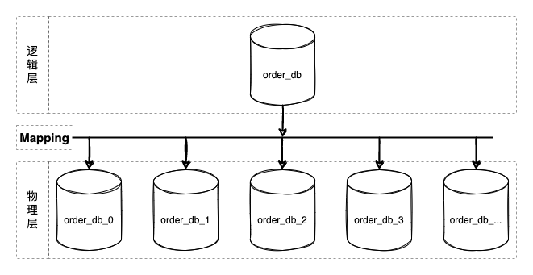
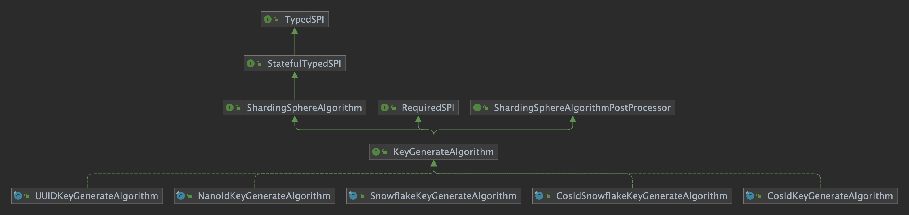
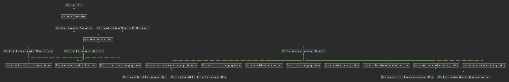

<p align="center" >
  
</p>

# ShardingSphere 集成 CosId 实战

## 背景

在软件系统演进过程中，随着业务规模的增长 (TPS/存储容量)，我们需要通过集群化部署来分摊计算、存储压力。
应用服务的无状态设计使其具备了伸缩性。在使用 **Kubernetes** 部署时我们只需要一行命令即可完成服务伸缩
(`kubectl scale --replicas=5 deployment/order-service`)。

但对于有状态的数据库就不那么容易了，此时数据库变成系统的性能瓶颈是显而易见的。

### 分库分表

> 从微服务的角度来理解垂直拆分其实就是微服务拆分。以限界上下文来定义服务边界将大服务/单体应用拆分成多个自治的粒度更小的服务，因为自治性规范要求，数据库也需要进行业务拆分。
> 但垂直拆分后的单个微服务依然会面临 TPS/存储容量 的挑战，所以这里我们重点讨论水平拆分的方式。

<p align="center" >
  
</p>

数据库分库分表方案是逻辑统一，物理分区自治的方案。其核心设计在于中间层映射方案的设计 (上图 **Mapping**)，即分片算法的设计。
几乎所有编程语言都内置实现了散列表(java:`HashMap`/csharp:`Dictionary`/python:`dict`/go:`map` ...)。分片算法跟散列表高度相似(`hashCode`)，都得通过 `key`/`shardingValue` 映射到对应的槽位(`slot`)。

那么 `shardingValue` 从哪里来呢？**CosId**！！！

### CosId：分布式 ID 生成器

*[CosId](https://github.com/Ahoo-Wang/CosId)* 旨在提供通用、灵活、高性能的分布式 ID 生成器。**CosId** 目前提供了以下三种算法：

- `SnowflakeId` : *单机 TPS 性能：409W/s* , 主要解决 *时钟回拨问题* 、*机器号分配问题* 并且提供更加友好、灵活的使用体验。
- `SegmentId`: 每次获取一段 (`Step`) ID，来降低号段分发器的网络IO请求频次提升性能，提供多种存储后端：关系型数据库、**Redis**、**Zookeeper** 供用户选择。
- `SegmentChainId`(**推荐**):`SegmentChainId` (*lock-free*) 是对 `SegmentId` 的增强。性能可达到近似 `AtomicLong` 的 *TPS 性能:12743W+/s*。

`shardingValue` 问题解决了，但这就够了吗？**ShardingSphere**！！！

> 摘自 **CosId** 官网：<https://github.com/Ahoo-Wang/CosId>

### ShardingSphere

Apache ShardingSphere 是一款开源分布式数据库生态项目，由 JDBC、Proxy 和 Sidecar（规划中） 3 款产品组成。其核心采用可插拔架构，通过组件扩展功能。对上以数据库协议及 SQL 方式提供诸多增强功能，包括数据分片、访问路由、数据安全等；对下原生支持 MySQL、PostgreSQL、SQL Server、Oracle 等多种数据存储引擎。Apache ShardingSphere 项目理念，是提供数据库增强计算服务平台，进而围绕其上构建生态。充分利用现有数据库的计算与存储能力，通过插件化方式增强其核心能力，为企业解决在数字化转型中面临的诸多使用难点，为加速数字化应用赋能。

> 摘自 **Apache ShardingSphere** 官网：<https://shardingsphere.apache.org/index_zh.html>

接下来进入本文的主要内容：如何基于 **ShardingSphere** 可插拔架构（SPI）来集成 **CosId**，以及应用配置指南。

## 安装

> 以 **Spring-Boot 应用** 为例

- ShardingSphere v5.1.0+

> 因为 `ShardingSphere v5.1.0` [PR](https://github.com/apache/shardingsphere/pull/14132)，已经合并了 [cosid-shardingsphere](https://github.com/Ahoo-Wang/CosId/tree/main/cosid-shardingsphere) 模块,所以只需要引用 `ShardingSphere` 依赖即可。

``` xml
<dependency>
    <groupId>org.apache.shardingsphere</groupId>
    <artifactId>shardingsphere-jdbc-core-spring-boot-starter</artifactId>
    <version>5.1.1</version>
</dependency>
```

- ShardingSphere v5.0.0

``` xml
<dependency>
    <groupId>org.apache.shardingsphere</groupId>
    <artifactId>shardingsphere-jdbc-core-spring-boot-starter</artifactId>
    <version>5.0.0</version>
</dependency>
<dependency>
    <groupId>me.ahoo.cosid</groupId>
    <artifactId>cosid-shardingsphere</artifactId>
    <version>1.8.15</version>
</dependency>
```

## 分布式 ID

> `KeyGenerateAlgorithm`

### UML Class Diagram

<p align="center" >
  
</p>

> 上图展示了目前所有 `ShardingSphere` 内置的 `KeyGenerateAlgorithm` 实现，这里我们只讲 `CosIdKeyGenerateAlgorithm` ，其他实现请阅读<https://shardingsphere.apache.org/document/current/cn/features/sharding/concept/key-generator/>。

### CosIdKeyGenerateAlgorithm

#### 配置

> type: COSID

| 名称        | 数据类型     | 说明                                              | 默认值         |
|-----------|----------|-------------------------------------------------|-------------|
| id-name   | `String` | `IdGenerator` 的名称（在 `IdGeneratorProvider` 中已注册） | `__share__` |
| as-string | `String` | 是否生成字符串类型的ID                                    | `fasle`     |

```yaml
spring:
  shardingsphere:
    rules:
      sharding:
        key-generators:
          cosid:
            type: COSID
            props:
              id-name: __share__
```

## 分片算法

> `ShardingAlgorithm`

### UML Class Diagram

<p align="center" >
  
</p>

### CosIdModShardingAlgorithm

CosId取模分片算法

#### 算法说明

<p align="center" >
  
</p>

> 单值分片键(`PreciseShardingValue`)算法复杂度：`O(1)`。
> 
> 范围值分片键(`RangeShardingValue`)算法复杂度：`O(N)`，其中`N`为范围值个数。

#### 性能基准测试

| 精确值/单值(**PreciseShardingValue**)                                                                           | 范围值/多值(**RangeShardingValue**)                                                                           |
|------------------------------------------------------------------------------------------------------------|----------------------------------------------------------------------------------------------------------|
|  |  |

#### 配置

> type: COSID_MOD

| 名称                | 数据类型     | 说明         | 默认值 |
|-------------------|----------|------------|-----|
| logic-name-prefix | `String` | 逻辑表/数据源名前缀 |     |
| mod               | `int`    | 除数         |     |

```yaml
spring:
  shardingsphere:
    rules:
      sharding:
        sharding-algorithms:
          alg-name:
            type: COSID_MOD
            props:
              mod: 4
              logic-name-prefix: t_table_
```

### CosIdIntervalShardingAlgorithm

基于间隔的时间范围分片算法。

#### 算法说明

<p align="center" >
  
</p>

> 精确值/单值分片键(`PreciseShardingValue`)算法复杂度：`O(1)`。
> 
> 范围值分片键(`RangeShardingValue`)算法复杂度：`O(N)`，其中`N`为范围值单位时间个数。

#### 性能基准测试

| 精确值/单值(**PreciseShardingValue**)                                                                                | 范围值/多值(**RangeShardingValue**)                                                                                |
|-----------------------------------------------------------------------------------------------------------------|---------------------------------------------------------------------------------------------------------------|
|  |  |

#### 配置

> type: COSID_INTERVAL

| 名称                       | 数据类型         | 说明                                  | 默认值                              |
|--------------------------|--------------|-------------------------------------|----------------------------------|
| logic-name-prefix        | `String`     | 逻辑表/数据源名前缀                          |                                  |
| datetime-lower           | `String`     | 时间分片下界值，时间戳格式：`yyyy-MM-dd HH:mm:ss` |                                  |
| datetime-upper           | `String`     | 时间分片上界值，时间戳格式：`yyyy-MM-dd HH:mm:ss` |                                  |
| sharding-suffix-pattern  | `String`     | 分片真实表/数据源后缀格式                       |                                  |
| datetime-interval-unit   | `ChronoUnit` | 分片键时间间隔单位                           |                                  |
| datetime-interval-amount | `int`        | 分片键时间间隔                             |                                  |
| ts-unit                  | `String`     | 时间戳单位：`SECOND`/`MILLISECOND`        | `MILLISECOND`                    |
| zone-id                  | `String`     | 分片键时区                               | `ZoneId.systemDefault().getId()` |

```yaml
spring:
  shardingsphere:
    rules:
      sharding:
        sharding-algorithms:
          alg-name:
            type: COSID_INTERVAL
            props:
              logic-name-prefix: logic-name-prefix
              datetime-lower: 2021-12-08 22:00:00
              datetime-upper: 2022-12-01 00:00:00
              sharding-suffix-pattern: yyyyMM
              datetime-interval-unit: MONTHS
              datetime-interval-amount: 1
```

### CosIdSnowflakeIntervalShardingAlgorithm

#### 算法说明

我们知道 *SnowflakeId* 的位分区方式，*SnowflakeId* 可以解析出时间戳，即 *SnowflakeId* 可以作为时间，所以 *SnowflakeId* 可以作为 *INTERVAL* 的分片算法的分片值。
（当没有`CreateTime`可用作分片时[这是一个非常极端的情况]，或者对性能有非常极端的要求时， *分布式ID主键* 作为查询范围可能是持久层性能更好的选择。 )

#### 配置

> type: COSID_INTERVAL_SNOWFLAKE

| 名称                       | 数据类型         | 说明                                              | 默认值         |
|--------------------------|--------------|-------------------------------------------------|-------------|
| logic-name-prefix        | `String`     | 逻辑表/数据源名前缀                                      |             |
| datetime-lower           | `String`     | 时间分片下界值，时间戳格式：`yyyy-MM-dd HH:mm:ss`             |             |
| datetime-upper           | `String`     | 时间分片上界值，时间戳格式：`yyyy-MM-dd HH:mm:ss`             |             |
| sharding-suffix-pattern  | `String`     | 分片真实表/数据源后缀格式                                   |             |
| datetime-interval-unit   | `ChronoUnit` | 分片键时间间隔单位                                       |             |
| datetime-interval-amount | `int`        | 分片键时间间隔                                         |             |
| id-name                  | `String`     | `IdGenerator` 的名称（在 `IdGeneratorProvider` 中已注册） | `__share__` |

```yaml
spring:
  shardingsphere:
    rules:
      sharding:
        sharding-algorithms:
          alg-name:
            type: COSID_INTERVAL_SNOWFLAKE
            props:
              logic-name-prefix: logic-name-prefix
              datetime-lower: 2021-12-08 22:00:00
              datetime-upper: 2022-12-01 00:00:00
              sharding-suffix-pattern: yyyyMM
              datetime-interval-unit: MONTHS
              datetime-interval-amount: 1
              id-name: cosid-name
```

## 总结

本文主要讨论了分库分表产生的背景以及如何基于 **ShardingSphere** 可插拔架构集成 **CosId** 的应用实战。
**ShardingSphere** 采用可插拔架构，使得开发者非常方便的自定义满足自身应用场景的功能扩展，如果你也对参与 **ShardingSphere** 社区贡献感兴趣请参考 <https://shardingsphere.apache.org/community/cn/contribute/contributor/> 。

## 阅读源码的小技巧之类图

相信很多小伙伴在阅读源码过程中总是难以自拔的遍历式以方法为单位一行行查看源码的实现细节，以至于迷失在细节中（如果你还能坚持下来，那真是佩服你的毅力之坚韧！）。这样的阅读方式是非常糟糕的、低效的。
阅读源码跟阅读书籍一样有非常多的相似之处：先建立一个概览图（索引），然后再逐层往下精进。（自上而下的方式更有利于阅读过程中不迷失在具体细节中）
推荐大家使用IDEA的插件 *Diagrams* 用于生成源码级别的概览图：UML类图。

> - IntelliJ IDEA: <https://www.jetbrains.com/help/idea/class-diagram.html>

## 引用说明

- ShardingSphere 官方文档：<https://shardingsphere.apache.org/document/current/cn/overview/>
- IntelliJ IDEA: <https://www.jetbrains.com/help/idea/class-diagram.html>
- CosId-ShardingSphere: <https://cosid.ahoo.me/guide/cosid-shardingsphere.html>
