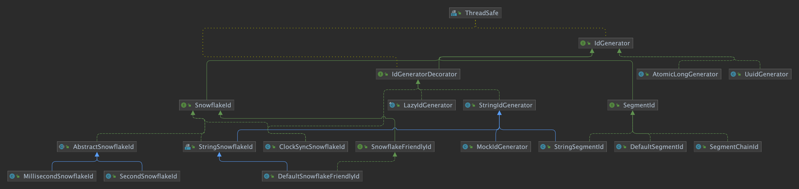

# IdGenerator

> **分布式ID**生成器

## 接口定义

```java

@ThreadSafe
public interface IdGenerator {

    /**
     * ID转换器，用于将 {@link long} 类型ID转换为 {@link String}
     *
     * @return ID转换器
     */
    default IdConverter idConverter() {
        return ToStringIdConverter.INSTANCE;
    }

    /**
     * 生成分布式ID
     *
     * @return 分布式ID
     */
    long generate();

    /**
     * 生成分布式ID字符串
     *
     * @return 分布式ID字符串
     */
    default String generateAsString() {
        return idConverter().asString(generate());
    }
}
```

## IdGenerator 实现类图

<p align="center">
  
</p>

## 实现类

CosId 提供了多种 `IdGenerator` 实现：

| 实现类 | 描述 |
|--------|------|
| `CosIdGenerator` | 通用高性能生成器，支持百万级实例 |
| `SnowflakeId` | Twitter Snowflake 算法实现 |
| `SegmentId` | 基于号段的 ID 生成，支持批量分配 |
| `SegmentChainId` | 带预取工作线程的无锁号段链 |

## 使用示例

```java
// 通过 @Autowired 注入
@Autowired
private IdGenerator idGenerator;

// 生成 long 类型ID
long id = idGenerator.generate();

// 生成 String 类型ID
String idStr = idGenerator.generateAsString();
```
