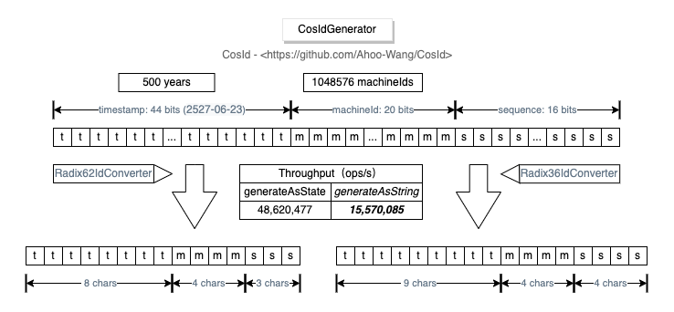

# CosIdGenerator

_CosIdGenerator_ *单机 TPS 性能：1557W/s*，三倍于 `UUID.randomUUID()`，基于时钟的全局趋势递增ID，可以同时支持一百万个实例。

  

## 特性介绍

- 全局趋势递增
- 局部单调递增
- 高性能:15,570,085 ops/s(generateAsString),3倍于 `UUID.randomUUID()`
- 反向解析ID状态（时间戳，机器号，序列号）
- 易于扩展
- 更小的存储空间：15个字符
- 同时支持一百万个实例

基于以上特性，_CosIdGenerator_ 特别适用于大规模集群场景下的全局唯一性ID生成。

## Radix36CosIdGenerator

使用36进制格式化的*CosId生成器*

`[timestamp(44)]-[machineId(20)]-[sequence(16)] = 80 BITS = 17 CHARS=[timestamp(8)]-[machineId(4)]-[sequence(3)]`

- 时间戳由原来的44位缩减为8位
- 机器号由原来20位缩减为4位
- 序列号由原来的16位缩减为3位

## Radix62CosIdGenerator

使用62进制格式化的*CosId生成器*

`[timestamp(44)]-[machineId-(20)]-[sequence-(16)] = 80 BITS = 15 CHARS=[timestamp(9)]-[machineId(4)]-[sequence(4)]`

- 时间戳由原来的44位缩减为9位
- 机器号由原来20位缩减为4位
- 序列号由原来的16位缩减为3位

## 配置

[CosIdGenerator 配置](../reference/config/cosid-generator.md)
