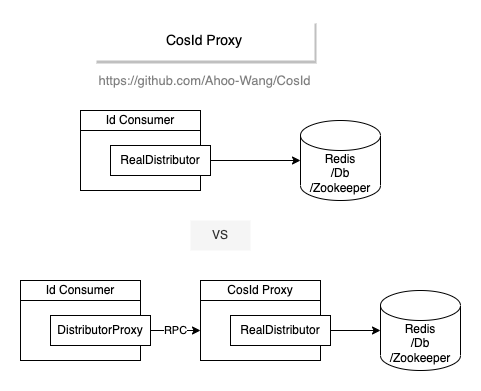

# CosId Proxy 模块

<center>


</center>

CosId Proxy 支持远程 ID 分发，允许客户端通过代理服务器分发机器 ID 和号段 ID，而不是直接连接底层存储。

## 概述

CosId Proxy 提供客户端-服务器架构：

- **代理服务器**：使用底层存储（Redis、ZooKeeper、JDBC 等）管理机器 ID 和号段 ID 的实际分发
- **代理客户端**：使用 `ProxyMachineIdDistributor` 和 `ProxyIdSegmentDistributor` 通过 HTTP/REST API 与代理服务器通信

此架构适用于：
- 直接访问存储基础设施受限的场景
- 需要集中管理 ID 的场景
- 需要增强安全性和审计的场景

## 核心组件

### ProxyMachineIdDistributor

`ProxyMachineIdDistributor` 是 `MachineIdDistributor` 的远程实现，通过与代理服务器通信来实现：
- 分发机器 ID
- 回滚机器 ID
- 守护机器 ID（心跳）

### ProxyIdSegmentDistributor

`ProxyIdSegmentDistributor` 是 `IdSegmentDistributor` 的远程实现，通过与代理服务器通信来实现：
- 分配号段 ID
- 管理号段链

## 架构

```
┌─────────────────┐         HTTP/REST          ┌─────────────────┐
│  CosId 客户端   │ ◄──────────────────────► │  代理服务器      │
│                 │                           │                 │
│ ProxyMachineId  │                           │ Redis/JDBC/ZK   │
│ ProxyIdSegment  │                           │                 │
└─────────────────┘                           └─────────────────┘
```

## 使用场景

- **安全受限环境**：当客户端应用无法直接访问存储基础设施时
- **集中管理**：当需要集中控制 ID 生成时
- **多租户系统**：当希望通过代理隔离每个租户的 ID 生成时