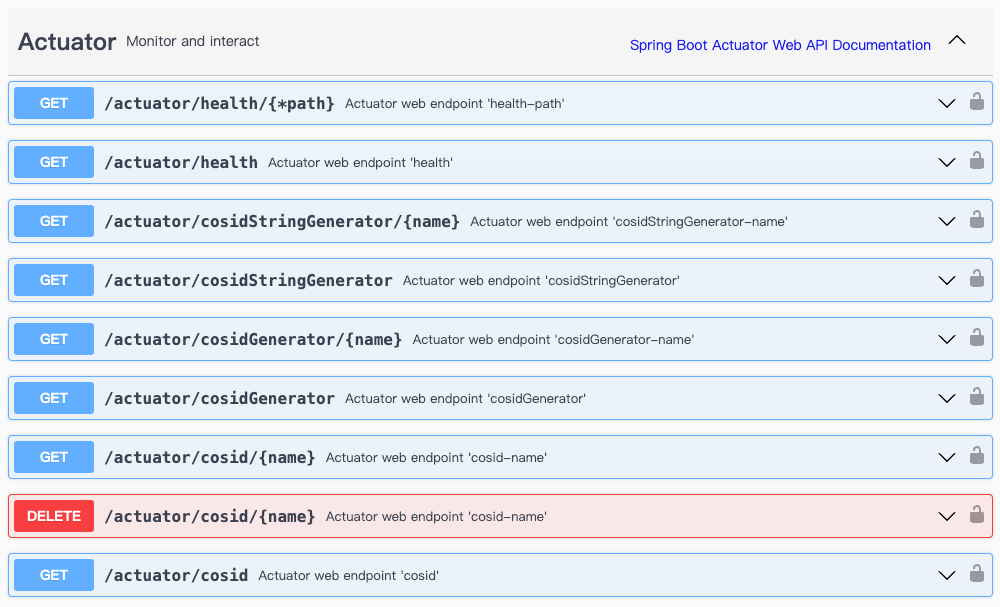

# CosId-Spring-Boot-Starter 模块

_Spring-Boot-Starter_ 模块 集成了所有 _CosId_ 扩展，提供了自动装配的能力，使 _CosId_ 框架在 _Spring Boot_ 项目中更加便捷地使用。

::: tip
该模块的配置文档请参考 [配置](../../reference/config/basic)。
:::

## 安装

::: code-group
```kotlin [Gradle(Kotlin)]
    val cosidVersion = "latestVersion"
    implementation("me.ahoo.cosid:cosid-spring-boot-starter:${cosidVersion}")
```
```xml [Maven]
    <dependencies>
        <dependency>
            <groupId>me.ahoo.cosid</groupId>
            <artifactId>cosid-spring-boot-starter</artifactId>
            <version>${cosid.version}</version>
        </dependency>
    </dependencies>
```
:::

## Actuate

CosId-Spring-Boot-Starter 模块提供了 actuator 支持，可以通过 actuator 端点查看 CosId 的状态。



### CosIdEndpoint

用于查看所有定义的 Id 生成器状态信息。

:::code-group
```shell [curl]
curl -X GET "http://localhost:8080/actuator/cosid" -H  "accept: */*"
```
```json [响应内容]
{
  "cosid": {
    "kind": "ClockSyncCosIdGenerator",
    "actual": {
      "kind": "Radix62CosIdGenerator",
      "machineId": 252,
      "lastTimestamp": 1704183358593,
      "converter": {
        "kind": "RadixCosIdStateParser",
        "actual": null
      }
    },
    "converter": {
      "kind": "RadixCosIdStateParser",
      "actual": null
    }
  },
  "user": {
    "kind": "StringSegmentId",
    "actual": {
      "kind": "SegmentChainId",
      "fetchTime": 1703401907,
      "maxId": 91658,
      "offset": 91638,
      "sequence": 91638,
      "step": 20,
      "isExpired": false,
      "isOverflow": false,
      "isAvailable": true,
      "converter": {
        "kind": "Radix62IdConverter",
        "radix": 62,
        "charSize": 11,
        "padStart": true,
        "maxId": 9223372036854776000
      }
    },
    "converter": {
      "kind": "Radix62IdConverter",
      "radix": 62,
      "charSize": 6,
      "padStart": true,
      "maxId": 56800235584
    }
  }
}
```
:::

### CosIdGeneratorEndpoint

提供了生成 `long` 类型 ID 的 API 接口。

### CosIdStringGeneratorEndpoint

提供了生成 `string` 类型 ID 的 API 接口。

### 配置

```yaml {6-8}
management:
  endpoints:
    web:
      exposure:
        include:
          - cosid
          - cosidGenerator
          - cosidStringGenerator
```