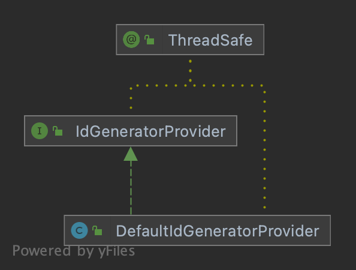

# IdGeneratorProvider

> `IdGenerator` 容器

<p align="center">
  
</p>

## DefaultIdGeneratorProvider

`DefaultIdGeneratorProvider` 是默认的 `IdGenerator` 容器实现。它是一个线程安全的注册表，使用 `ConcurrentHashMap` 管理命名的 ID 生成器实例。

### 主要特性

- **线程安全**: 使用 `ConcurrentHashMap` 进行并发访问
- **单例**: 通过 `INSTANCE` 提供共享实例
- **命名生成器**: 支持多个命名的 ID 生成器

### 使用方法

#### 获取共享生成器

```java
IdGenerator share = DefaultIdGeneratorProvider.INSTANCE.getShare();
long id = share.generate();
```

#### 获取命名生成器

```java
Optional<IdGenerator> orderGenerator = DefaultIdGeneratorProvider.INSTANCE.get("order");
orderGenerator.ifPresent(gen -> {
    long id = gen.generate();
});
```

#### 注册生成器

```java
DefaultIdGeneratorProvider.INSTANCE.set("order", segmentChainId);
```

#### 移除生成器

```java
IdGenerator removed = DefaultIdGeneratorProvider.INSTANCE.remove("order");
```

## 在 Spring Boot 中使用

Spring Boot 应用请注入 `IdGeneratorProvider` Bean，而不是直接使用 `DefaultIdGeneratorProvider.INSTANCE`。注解访问器、MyBatis、Spring Data JDBC、Activiti、Flowable、Axon 适配器都从这个 Bean 获取生成器，因此自定义的 `IdGeneratorProvider` Bean 会对它们全部生效。

| 配置 | 默认值 | 说明 |
|------|--------|------|
| `cosid.provider.isolated` | `false` | `false`：`IdGeneratorProvider` Bean 就是 `DefaultIdGeneratorProvider.INSTANCE`（与以往版本一致）。`true`：每个 `ApplicationContext` 使用独立的 `DefaultIdGeneratorProvider`，Context 关闭时清空；多个 Context（如 devtools 重启、测试缓存的 Context）之间不会共享生成器，`INSTANCE` 中也不再包含 Spring 注册的生成器。 |

## LazyIdGenerator

`LazyIdGenerator` 提供 ID 生成器的懒加载功能。生成器只在首次访问时创建。

### 使用方法

```java
LazyIdGenerator lazyGenerator = new LazyIdGenerator(() -> {
    // 首次访问时创建生成器
    return new SegmentChainId(distributor);
});
```

### 使用场景

- 延迟昂贵的生成器初始化
- 根据配置条件创建生成器
- 测试场景中需要控制生成器创建的情况