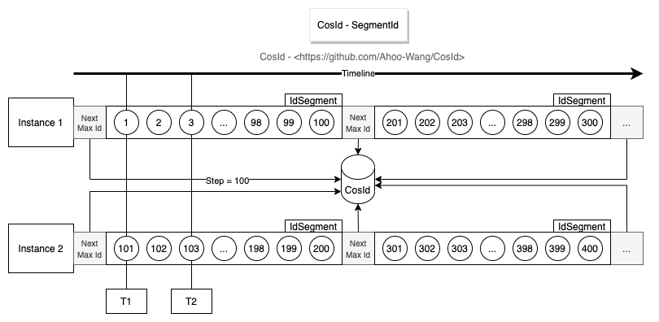
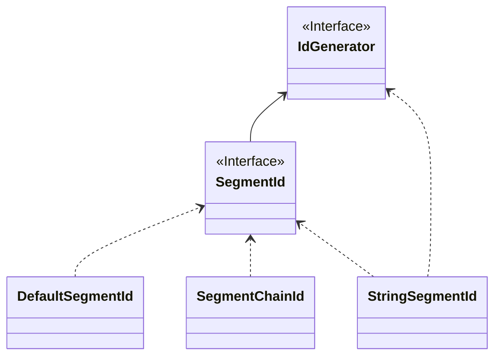

# SegmentId

  

从上面的设计图中，不难看出**号段模式**基本设计思路是通过每次获取一定长度（Step）的可用ID（Id段/号段），来降低网络IO请求次数，提升性能。

- :thumbsdown:强依赖第三方号段分发器，可用性受到第三方分发器影响。
- :thumbsdown:每次号段用完时获取`NextMaxId`需要进行网络IO请求，此时的性能会比较低。
- 单实例ID单调递增，全局趋势递增。
  - 从设计图中不难看出**Instance 1**每次获取的`NextMaxId`，一定比上一次大，意味着下一次的号段一定比上一次大，所以从单实例上来看是单调递增的。
  - 多实例各自持有的不同的号段，意味着同一时刻不同实例生成的ID是乱序的，但是整体趋势的递增的，所以全局趋势递增。
- ID乱序程度受到Step长度以及集群规模影响（从趋势递增图中不难看出）。
  - 假设集群中只有一个实例时**号段模式**就是单调递增的。
  - `Step`越小，乱序程度越小。当`Step=1`时，将无限接近单调递增。需要注意的是这里是无限接近而非等于单调递增，具体原因你可以思考一下这样一个场景：
    - 号段分发器T1时刻给**Instance 1**分发了`ID=1`,T2时刻给**Instance 2**分发了`ID=2`。因为机器性能、网络等原因，`Instance 2`网络IO写请求先于`Instance 1`到达。那么这个时候对于数据库来说，ID依然是乱序的。

## 具体实现

## IdSegmentDistributor

`IdSegmentDistributor` 是 CosId 中用于分发 ID 号段的核心接口。它提供了在分布式实例之间分配连续 ID 块的方法。

主要职责：
- 在命名空间内分配唯一的 ID 号段
- 管理号段大小（step）配置
- 提供号段链功能用于高级场景
- 支持号段的有效期

常用实现包括：
- **RedisIdSegmentDistributor**: 使用 Redis 进行号段分发
- **JdbcIdSegmentDistributor**: 使用关系数据库进行号段分发
- **ZookeeperIdSegmentDistributor**: 使用 ZooKeeper 进行号段分发

## GroupedIdSegmentDistributor

`GroupedIdSegmentDistributor` 扩展了 `IdSegmentDistributor`，支持 ID 分组（按分组键进行分区）。

分组分发器允许按分组键对 ID 号段进行分区，例如：
- **时间桶**: "2024-01" 用于按月分片，"2024-01-15" 用于按天分片
- **自定义键**: 业务特定的分组条件

这使得以下场景成为可能：
- 在时间边界（每天、每月、每年）重置序号
- 为不同租户或业务单元隔离 ID 范围
- 支持基于时间的分片算法

`GroupedIdSegmentDistributor` 允许 `allowReset()` 返回 `true`，从而在分组键变更时允许号段重置。

## 配置

[SegmentId 配置](../reference/config/segment)
