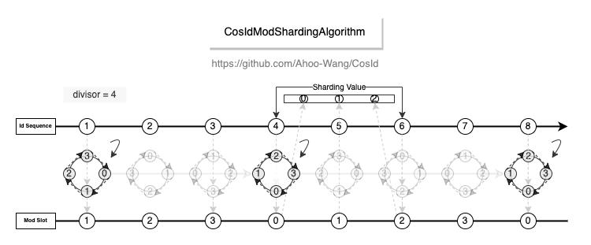
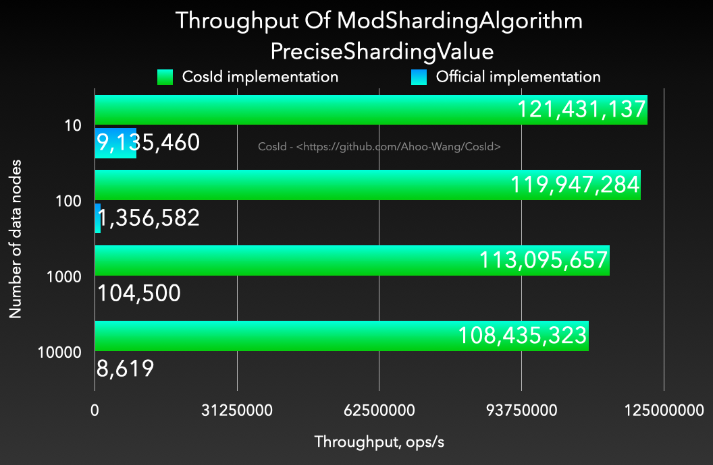
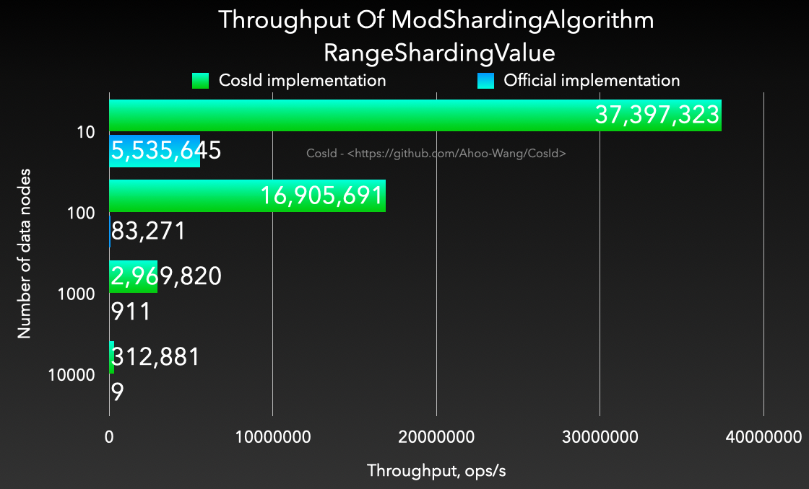

# 取模分片算法

  

- 算法复杂度：O(1)
- 性能 : 相比于 `org.apache.shardingsphere.sharding.algorithm.sharding.mod.ModShardingAlgorithm` 性能高出 *1200~4000* 倍。并且稳定性更高，不会出现严重的性能退化。

| **PreciseShardingValue**                                                                                      | **RangeShardingValue**                                                                                      |
|---------------------------------------------------------------------------------------------------------------|-------------------------------------------------------------------------------------------------------------|
|  |  |

## 区间分片语义

- 区间（`Range`）查询按跨度解析节点：跨度不小于分片总数时返回全部节点。典型如以 `Range.closed(0, Long.MAX_VALUE)` 表达"无上界"的查询会正确路由到全部节点（自 v3.2.1 起，大跨度区间不再受 int 溢出影响）。
- 分片值应为非负整数（雪花 ID、号段 ID 均为非负），负数分片值不受支持。

