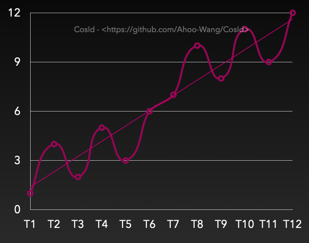

# 分布式ID(CosId)之号段链模式性能(1.2亿/s)解析

> 上一篇文章[《分布式ID生成器（CosId）设计与实现》](https://github.com/Ahoo-Wang/CosId/blob/main/wiki/Distributed-ID.zh-CN.md)我们已经简单讨论过[CosId](https://github.com/Ahoo-Wang/CosId)的设计与实现全貌。
> 
> 但是有很多同学有一些疑问：CosId的号段链模式（SegmentChainId）性能有些难以置信(TPS峰值性能1.2亿/s)，甚至是不同性能级别号段分发器（**RedisIdSegmentDistributor**、**JdbcIdSegmentDistributor**）均能够达到这样的性能级别。
> 
> 所以本篇文章将深度解析CosId的号段链模式（SegmentChainId）的设计思路与实现优化。
> 
> 新同学最好先查阅上一篇文章[《分布式ID生成器（CosId）设计与实现》](https://github.com/Ahoo-Wang/CosId/blob/main/wiki/Distributed-ID.zh-CN.md)。

## 背景（为什么需要*SegmentChainId*）

通过上一篇文章[《分布式ID生成器（CosId）设计与实现》](https://github.com/Ahoo-Wang/CosId/blob/main/wiki/Distributed-ID.zh-CN.md)我们知道号段模式（SegmentId）主要有以下问题：

- 稳定性：**SegmentId**的稳定性问题主要是因为号段用完之后获取ID的线程需要同步进行`NextMaxId`导致的（会产生网络IO）。
- 步长（Step）：设置多大的步长是一个权衡问题，设置太小会影响整体性能，设置太大会导致全局ID乱序的程度增加。
- 本机单调递增、全局趋势递增: 本地单调递增是我们期望看到的，但是如何理解/衡量全局趋势递增呢。下面我们来解释一下什么是全局趋势递增：

从上图的号段模式设计中我们可以看出：

- **Instance 1**每次获取的`NextMaxId`，一定比上一次大，意味着下一次的号段一定比上一次大，即F(Tn+1)>F(Tn)，所以从单实例上来看是单调递增的。
- **Instance 1**、**Instance 2**实例各自持有的不同的号段，意味着在一个时间段内不同实例生成的ID是乱序的。但是多实例在获取`NextMaxId`时是单调递增的，所以整体趋势的递增，即全局趋势递增。

---

> 全局趋势递增反向说明的是ID在一个时间周期内是会乱序的，所以我们要尽可能让ID的乱序程度降低。这是一个优化点。

号段模式生成的ID，在数据库视角可以近似的理解为上面的趋势递增图（Tn>Tn-s）。ID乱序的程度受到步长（Step）影响，步长越小ID乱序的程度越小。这里我们使用边界值（`Step=1`）作一下说明。

- 当`Step=1`时，即每次都获取`NextMaxId`，将无限接近单调递增（数据库视角）。需要注意的是这里是无限接近而非等于单调递增，具体原因你可以思考一下这样一个场景：
  - 号段分发器T1时刻给**Instance 1**分发了`ID=1`,T2时刻给**Instance 2**分发了`ID=2`。因为机器性能、网络等原因，`Instance 2`网络IO写请求先于`Instance 1`到达。那么这个时候对于数据库来说，ID依然是乱序的。

所以不难理解的是影响**全局ID乱序**的因素有俩个：集群规模、`Step`大小。集群规模是我们不能控制的，但是`Step`是可以调节的。

所以*SegmentChainId*就是在这样的背景下诞生的。

## 号段链模式（SegmentChainId）的优势

通过**SegmentChainId**设计图中我们可以看到，号段链模式新增了一个角色**PrefetchWorker**。
**PrefetchWorker**主要的职责是维护和保证号段链头部到尾部的**安全距离**，也可以近似理解为缓冲距离。
有了安全距离的保障不难得出的结论是所有获取ID的线程只要从进程内存的号段里边获取下次ID即可，理想情况下不需要再进行`NextMaxId`（向号段分发器请求`NextMaxId`，网络IO）的，所以性能可以达到近似`AtomicLong` 的 *TPS 性能:12743W+/s*的级别。

**SegmentChainId**是**SegmentId**的增强版，相比于**SegmentId**有以下优势：

- TPS性能：可达到近似 `AtomicLong` 的 *TPS 性能:12743W+/s* [JMH 基准测试](https://github.com/Ahoo-Wang/CosId/blob/main/README.zh-CN.md#jmh-benchmark)。通过引入了新的角色**PrefetchWorker**用以维护和保证**安全距离**，理想情况下使得获取ID的线程几乎完全不需要进行同步的等待`NextMaxId`获取。
- 稳定性：P9999=0.208(us/op)，通过上面的TPS性能描述中我们可以看到，**SegmentChainId**消除了同步等待的问题，所以稳定性问题也因此迎刃而解。
- 适应性：从**SegmentId**介绍中我们知道了影响**ID乱序**的因素有俩个：集群规模、`Step`大小。集群规模是我们不能控制的，但是`Step`是可以调节的。
  - `Step`应该尽可能小才能使得**ID单调递增**的可能性增大。
  - `Step`太小会影响吞吐量，那么我们如何合理设置`Step`呢？答案是我们无法准确预估所有时点的吞吐量需求，那么最好的办法是吞吐量需求高时，Step自动增大，吞吐量低时Step自动收缩。
  - **SegmentChainId**引入了**饥饿状态**的概念，**PrefetchWorker**会根据**饥饿状态**检测当前**安全距离**是否需要膨胀或者收缩，以便获得吞吐量与有序性之间的权衡，这便是**SegmentChainId**的自适应性。
  - 所以在使用**SegmentChainId**时我们可以配置一个比较小的`Step`步长，然后由**PrefetchWorker**根据吞吐量需求自动调节**安全距离**，来自动伸缩步长。

## 常见问题

### RedisIdSegmentDistributor、JdbcIdSegmentDistributor 均能够达到TPS=1.2亿/s？

#### RedisChainIdBenchmark-Throughput

#### MySqlChainIdBenchmark-Throughput

上面的两张图给许多同学带来了困扰，为什么在`Step=1000`的时候*RedisChainIdBenchmark*、*MySqlChainIdBenchmark*TPS性能几乎一致(TPS=1.2亿/s)。
*RedisIdSegmentDistributor*应该要比*JdbcIdSegmentDistributor*性能更高才对啊，为什么都能达到*AtomicLong*性能上限呢？
如果我说当`Step=1`时，只要基准测试的时间够长，那么他们依然能够达到*AtomicLong*性能级别(TPS=1.2亿/s)，你会不会更加困惑。
其实这里的*障眼法*是**PrefetchWorker**的**饥饿膨胀**导致的，*SegmentChainId*的极限性能跟分发器的TPS性能没有直接关系，因为最终都可以因饥饿膨胀到性能上限，只要给足够的时间膨胀。
而为什么在上图的`Step=1`时TPS差异还是很明显的，这是因为*RedisIdSegmentDistributor*膨胀得更快，而基准测试又没有给足测试时间而已。

**SegmentChainId**基准测试*TPS极限性能*可以近似使用以下的公式的表示：

`TPS(SegmentChainId)极限值=(Step*Expansion)*TPS(IdSegmentDistributor)*T/s<=TPS(AtomicLong)`

1. `<=TPS(AtomicLong)`：因为*SegmentChainId*的内部号段就是使用的`AtomicLong`，所以这是性能上限。
2. `Step*Expansion`：*Expansion*可以理解为饥饿膨胀系数，默认的饥饿膨胀系数是2。在*MySqlChainIdBenchmark*、*MySqlChainIdBenchmark*基准测试中这个值是一样的。
3. `TPS(IdSegmentDistributor)`: 这是公式中唯一的不同。指的是请求号段分发器`NextMaxId`的TPS。
4. `T`: 可以理解为基准测试运行时常。

从上面的公式中不难看出*RedisChainIdBenchmark*、*MySqlChainIdBenchmark*主要差异是分发器的TPS性能。
分发器的`TPS(IdSegmentDistributor)`越大，达到`TPS(AtomicLong)`所需的`T`就越少。但只要`T`足够长，那么任何分发器都可以达到近似`TPS(AtomicLong)`。
这也就解释了为什么不同TPS性能级别的号段分发器(**IdSegmentDistributor**)都可以达到TPS=1.2亿/s。

### CosId需要部署服务端吗？

[CosId](https://github.com/Ahoo-Wang/CosId)是以本地SDK的形式存在的，用户只需要安装一下**CosId**的依赖包做一些简单配置（[快速开始](wiki/getting-started.md)、[DEMO](https://github.com/Ahoo-Wang/CosId/tree/main/cosid-rest-api)）即可。

> 分布式ID是不适合使用服务端部署模式的(C/S)。使用服务端部署模式，必然会产生网络IO（*Client*通过远程过程调用*Server*，获取ID），你想想我们费了那么大劲消除网络IO是为了什么？

### PrefetchWorker 是如何维护安全距离的？

- 定时维护：每隔一段时间**PrefetchWorker**会主动检测安全距离是否满足配置要求，如果不满足则执行`NextMaxId`预取，保证安全距离。
- 被动饥饿唤醒：当获取ID的线程获取ID时没有可用号段，会尝试获取新的号段，并主动唤醒**PrefetchWorker**并告诉他你太慢了，被唤醒的**PrefetchWorker**会检测安全距离是否需要膨胀，然后进行安全距离的维护。

### 本机单调、全局趋势递增-为什么还要尽可能保证单调递增？

从上文的论述中我们不难理解本机单调递增，全局趋势递增是权衡后的设计结果。
但是全局趋势递增的背面是周期内ID乱序，所以尽可能向单调递增优化（降低ID乱序程度）是优化目标，这俩点并不冲突。

> 如果各位同学还有其他问题请至 [Issues](https://github.com/Ahoo-Wang/CosId/issues) 提交你的疑问。

